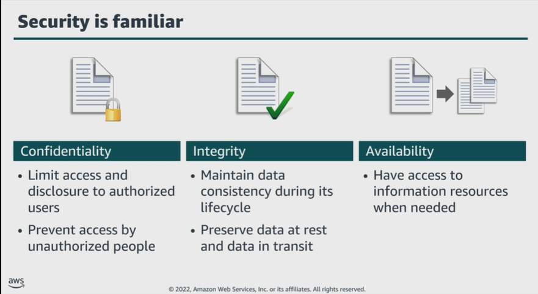

# Module 2: Security in the AWS Cloud

Favorite: No
Archive: No
Notebook: AWS Cloud Security (../../AWS%20Cloud%20Security%2037a6c6880dca808794ffd649839ae789.md)
Edited: June 9, 2026 4:32 PM
Created: June 9, 2026 3:13 PM

## Benefits of the Cloud

- Trade fixed expense for variable expense; pay only when you consume computing resources and only for how much you consume.
- Benefit from massive economies of scale; by using cloud computing, you can achieve lower variable cost than you can get on your own, because usage from hundreds of thousands of customers is aggregated in the cloud, providers like AWS can achieve higher economies of scale, which translates into lower pay-as-you-go prices.
- Stop guessing on your capacity needs; when making a capacity decision prior to deploying an application, you could have idle resources or limited capacity. With Cloud Computing, you can access as much or as little as needed, scaling up and down as required within a few minutes.
- Increase speed and agility; reducing the time to make resources available to developers from weeks to minutes, resulting in increase in agility for the organization, because cost and time to experiment and develop is significantly lower.
- Stop spending money to run and maintain data centers; focus instead on projects and customers rather than on the heavy lifting of racking, stacking, and powering servers.
- Go global in minutes; easily deploy applications in multiple regions around the world in few clicks, providing lower latency and better experience for customers at minimal cost.

## Security is familiar (CIA triad)

## AWS Cloud Security: Objectives

- Controllability
- Auditability
- Visibility
- Agility
- Automation

## AWS Cloud Security: Controllability (AWS IAM)

- Can I effectively manage users?
- How can I provide temporary credentials?
- Can I use my own keys?
  - The AWS IAM service, helps securely control access to AWS resources for users. Use IAM to control who can use your AWS resources, what resources they can use, and in what way.
  - You can grant different permissions to different people for different resources. Example. You might allow some users complete access to Amazon Elastic Compute Cloud, or Amazon EC2, and for other users, you can allow read-only access to just some Amazon Simple Storage Service, or S3 buckets; permissions to administer only some EC2 instances or access to your billing information but nothing else.
  - You can use AWS Security Token Service, or AWS STS, to create and provide trusted users with temporary security credentials that can control access to AWS resources.

## AWS Cloud Security: Auditability (AWS CloudTrail)

- Who has access to this resource?
- Who performed what action?
- When was the action performed and from where?
- Where is the evidence?
  - Organizations typically rely on regular audits, either internal or external, of their environments to ensure conformity with policies and regulations.
  - AWS CloudTrail can help answer questions like, what actions did the user take over a given time period.

## AWS Cloud Security: Visibility

- Who has access to this resource?
- Who performed what action?
- When was the action performed and from where?
- Where is the evidence?
  - The first step to secure your assets is to know what they are. AWS offers tools to keep track of and monitor AWS resources, so you have instant visibility into your inventory, and your user and application activity.
  - Example. By using AWS Config, you can discover existing AWS resources, export a complete inventory of AWS resources with all configuration details, and determine how a resource was configured at any point in time. These capabilities help with compliance auditing, security analysis, resource change tracking, and troubleshooting.

## AWS Cloud Security: Agility and Automation

- How do I ensure high availability?
- Can I automatically deploy applications with security and compliance-related settings?
- How can I apply security checks in a reproducible manner?
  - The increase in agility and the ability to perform actions faster, at a larger scale and at lower cost, does not invalidate well-established principles of information security.
  - Automatically scaling to ensure high availability during a security attack is one of the ways that AWS provides agility to meet needs.
  - AWS designs data centers with excess bandwidth, so that if a major disruption occurs, sufficient capacity is available to load balance traffic and route it to remaining sites, to minimize the impact on customers.
  - By building security tools from the ground up, AWS can automate many of the routine tasks that security experts spend time on.
  - Example. AWS CloudFormation; you can have AWS deploy an environment in a secure and reproducible manner.

## Key takeaways: Security in the AWS Cloud

- The triad of confidentiality, integrity, and availability, or CIA, was originally developed to highlight the important aspects of information security within an organization.
- AWS offers several tools and features to help meet the security objectives around controllability, auditability, visibility, agility and automation.
