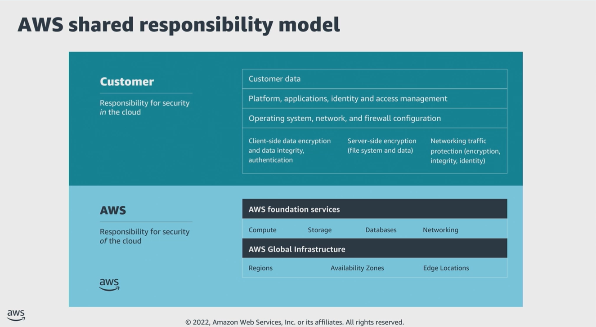

# Module 2: Shared responsibility model

Favorite: No
Archive: No
Notebook: AWS Cloud Security (../../AWS%20Cloud%20Security%2037a6c6880dca808794ffd649839ae789.md)
Edited: June 10, 2026 11:40 AM
Created: June 10, 2026 10:27 AM

## AWS Shared Responsibility Model

- Security and compliance are shared responsibilities between AWS and customers.
- AWS operates, manages, and controls security of the Cloud. This responsibility includes securing components, from the host OS and virtualization layers, down to the physical security of the facilities where the service operates.
- AWS is responsible for protecting the global infrastructure that runs all the services that are offered in the AWS Cloud. This infrastructure is composed of the hardware, software, networking, and facilities that run AWS Cloud services.
- The customer assumes responsibility and management in the Cloud. The security steps that you must take depend on the services used and complexity of the system.
- Customer responsibilities include selecting and securing OS that run on EC2 instances, and securing applications that are launched on AWS resources.
- Customers must also select and handle security group configurations, firewall configurations, network configurations, and secure account management.
- Customers are also responsible for managing their data, including encryption options.

## Shared responsibility example

- This is an example where the company uses Amazon S3 to store data.
- The AWS environment also includes EC2 instances and an Amazon Relational Database Service (RDS) instance.
- These resources run a MySQL database, deployed inside a VPC.
- One EC2 instance hosts a web server, and the web application that runs on it uses the database to store application data.
- In this scenario, AWS is responsible for protecting the global infrastructure, which contains the physical servers that host virtual machines and storage hardware. These virtual machines and storage hardware host the S3 bucket, EC2 instances, and database instance.
- AWS is responsible for the security of the physical networking infrastructure that ensures that these components can be accessed. AWS is also responsible for the security of the hypervisor layer that hosts the EC2 instances.
- The customer is responsible for managing guest OS that runs on the EC2 instances, including Windows or Linux OS updates and security patches.
- The customer is also responsible for managing any application software or utilities that is installed. Additionally, the configuration of the security groups that control network access to each EC2 instance and to the RDS database instance. Finally, the configuration of security on the S3 bucket and the objects stored in it.

## Security in the Cloud

- While AWS secures and maintains the Cloud infrastructure, you are responsible for securing everything that you put in the Cloud.
- Before architecting any workload, put practices in place that influence security. You want to control who can do what.
- You want to also identify security incidents, protect systems and services, and maintain the confidentiality and integrity of data through data protection.
- You should have a well-defined and practiced process to respond to security incidents.
- These tools and techniques are important because they support objectives such as preventing financial loss or complying with regulatory obligations.
- When using AWS services, you maintain complete control over your content and are responsible for managing critical security requirements, including:
  - Content you choose to store on AWS
  - AWS services that are used with the content
  - The country the content is stored in
  - Format and structure of content, and whether it is masked, anonymized, or encrypted
  - Who has access to that content, and how access rights are granted, managed, and revoked.

## Activity 1

## Activity 2

## Managed Services Organization

- One approach to implement security and governance is to create a centralized team that is responsible for establishing repeatable processes.
- This team also creates templates to deploy applications to AWS, while maintaining organizational control over deployments.
- Such a team could be either internal or external, and is referred to as a provisioning team or managed services organization (MSO).
- External vendors are commonly referred to as managed service providers (MSP).
- AWS validates AWS Partners under the AWS MSP program.
- MSOs or MSPs are typically responsible for:
  - Provisioning accounts
  - Establishing repeatable processes for deployment
  - Auditing deployment of workload owners
  - Hosting shared services for security, continuous monitoring, connectivity, and authentication.
- MSOs essentially create the guardrails for security, data protection, and disaster recovery in the company.

## MSO Model

- In the MSO model, workload owners handle the actual deployment, development, and maintenance of applications.
- Workload owners typically include system administrators, developers, and others who are directly responsible for one or more applications.
- Adding an MSO helps ensure that applications are deployed in a secure and compliant fashion through the automated implementation of organizational security requirements.
- Having an MSO also means that the workload owner can scope down their authorization documentation to only the configuration and installation of software that is specific to a particular application. This is because the workload owner inherits a significant portion of the security control implementation from the MSO.
- AWS customer MSOs often perform the following:
  - Account provisioning
  - Security oversight
  - VPC configuration
  - IAM configuration
  - Development and approval of templates
  - AMI creation and management
  - Development of shared services VPCs

## Key takeaways: Shared Responsibility Model

- The AWS shared responsibility model helps organizations that adopt the Cloud to achieve their security and compliance goals.
- Customers are responsible for securing everything they put in the Cloud.
- An MSO essentially creates the guardrails for security, data protection, and disaster recovery.
