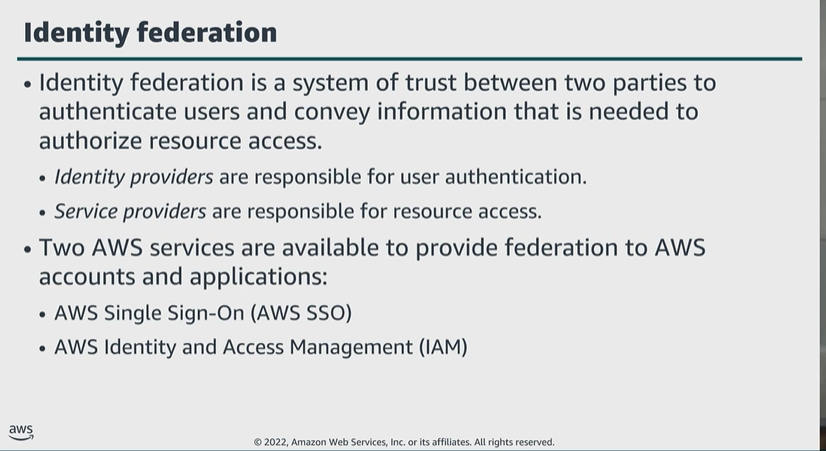
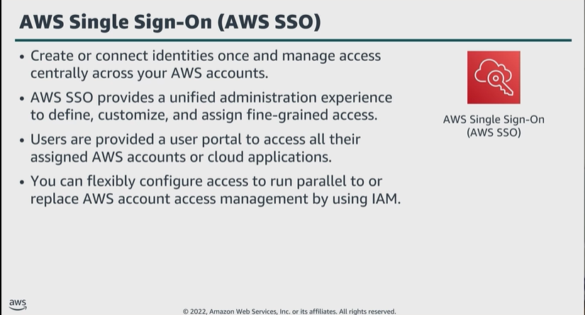

# Module 3: Additional authentication and access management services

Favorite: No
Archive: No
Notebook: AWS Cloud Security (../../AWS%20Cloud%20Security%2037a6c6880dca808794ffd649839ae789.md)
Edited: June 11, 2026 9:38 AM
Created: June 10, 2026 2:57 PM

## Identity Federation

- Through administrative agreement and configuration, the SP trusts the IdP to authenticate users and grants them access to the requested resources.
- If you are using a single centralized directory, AWS SSO is a great option to employ.
- If you are using multiple directories within your organization, or you wish to use attribute-based permissions, consider IAM.

## AWS Single Sign-On (AWS SSO)

- AWS SSO supports commonly used Cloud applications like Microsoft 365 and Salesforce.
- The service provides application integration instructions that eliminate the need for administrators to learn configuration nuances of each Cloud application.

## AWS Directory Service

## Amazon Cognito

- Amazon Cognito relies on two main components to provide its services:
  - User pools:
    - Directories that provide sign-up and sign-in options for app users. This integrates with social identity providers and support security features like MFA and phone verification.
  - Identity pools:
    - You grant users access to AWS services through temporary, limited-privilege AWS credentials.

