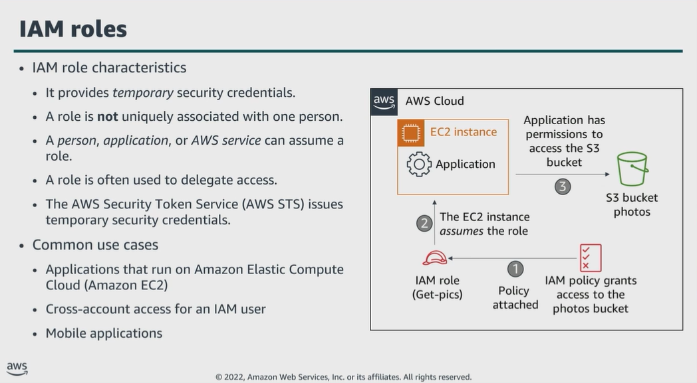

# Module 3: Authenticating with IAM

Favorite: No
Archive: No
Notebook: AWS Cloud Security (../../AWS%20Cloud%20Security%2037a6c6880dca808794ffd649839ae789.md)
Edited: June 10, 2026 12:43 PM
Created: June 10, 2026 12:25 PM

## IAM Roles

- In the example:
  - The administrator creates the Get-pics role in IAM.
  - They define a policy that grants access to the Amazon Simple Storage Service, or Amazon S3, photos bucket, and attach the policy to the role.
  - The EC2 instance assumes the Get-pics role, finally, the EC2 instance is granted temporary permissions to the S3 bucket.

## IAM Credentials for authentication

## Multi-factor authentication (MFA)

## Authentication Scenario

- The organization has created multiple AWS accounts to isolate your production environment from your development environment.
- After testing an update within the development environment, you need to grant members of the Developers group temporary access to update the production app S3 bucket.
- The diagram explains how temporary access can be granted to members of the Developers group.

