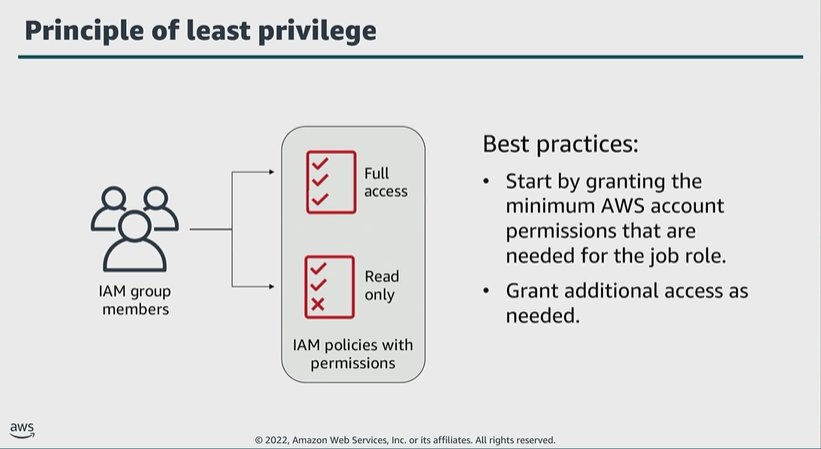

# Module 3: Authorizing with IAM

Favorite: No
Archive: No
Notebook: AWS Cloud Security (../../AWS%20Cloud%20Security%2037a6c6880dca808794ffd649839ae789.md)
Edited: June 10, 2026 1:29 PM
Created: June 10, 2026 12:45 PM

## Principle of least privilege

- It’s more secure to start with a minimum set of permissions and grant additional permissions as needed. This provides better security than starting with permissions that are too permissive and trying to restrict them later.
- Create policies for individual resources that identify precisely who is allowed to access the resource and allow only the minimal permission for those users.

## Policies and Permissions

- In this example, the users in the IAM group can read, write and delete objects in bucket 1. However, they can only read objects in bucket 2.
- By default, an IAM user, group, or role can’t access anything in your account until you grant them permissions by creating a policy.
- Most policies are defined and stored in JSON documents. Policies define the effect, actions, resources, and optional conditions under which an entity can invoke API operations to the AWS account.
- Any actions or resources that aren’t explicitly allowed are denied.
- When an IAM principal makes a request, AWS evaluates that request based on the permissions in these policies to determine whether to allow or deny access.
- AWS currently supports 6 types of policies:
  - Identity-based policies are attached to IAM identities to grant permission to the identity.
  - Resource-based policies are attached to resources and grant permissions to a specified principal.
  - Identity-based and resourced-based policies are the only 2 policy types that can be used to grant permissions.
  - Permissions boundaries define the maximum permissions that identity-based policies can grant to an entity. Permissions boundaries can’t grant permissions.
  - AWS Organizations service control policy (SCP) can define the maximum permissions for account members of an organization or an organizational unit (OU). You can use SCPs to limit permissions of identity-based or resource-based policies, but they can’t be used to grant permissions. ACLs can be used to control which principals in other accounts can access the resource the ACL is attached to. You can’t use an ACL to control access for entities that reside within the same account.
  - Session policies are used with the AWS CLI or API to create a temporary session for a role or federated user. You can use session policies to limit the permissions that an identity-based policy grants to a session. Session policies limit permissions, but can’t grant them.

## Identity-based and Resource-based Policies

- Identity-based policies are attached to an IAM user, group, or role and indicate what an identity can do. Example. You could grant a user the ability to access an Amazon DynamoDB table.
- Resource-based policies are attached to a resource. They indicate what a specified user or group or group of users is permitted to do with the resource. Example. You can grant access to an S3 bucket or grant cross-account access between 2 trusted AWS accounts.

## Managed and Inline IAM Policies

- AWS creates and manages AWS managed policies, and you can create and manage customer managed policies.
- Managed policies allow permissions boundaries; this is an advanced feature that allows a managed policy to set the maximum permissions that an identity-based policy can grant to an IAM entity.
- Inline policies are an inherent part of the entity. You can use the same policy for multiple entities, but those entities, don’t share the policy. Instead, each entity has its own copy of the policy, meaning it’s impossible to centrally manage inline policies.
- Inline policies cannot be inadvertently attached to the wrong entity.
- In most cases, AWS recommends using managed policies instead of inline.

## Evaluation logic for IAM Policies

## Key takeaways: Authorizing with IAM

- Permissions to access AWS account services and resources are defined in IAM policy documents.
- Attach IAM policies to IAM users, IAM groups, or IAM roles.
- Follow the principle of least privilege when you grant account access.
- When IAM determines permissions, an explicit deny will always override any allow statement.
