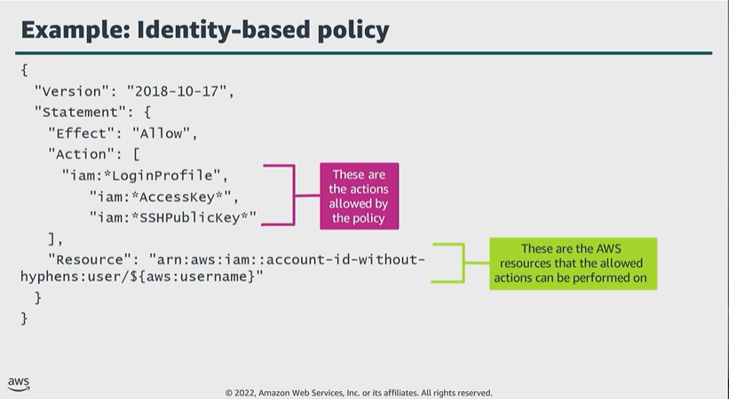

# Module 3: Examples of authorizing with IAM

Favorite: No
Archive: No
Notebook: AWS Cloud Security (../../AWS%20Cloud%20Security%2037a6c6880dca808794ffd649839ae789.md)
Edited: June 10, 2026 2:32 PM
Created: June 10, 2026 2:15 PM

## Example: Identity-based policy

- As shown below, if the entity is a user, the policy allows the user to create, delete, get, or update their own password by using IAM LoginProfile actions.
- The user can also perform actions on their own access key by using IAM AccessKey actions and on their own SSH keys by using IAM SSHPublicKey actions.
- The actions in the policy include wildcards, indicated with an asterisk. Wildcards provide a convenient way to include a set of related actions.
- Notice below how the policy gets the AWS user name dynamically, as defined in the Resource key.

## Example: Cross-account, resource-based policy

- In this scenario, Account A created a resource-based policy. The policy grants Account B access to perform any Amazon S3 API operation as indicated by the asterisk on Account A’s S3 bucket, named DOC-EXAMPLE-BUCKET.
- This S3 bucket policy doesn’t specify any IAM principals. Instead, it specifies Account B by the account number.
- Account B should create an IAM user policy to allow a user in Account B to access Account A’s bucket.

## Example IAM policy: Allow statement

- This first half of the policy below is an explicit allow that gives users access to only specific resources, a DynamoDB table named coursenotes, an S3 bucket named course-notes-web, and an S3 bucket named course-notes-mp3, including all of its objects.
- The second half of the policy is an explicit deny. This explicit deny ensures that the entity can’t perform any action on any DynamoDB table or S3 bucket, except those specified in the policy statement.
- Overall, this IAM policy allows access to specific DynamoDB and Amazon S3 resources, and explicitly denies access to any other DynamoDB or S3 resources in the account.

## Example IAM policy: Permissions boundary

- Assume policy 1 is attached to the IAM user ExampleUser.
- This policy allows the user to manage only Amazon S3, Amazon CloudWatch, and Amazon EC2 resources and restricts all other services, including IAM.
- If IAM policy 2 is then attached to ExampleUser, and they attempt to perform the _iam:createUser_ operation, the operation fails because of the restrictions placed by policy 1.

