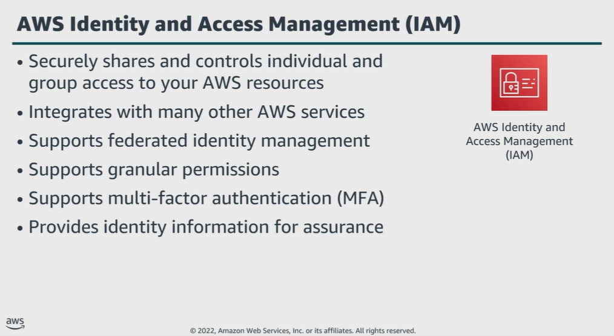

# Module 3: IAM fundamentals

Favorite: No
Archive: No
Notebook: AWS Cloud Security (../../AWS%20Cloud%20Security%2037a6c6880dca808794ffd649839ae789.md)
Edited: June 10, 2026 12:21 PM
Created: June 10, 2026 12:01 PM

## AWS Identity and Access Management (IAM)

## What IAM Provides

## IAM Overview

## IAM terminology

## Requests in IAM

- A request is made any time a principal attempts to use the AWS Management Console, API, or AWS CLI.
- The request contains the following information:
  - _Actions or operations_: What the principal wants to perform
  - _Resources_: The object upon which the actions or operations are performed
  - _Principal_: The person or application that sends a request by using a user or role
  - _Environment data_: The IP address, user agent, SSL enabled status, or time of day
  - _Resource data_: Data related to the resource being requested

## Service Endpoints

- To connect to an AWS service, you must use the URL of the entry point for that service, known as endpoint.
- The AWS SDK and AWS CLI use the default endpoint for each service in an AWS Region.
- You can specify alternate endpoints for API requests based on configuration requirements.
- An example of an endpoint for Amazon Elastic Compute Cloud (Amazon EC2), is _ec2.us-east-1.amazonaws.com_
- You can create endpoint policies and attach them to endpoints, but endpoint policies won’t override or replace IAM user policies or service-specific policies.
- An endpoint policy is a separate policy to only control access from the endpoint to the specified service.

## Key takeaways: IAM fundamentals

- IAM is a web service that helps you securely control access to AWS resources.
- Authentication deals with who is requesting access. Authorization determines what they have access to.
- IAM uses users, groups, roles, and policies to provide authentication and authorization to AWS resources.
