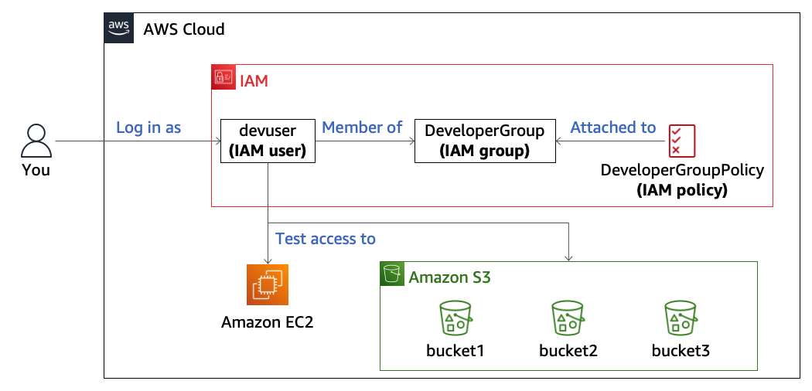
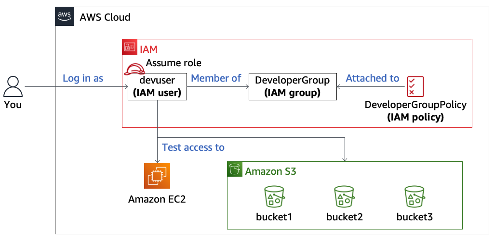
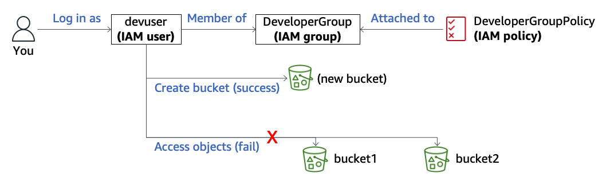
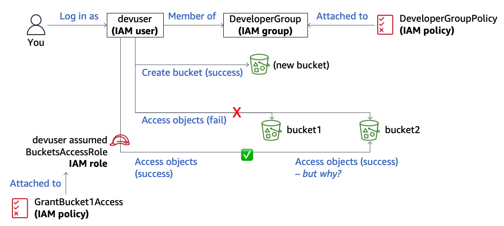
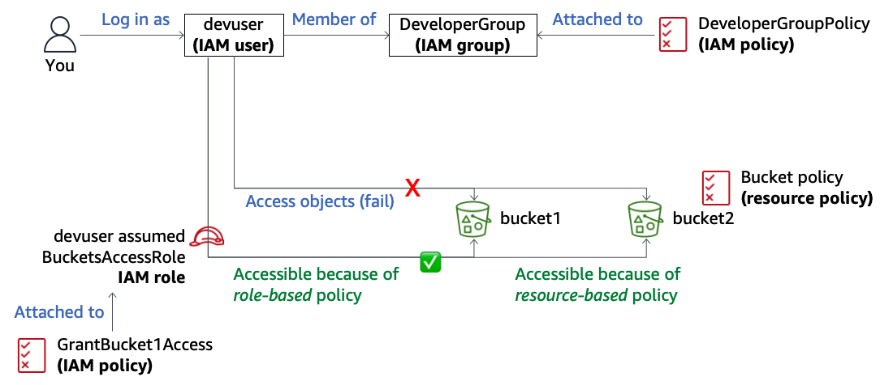

# Module 3: Lab 3.1 - Using Resource-Based Policies to Secure an S3 Bucket

Favorite: No
Archive: No
Notebook: AWS Cloud Security (../../AWS%20Cloud%20Security%2037a6c6880dca808794ffd649839ae789.md)
Edited: June 11, 2026 10:45 AM
Created: June 11, 2026 9:48 AM

# **Lab 3.1: Using Resource-Based Policies to Secure an S3 Bucket**

## **Lab overview and objectives**

In this lab, you will learn how to configure permissions by using AWS Identity and Access Management (IAM) identity-based and resource-based policies, such as Amazon Simple Storage Service (Amazon S3) bucket policies. You will also learn how IAM policies and resource policies define access permissions.

After completing this lab, you should be able to do the following:

- Recognize how to use IAM identity-based policies and resource-based policies to define fine-grained access control to AWS services and resources.
- Describe how an IAM user can assume an IAM role to gain different access permissions to an AWS account.
- Explain how S3 bucket policies and IAM identity-based policies that are assigned to IAM users and roles affect what users can see or modify across different AWS services in the AWS Management Console.

## **Duration**

This lab will require approximately **60 minutes** to complete.

## **AWS service restrictions**

In this lab environment, access to AWS services and service actions might be restricted to the ones that are needed to complete the lab instructions. You might encounter errors if you attempt to access other services or perform actions beyond the ones that are described in this lab.

## **Scenario**

The following diagram shows the architecture that was created for you in AWS at the _beginning_ of the lab.



The lab environment has three preconfigured Amazon S3 buckets: _bucket1_, _bucket2_, and _bucket3_. The environment also has a preconfigured IAM role, which allows access to certain buckets and their objects when the role is assumed. You will analyze different policies to better understand how they control your access level.

By the _end_ of this lab, you will have created the architecture shown in the following diagram.



## **Task 1: Accessing the console as an IAM user**

1. At the top of these instructions, choose **Start Lab**.
   - The lab session starts.
   - A timer displays at the top of the page and shows the time remaining in the session.
     **Tip:** To refresh the session length at any time, choose **Start Lab** again before the timer reaches 00:00.
2. Before you continue, wait until the circle icon to the right of the AWS link in the upper-left corner turns green. When the lab environment is ready, the AWS Details panel will also display.

   **Warning:** Do NOT choose the AWS link to connect to the console in this lab. You will access the console in a different way than you do in most labs.

3. Log in as the IAM user named _devuser_:
   - Choose the **AWS Details** link at the top of the page.
   - Copy the **IAMUserLoginURL** value, and load it in a new browser tab.
   - For **IAM user name**, enter `devuser`
   - For **Password**, enter the **IAMUserPassword** value from the AWS Details panel on the lab instructions page.
   - Choose **Sign in**.
     The AWS Management Console displays.
     **Warning:** To avoid issues, do NOT change the Region during this lab unless instructed.
4. Arrange the AWS Management Console tab so that it displays next to these instructions. Ideally, you will be able to see both browser tabs at the same time so that you can follow the lab steps more easily.

## **Task 2: Attempting read-level access to AWS services**

Now that you are logged in to the console as the IAM user named _devuser_, you will explore the level of access that you have to a few AWS services, including Amazon Elastic Compute Cloud (Amazon EC2), Amazon S3, and IAM.

1. Open the Amazon EC2 console:
   - From the **Services** menu, choose **Compute** > **EC2**.
   - In the left navigation pane, choose **EC2 Dashboard**.
     Many _API Error_ messages display. This is expected.
2. Attempt some actions in the Amazon EC2 console:
   - In the left navigation pane, choose **Instances**.
     In the Instances list, a message displays _You are not authorized to perform this operation_.
   - Choose **Launch instances**
   - Scroll down and choose the Key pair name drop down list.
     A message displays _You are not authorized to perform this operation_.
     Notice that Key pair name is a _required_ setting that must be configured if you want to launch an instance. This is just one of many indications that you will not be able to launch an EC2 instance with the permissions that have been granted to you as the devuser.
   - In the Summary panel on the right, choose **Cancel**.
3. To explore what you can access in the Amazon S3 console, from the **Services** menu, choose **Storage** > **S3**.

   Three buckets are listed. The bucket names are unique, but one bucket name contains _bucket1_, another contains _bucket2_, and the third contains _bucket3_.

   In the list of buckets, notice that the **Access** column displays the message _Insufficient permissions_ for all three buckets. This is expected.

## **Task 3: Analyzing the identity-based policy applied to the IAM user**

You have observed how the _devuser_ IAM user is unable to access certain information and actions in both the Amazon S3 console and Amazon EC2 console. In this task, you will look at the IAM policy details that apply to _devuser_ to understand why you can't perform these actions.

1. Access the IAM console, and observe user and group membership settings:
   - From the **Services** menu, choose **Security, Identity, & Compliance** > **IAM**.
     On the IAM dashboard page, notice that you do not have permissions to view certain parts of the page. Both messages state \*User: arn:aws:iam:::user/devuser is not authorized to perform: iam:GetAccountSummary on resource: \*\*. This is expected.
   - In the left navigation pane, choose **User groups**.
   - Choose the **DeveloperGroup** group name.
     On the **Users** tab, notice that _devuser_ is a member of this IAM group.
   - Choose the **Permissions** tab.
     Notice that an IAM policy named DeveloperGroupPolicy is attached to this IAM group.
     **Note:** When a policy is attached to a group, the policy applies to any IAM users who are members of the group. Therefore, this policy currently governs your access to the console, because you are logged in as _devuser_, who is a member of this IAM group.
2. Review the IAM policy details:
   - On the lower portion of the page, choose the plus icon to the left of **DeveloperGroupPolicy** to display the policy details.
   - Review the JSON policy details, and recall the level of access that you had for Amazon EC2 and Amazon S3 in the previous task.
     - Notice that the policy does not allow any Amazon EC2 actions.
     - Notice the IAM actions that the policy allows. When you accessed the IAM dashboard, you saw a message that stated that you did not have _iam:GetAccountSummary_ authorization. That action is not permitted in this policy document. However, many read-level IAM permissions are granted. For example, you are able to review the details for this policy.
     - Notice the Amazon S3 actions that the policy allows. No object-related actions are granted, but some actions related to buckets are allowed.
3. Save the policy to a file on your computer:
   - To copy the JSON-formatted policy to your clipboard, choose **Copy**.
   - Open a text editor on your local computer, and paste the policy that you just copied.
   - Save the policy document as `DeveloperGroupPolicy.json` to a location on your computer that you will remember.

## **Task 4: Attempting write-level access to AWS services**

Any action that you attempt when you interact with an AWS service is an API call, whether you are using the console, AWS Command Line Interface (AWS CLI), or AWS software development kits (SDKs). All attempted API calls are recorded in the AWS CloudTrail event logs.

In this task, you will attempt to make two API calls that require _write-level_ access within Amazon S3. The first action is to create an S3 bucket, and the second action is to upload an object to that bucket. After you attempt the two tasks, you will again analyze the policy attached to the IAM group to analyze why you could or could not perform the specific API calls.

1. Attempt to create an S3 bucket:
   - Navigate to the Amazon S3 console.
     **Tip:** Use the **Services** menu, or search for `S3` in the search box to the right of the menu.
   - Choose **Create bucket**
   - For **Bucket name**, enter your initials followed by a random four-digit number; for example, _zba1234_.
     **Note:** By default, new buckets, access points, and objects don't allow public access. Diving deeper into this goes beyond the scope of this lab, but it's important to note.
   - For **AWS Region**, choose **US East (N. Virginia) us-east-1**.
   - Review the settings, and then choose **Create bucket** at the bottom of the page.
     You successfully created an S3 bucket.
2. Access the bucket, and attempt to upload an object:
   - Choose the name of the bucket that you just created.
   - Choose **Upload**, and then choose **Add files**.
   - Browse to and choose the **DeveloperGroupPolicy.json** file that you saved earlier.
   - Choose **Upload**.
     A message displays _Upload failed_.
   - On the **Files and folders** tab on the lower part of the page, in the **Error** column, choose the **Access Denied** link.
     The message states _You don't have permissions to upload files and folders_.
   - Choose **Close**.
   - From the breadcrumbs in the upper-left corner of the page, choose **Amazon S3**.
3. Review the policy details for Amazon S3 access:
   - Return to the text editor where you copied the DeveloperGroupPolicy.json document.
   - Review the policy details to understand why you were able to create an S3 bucket but couldn't upload objects to it.
     **Tip:** The _Service Authorization Reference_ document provides a list of actions that each AWS service supports. For information about Amazon S3 actions, open the [IAM documentation](https://docs.aws.amazon.com/iam/) page, and then open the _Service Authorization Reference_ document. In the left navigation pane, expand **Actions, resources, and condition keys**, and then choose **Amazon S3**. In the **Actions defined by Amazon S3** section, the table lists every possible Amazon S3 action that can be granted or denied, along with a description of the action.

## **Task 5: Assuming an IAM role and reviewing a resource-based policy**

In this task, you will try to access _bucket1_ and _bucket2_ while logged in as the _devuser_ IAM user. You will also try to access the buckets by using a role that was preconfigured as part of the lab setup.

1. Try to download an object from the buckets that were created during lab setup:
   - In the Amazon S3 console, choose the bucket name that contains **bucket1**.
   - Select **Image2.jpg**, and then choose **Download**.
     An AccessDenied error page appears.
   - To return to the Amazon S3 console, choose your browser's back button.
   - From the breadcrumbs in the upper-left corner of the page, choose **Amazon S3**.
   - Try to download the **Image1.jpg** file from _bucket2_.
     You receive the same error.
   - To return to the Amazon S3 console, choose your browser's back button.**Analysis:** As shown in the following diagram, with the permissions that are granted through membership in the _DeveloperGroup_, you were able to create a new bucket. However, you cannot access objects in _bucket1_ or _bucket2_.

   
   - From the breadcrumbs in the upper-left corner of the page, choose **Amazon S3**.

2. Assume the _BucketsAccessRole_ IAM role in the console:
   - In the upper-right corner of the page, choose **devuser**, and then choose **Switch role**.
   - If the Switch role page appears, choose **Switch Role.**
   - Configure the following:
     - **Account:** Enter the **AccountID** value from the AWS Details panel on the lab instructions page.
     - **Role:** Enter `BucketsAccessRole`
     - **Display Name:** Leave this field blank.
     - Choose **Switch Role**
       You successfully assumed the IAM role named _BucketsAccessRole_, which was preconfigured for this lab.
       **Tip:** You can tell that you switched into the role by looking at the upper-right corner of the console. Notice that **BucketsAccessRole** is displayed where **devuser** was previously displayed.
3. Try to download an object from Amazon S3 again:
   - In the Amazon S3 console, choose the bucket name that contains **bucket1**.
   - Select **Image2.jpg**, and then choose **Download**.
   - Open the file to verify that the file downloaded.
     **Analysis:** The download was successful, which means that the policy or policies applied to the _BucketsAccessRole_ allow the _s3:GetObject_ action on _bucket1_.
4. Test IAM access with the _BucketsAccessRole_:
   - Navigate to the IAM console.
     **Note:** By changing roles, the permissions that you have to interact with different AWS services have changed. As you navigate the IAM console, you will see new error messages that state that you are not authorized.
   - In the left navigation pane, choose **User groups**.
     **Analysis:** An error message displays. You no longer have permissions to view the IAM user groups page because _BucketsAccessRole_ does not have the _iam:ListGroups_ action applied to it.
5. Assume the _devuser_ role again, and test access to the user groups page:
   - In the upper-right corner of the page, choose **BucketsAccessRole**, and then choose **Switch back**.
   - In the left navigation pane, choose **User groups** again.
     **Analysis:** Now that you unassumed the _BucketsAccessRole_, you have the permissions that are assigned to the _devuser_ IAM user (through this user's membership in the _DeveloperGroup_). You are able to view the user groups page again.
6. Analyze the IAM policy that is associated with the _BucketsAccessRole_:
   - In the left navigation pane, choose **Roles**.
   - Search for `BucketsAccessRole` and choose the role name when it appears.
   - Choose the arrow to the left of **ListAllBucketsPolicy**.

   This policy grants the same _s3:ListAllMyBuckets_ action to every resource. This permission allows you to see all S3 buckets when you assume _BucketsAccessRole_.
   - Choose the arrow to the left of **GrantBucket1Access**.
     **Analysis:** This policy allows the _s3:GetObject_, _s3:ListObjects_, and _s3:ListBucket_ actions. Notice that this policy does _not_ grant _s3:PutObject_ access. The allowed actions are only granted for specific resources, _bucket1_ and all objects within _bucket1_ (as indicated by **/\***). The asterisk (\*) is a wildcard character, which indicates that this would match any value.
     Because of this policy, when you assumed the _BucketsAccessRole_, you could see and download objects from _bucket1_.

7. Save a copy of the _GrantBucket1Access_ policy to your computer:
   - Place your cursor at the start of line 1 in the policy details, and select all the lines of code (down to line 17).
   - Copy the JSON-formatted policy to your clipboard.
   - Open a new text file on your computer, and paste the policy that you just copied.
   - Save the policy document as `GrantBucket1Access.json` to a location on your computer that you will remember.
8. Complete your analysis of the _BucketsAccessRole_ details:
   - Scroll back up the page, and choose the **Trust relationships** tab.
     Notice that the _devuser_ IAM user in this AWS account is listed as a trusted entity that can assume this role.
     Notice that the account number that appears in the upper-right corner of the console (after **devuser**) matches the account number in the **Trusted entities** list (without the dashes).
     **Note:** The AWS Security Token Service (AWS STS) will provide temporary credentials to any trusted entity that requests to assume the role. This trust policy trusts an IAM user in the same account. However, a trust policy could be configured to trust one or more principals, even in other AWS accounts. Examples of other principals are AWS services, IAM roles, and IAM users.
9. Assume the _BucketsAccessRole_, and try to upload an image to _bucket2_:
   - To assume the _BucketsAccessRole_ again, in the upper-right corner of the page, choose **devuser**.
   - Under **Role history**, choose **BucketsAccessRole**.
   - Navigate to the Amazon S3 console.
   - Choose the bucket name that contains **bucket2**.
     Notice that this bucket does not yet have an Image2.jpg file.
   - Choose **Upload**, and then choose **Add files**.
   - Browse to and choose the **Image2.jpg** file that you downloaded earlier from _bucket1_.
   - Choose **Upload**.
     The file uploads successfully.
   - Choose **Close**.
     **Analysis:** After assuming the _BucketsAccessRole_, you successfully accessed _bucket1_ to download an object. You then uploaded the same object to _bucket2_.
     After inspecting the policies attached to the _BucketsAccessRole_, you know that the Amazon S3 permissions that were granted to that role were limited to _bucket1_, as shown in the following diagram.
     
   - So, how were you just now able to upload an object to _bucket2_? The reason will become clear in the next task.

## **Task 6: Understanding resource-based policies**

In this task, you will inspect the bucket policy that is associated with _bucket2_.

1. Observe the details of the bucket policy that is applied to _bucket2_:
   - On the details page for _bucket2_, choose the **Permissions** tab.
   - In the **Bucket policy** section, review the policy that is applied to _bucket2_.
     The policy has two statements.
     The first statement ID (SID) is _S3Write_. The principal is the _BucketsAccessRole_ IAM role that you assumed. This role is allowed to call the actions _s3:GetObject_ and _s3:PutObject_ on the resource, which is _bucket2_.
     The second SID is _ListBucket_. The principal is _BucketsAccessRole_. This role is allowed to call the action _s3:ListBucket_ on the resource, which is _bucket2_.
     **Analysis:** You should now have a better understanding of how resource-based policies (such as S3 bucket policies) and role-based policies (policies associated with IAM roles) can interact and be used together.
     In this lab, the _role-based policies_ attached to the _BucketsAccessRole_ IAM role granted _s3:GetObject_ and _s3:ListBucket_ access to _bucket1_ and the objects in it. These role-based policies did not explicitly allow access to _bucket2_; however, they also did not explicitly deny access.
     The following diagram shows how the policies that were applied to the IAM user, IAM role, and bucket determined what actions you were able to perform.
     
     Then, while still assuming the _BucketsAccessRole_, you tried to upload an object to _bucket2_, and you were able to do it. That seemed strange based on the IAM policies that you reviewed. However, after you reviewed the _resource-based policy_ (in this case, a bucket policy) that was attached to the bucket, your access made sense. That bucket policy grants access, including the _s3:PutObject_ action, to _bucket2_ to the _BucketsAccessRole_ principal.

## **Challenge task**

Your objective for this challenge task is to figure out a way to upload the Image2.jpg file to _bucket3_.

1. Try to upload the file as _devuser_ with no role assumed:
   - Unassume the _BucketsAccessRole_.
   - Attempt to upload Image2.jpg, which you downloaded from _bucket1_ earlier in this lab, to _bucket3_.
     The upload fails.
   - Check whether a bucket policy is associated with _bucket3_. Maybe that will give you some indication about how to accomplish this task.
     You can't view the bucket policy.
2. Assume the _BucketsAccessRole_, and try the actions from the previous step:
   - Can you upload a file to _bucket3_?
   - Can you view the bucket policy now? Review the bucket policy details. Do you have an idea for how you can upload Image2.jpg to _bucket3_?
   - Did you figure out how to upload the file? If so, congratulations!

#### Challenge Task Solution

1. Review the permissions as BucketsAccessRole because devuser does not have the permission to view the bucket permissions.
2. According to the permissions JSON file another role called OtherBucketAccessRole is explicitly allowed actions not BucketsAccessRole

```json
{
  "Version": "2008-10-17",
  "Statement": [
    {
      "Sid": "S3Write",
      "Effect": "Allow",
      "Principal": {
        "AWS": "arn:aws:iam::697021333382:role/OtherBucketAccessRole"
      },
      "Action": ["s3:GetObject", "s3:PutObject"],
      "Resource": "arn:aws:s3:::c217314a5488883l15493076t1w697021333382-bucket3-8kknowzyiavs/*"
    },
    {
      "Sid": "ListBucket",
      "Effect": "Allow",
      "Principal": {
        "AWS": "arn:aws:iam::697021333382:role/OtherBucketAccessRole"
      },
      "Action": "s3:ListBucket",
      "Resource": "arn:aws:s3:::c217314a5488883l15493076t1w697021333382-bucket3-8kknowzyiavs"
    }
  ]
}
```

1. Assume the role, by switching role to OtherBucketAccess role, this way you can actually upload the file since that role is explicitly allowed to do so.

## **Submitting your work**

1. To record your progress, choose **Submit** at the top of these instructions.
2. When prompted, choose **Yes**.

   After a couple of minutes, the grades panel appears and shows you how many points you earned for each task. If the results don't display after a couple of minutes, choose **Grades** at the top of these instructions.

   **Tip:** You can submit your work multiple times. After you change your work, choose **Submit** again. Your last submission is recorded for this lab.

3. To find detailed feedback about your work, choose **Submission Report**.

## **Lab complete**

Congratulations! You have completed the lab.

1. At the top of this page, choose **End Lab**, and then choose **Yes** to confirm that you want to end the lab.

   A message panel indicates that the lab is terminating.

2. To close the panel, choose **Close** in the upper-right corner.
