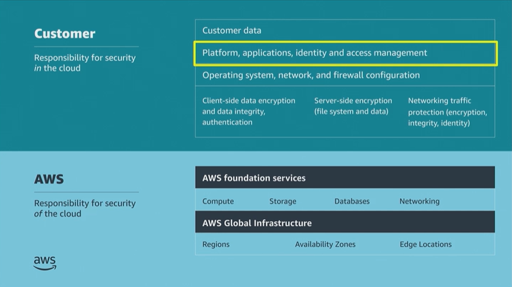

# Module 3: Securing Access to Cloud Resources

Favorite: No
Archive: No
Notebook: AWS Cloud Security (../../AWS%20Cloud%20Security%2037a6c6880dca808794ffd649839ae789.md)
Edited: June 10, 2026 12:01 PM
Created: June 10, 2026 11:49 AM

## Bank Business Scenario

- The developer’s initial meeting with the Bank went well. The Bank now has a strong grasp of the fundamentals of Cloud Security and they want to use the shared responsibility model as a focal point for their discussions.
- The developer agrees that migrating to the AWS Cloud could be a smart move to modernize the Bank’s business operations. However, the developer has reservations about how the Bank could adequately secure online access for their members while also maintaining internal security protocols.
- The Bank is particularly focused on restricting internal access to critical resources as much as possible.
- In preparation for their next meeting, the developer focuses on AWS services for IAM, including services that could be used to rollout a planned mobile app. The developer also plans to discuss security best practices, such as the principle of least privilege, to address the Bank’s concerns about access.

## Shared Responsibility Model

- This module will focus on the platform applications and IAM portion of the shared responsibility model, which the customer is responsible to secure.

