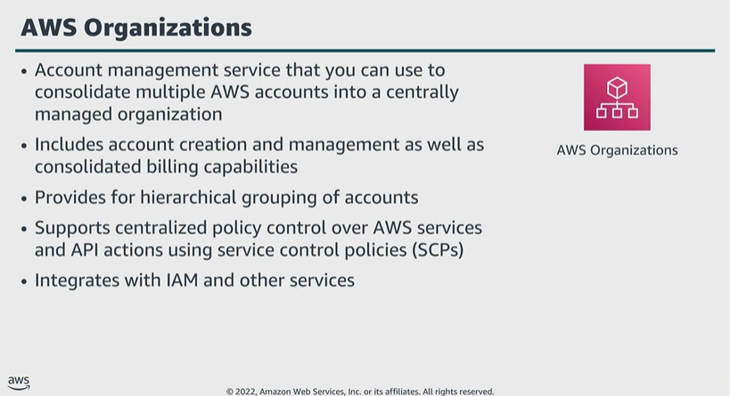

# Module 3: Using AWS Organizations

Favorite: No
Archive: No
Notebook: AWS Cloud Security (../../AWS%20Cloud%20Security%2037a6c6880dca808794ffd649839ae789.md)
Edited: June 11, 2026 11:04 AM
Created: June 11, 2026 9:39 AM

## AWS Organizations

- You can manage security, compliance, budgetary needs more efficiently.
- You can hierarchically group accounts in organizational units (OUs), and attach different access policies to each. This provides the ability to create and customize fine-grained policies, which you can target to a single OU or attach to multiple OUs.
- You can nest OUs within other OUs up to a depth of five levels, which helps structure hierarchy as you prefer.
- SCPs help specify maximum permissions for member accounts in organization. This helps ensure accounts stay within the organization’s access control guidelines. Although, you cannot use SCPs to grant any permissions, they can only restrict access to a service, resource, or API action for any member account, user, or role determined.
- Any restrictions placed by an SCP will remain in place even if the restricted actions are implicitly allowed elsewhere.

## Example: SCP

- The effect of the policy statement is to explicitly deny the organization’s leaveOrganization action, which prevents member accounts from leaving the organization.

