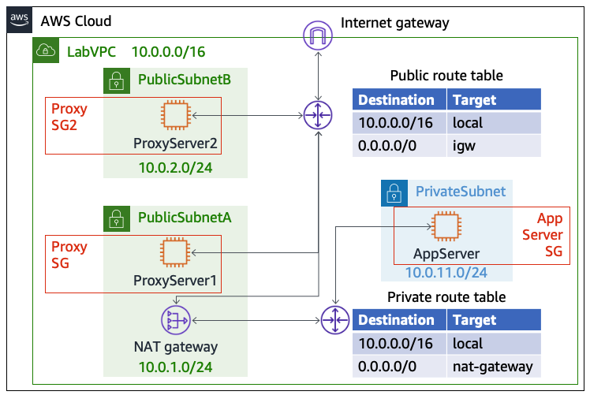
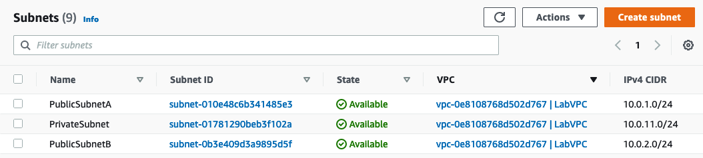
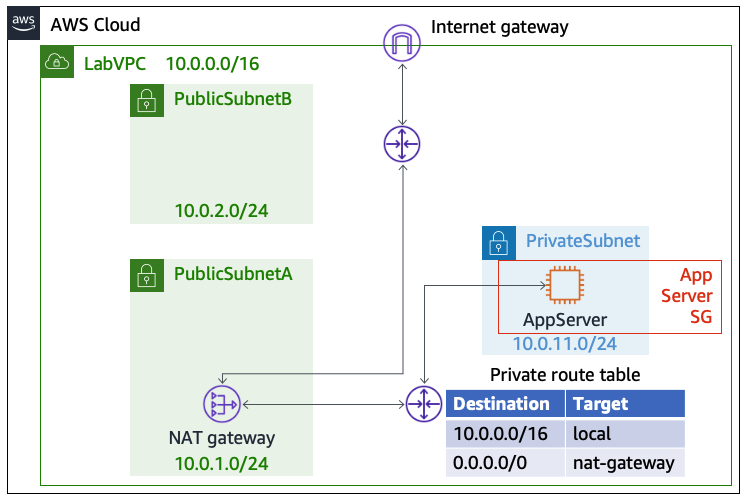
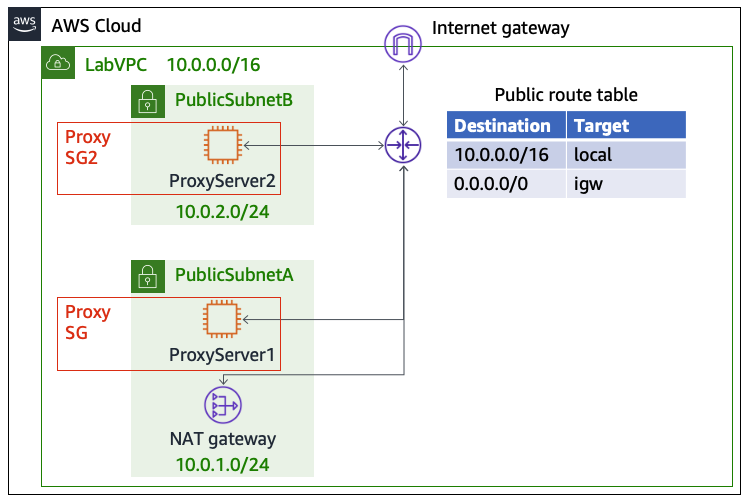
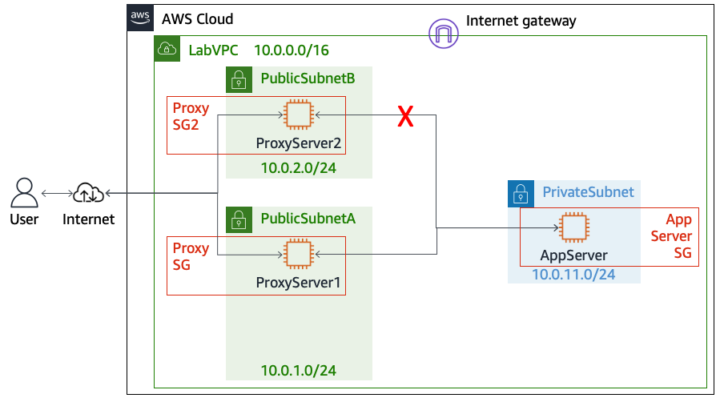
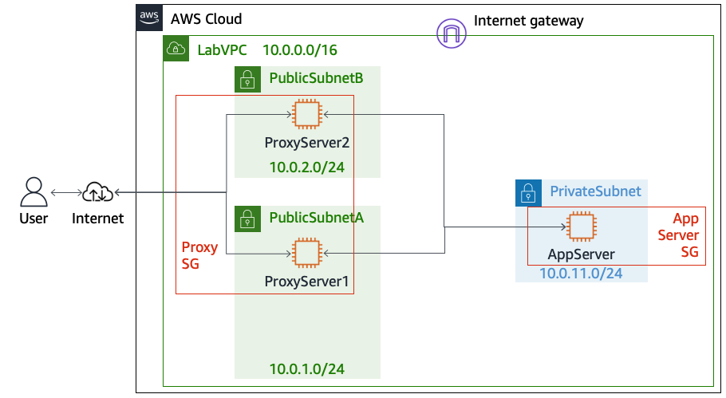
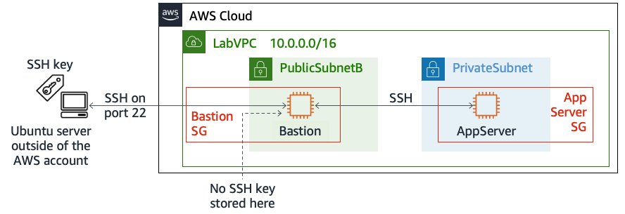
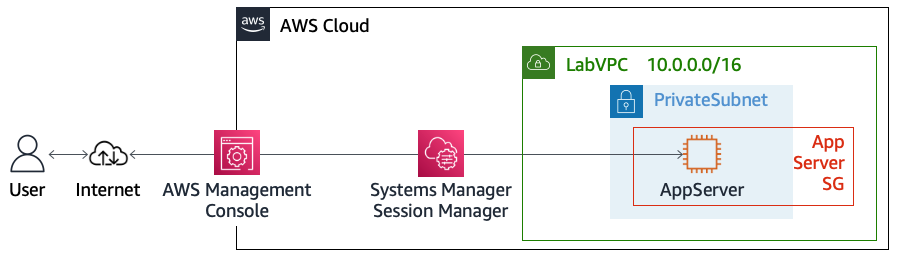

# Module 4: Lab 4.1 - Securing VPC Resources by Using Security Groups

Favorite: No
Archive: No
Notebook: AWS Cloud Security (../../AWS%20Cloud%20Security%2037a6c6880dca808794ffd649839ae789.md)
Edited: June 12, 2026 9:38 AM
Created: June 11, 2026 3:53 PM

# **Lab 4.1: Securing VPC Resources by Using Security Groups**

## **Lab overview and objectives**

Security groups are virtual firewalls that are attached to Amazon Elastic Compute Cloud (Amazon EC2) instances. Security group rules define what traffic is allowed in or out of an instance. In this lab, you are tasked to configure access rules for EC2 instances.

After completing this lab, you should be able to do the following:

- Examine security groups to determine what traffic is allowed.
- Change which security groups are applied to EC2 instances.
- Create new security groups.
- Update the inbound rules on security groups to follow the principle of least privilege.
- Understand how security groups can reference other security groups.
- Configure a network access control list (ACL) to block traffic on a specific TCP port.
- Connect to an instance in a private subnet by using SSH.
- Connect to an instance in a private subnet by using AWS Systems Manager Session Manager.

## **Duration**

This lab will require approximately **90 minutes** to complete.

## **AWS service restrictions**

In this lab environment, access to AWS services and service actions might be restricted to the ones that are needed to complete the lab instructions. You might encounter errors if you attempt to access other services or perform actions beyond the ones that are described in this lab.

## **Scenario**

The lab environment includes a fully functional virtual private cloud (VPC) with multiple subnets, route tables, an internet gateway, a NAT gateway, and multiple security groups. In addition, three EC2 Linux instances have been launched into different subnets: two into public subnets and one into a private subnet. The instances in the public subnets are configured as proxy servers to forward traffic to the application server in the private subnet. You will connect to the proxy instances by using a web browser to test connectivity to the private application server to verify how security groups restrict access.

The following diagram shows the architecture that was created for you in the AWS account at the beginning of the lab.



## **Accessing the AWS Management Console**

1. At the top of these instructions, choose **Start Lab**.
   - The lab session starts.
   - A timer displays at the top of the page and shows the time remaining in the session.
     **Tip:** To refresh the session length at any time, choose **Start Lab** again before the timer reaches 00:00.
   - Before you continue, wait until the circle icon to the right of the AWS link in the upper-left corner turns green. When the lab environment is ready, the AWS Details panel will also display.
2. To connect to the AWS Management Console, choose the **AWS** link in the upper-left corner, above the terminal window.
   - A new browser tab opens and connects you to the console.
     **Tip:** If a new browser tab does not open, a banner or icon is usually at the top of your browser with the message that your browser is preventing the site from opening pop-up windows. Choose the banner or icon, and then choose **Allow pop-ups**.

## **Task 1: Analyzing the VPC and private subnet resource settings**

In this first task, you will explore the resources configured in the LabVPC, so that you will be familiar with its current network settings.

1. In the AWS Management Console, in the search box to the right of **Services**, search for and choose **VPC** to open the Amazon Virtual Private Cloud (Amazon VPC) console.
2. Analyze the LabVPC and the subnets configured in it.
   - In the navigation pane, choose **Your VPCs**.
     The AWS Region that you are currently observing has two VPCs. One is the default VPC, which has a CIDR range of 172.31.0.0/16. The other is named **LabVPC** and has a CIDR range of 10.0.0.0/16. You will use the LabVPC in this lab.
   - In the navigation pane, choose **Subnets**.
   - In the subnets list, choose the **VPC** column header to organize the subnets by VPC, as shown in the following image.



Notice that LabVPC has three subnets defined in it. They are named **PrivateSubnet**, **PublicSubnetA**, and **PublicSubnetB**, and each one has a unique CIDR range of private IPv4 addresses assigned to it

1. Analyze the routing details that apply to EC2 instances in the PrivateSubnet, and change the name of the route table.
   - Select the checkbox for **PrivateSubnet**, and then in the lower pane, choose the **Route table** tab.
   - Above the list of routes, choose the link for the route table that is associated with this subnet.
   - Choose the **Routes** tab.
     Notice that all IP addresses in the LabVPC CIDR range (10.0.0.0/16) will be routed to local targets within the VPC. All other traffic (0.0.0.0/0) will be routed to a NAT gateway.
     **Note:** If 0.0.0.0/0 traffic for this subnet was instead routed to an internet gateway, then you would know that it is a _public_ subnet with direct access to the internet. _Instead_, it routes network traffic to a NAT gateway.
   - Choose the **Tags** tab, and then choose **Manage tags**.
   - Change the name of the route table from **changeme** to `Private` and then choose **Save**.
   - Choose the **Routes** tab, and then choose the **nat-xxxxxx** link, which is the target for non-local traffic.
     On the **Details** tab, notice that this NAT gateway runs in PublicSubnetA. Therefore, any internet-bound traffic initiated from instances in the PrivateSubnet will be routed to a NAT gateway in PublicSubnetA.
     **Detailed analysis:** The NAT gateway provides access out to the internet for instances in the private subnet. However, responses to such requests from computers on the internet will not know the IP address of the server in the private subnet that makes the request. Instead, the internet gateway will route received responses back to the NAT gateway, and the NAT gateway will route the responses to the requesting server. In this way, the servers in the private subnet are not directly connected to the internet, and their IP addresses are not known to computers on the internet. However, the servers in the private subnet can still communicate out to the internet and have responses routed back to them. The following diagram shows this architecture.
     
2. Observe details about the AppServer EC2 instance, which is in the PrivateSubnet, and its associated security group.
   - In the console, in the search box to the right of to **Services**, search for and choose **EC2**.
   - **Important:** _Right-click_ the **EC2** service in the results to open the Amazon EC2 console in a _new browser tab_.
     **Tip:** Keep the Amazon VPC console and Amazon EC2 console browser tabs open throughout this lab. You will use both of them in later steps.
   - In the Amazon EC2 console, in the navigation pane, choose **Instances**.
     - Select the **AppServer** instance, and on the **Details** tab:
       - Notice that this instance is running in the PrivateSubnet.
       - Also notice that it has a _private_ IPv4 address, but it does not have a _public_ IPv4 address.
         **Note**: A _private_ IPv4 address is an IP address that's not reachable over the Internet. Private IPv4 addresses can be used for communication between instances in the same VPC.
   - Choose the **Security** tab, and then choose the link of the security group that is associated with this instance. The security group name contains **AppServerSG**.
   - Choose the **Inbound rules** tab, and notice that a rule has been defined. HTTP traffic over TCP port 80 with a source of 0.0.0.0/0 (anywhere) is allowed.
     **Tip:** You might need to scroll the inbound rules table to the right to see all of these details.
     **Note:**
     - This means that any instance that has the AppServerSG security group attached to it can receive connections _from_ any computer that attempts to communicate with it on TCP port 80.
     - By default, when you create a security group, it does not have any inbound rules, which means that inbound network traffic is not permitted. However, this security group has one inbound rule defined.
     - Security groups are _stateful_. This means that if an instance sends a request, the response traffic for that request is allowed in regardless of inbound security group rules.
   - Choose the **Outbound rules** tab.
     Notice that all outbound traffic is allowed. This is the default setting for security groups.

Now that you have analyzed the private subnet settings, you will look at the same details for the public subnets.

## **Task 2: Analyzing the public subnet resource settings**

In this task, you will analyze the networking, routing, and security settings in the public subnets of the VPC.

1. In the Amazon VPC console, analyze the routing details that affect EC2 instances in PublicSubnetA.
   - Return to the browser tab where the Amazon VPC console is open.
   - In the navigation pane, choose **Subnets**, and then select **PublicSubnetA**.
     **Note:** If necessary, clear the checkbox for PrivateSubnet. If more than one item is selected in the list, then the **Details** tab and other tabs will not display below. Keep this in mind throughout the lab.
   - Choose the **Route table** tab.
     Notice that this public subnet route table routes 0.0.0.0/0 traffic to an internet gateway.
     **Note:** This subnet is called a _public_ subnet because it is configured to route non-local traffic to an internet gateway.
   - Choose the **igw-xxxxx** link, which is the target for non-local traffic.
     On the **Details** tab, notice that this internet gateway is associated with the LabVPC.
2. Observe details about the ProxyServer1 instance, which is running in PublicSubnetA, and its associated security group.
   - Return to the browser tab where the Amazon EC2 console is open.
   - In the navigation pane, choose **Instances**.
   - Select the **ProxyServer1** instance, and then choose the **Details** tab.
     Notice that, unlike the AppServer instance that runs in a _private_ subnet, this server runs in a _public_ subnet and has a _public_ IPv4 address.
   - Choose the **Security** tab.
     Notice that a security group with **ProxySG** in its name is associated with this EC2 instance. As you can see in the **Inbound rules** section, the security group allows inbound traffic on TCP port 80 from any source.
3. Observe details about the ProxyServer2 instance, which is running in PublicSubnetB, and its associated security group.
   - Select the **ProxyServer2** instance.
     Notice that this server runs in PublicSubnetB and has a _public_ IPv4 address.
   - Choose the **Security** tab. Notice that a security group with **ProxySG2** in its name is associated with this EC2 instance.
4. Add a new inbound rule to the ProxySG2 security group.
   - Choose the link for the **ProxySG2** security group.
   - Choose the **Inbound rules** tab, and then choose **Edit inbound rules**.
   - Choose **Add rule**, and configure as follows:
     - **Type:** Choose **HTTP**.
     - **Source:** Choose **Anywhere-IPv4**.
   - Choose **Save rules**.
     **Note:** Each security group can be configured differently, even though you just configured the inbound rule settings for ProxySG2 to match the ones found in ProxySG. This means that you are able to independently configure how each instance or group of instances can be accessed.
     The following diagram shows the updated subnet routing. ProxyServer1 is associated with ProxySG, while ProxyServer2 is associated with ProxySG2. However, both security groups have the same inbound rules now.
     

**Note:** When you associate a security group with an instance, you are actually assigning it to an elastic network interface on the instance. Many EC2 instances have one network interface, but an instance can have multiple network interfaces. You can attach a different security group to each network interface on an instance for different access behavior depending on the network connection.

In the next task, you will test connectivity to a webpage that is running on the AppServer. Later in the lab, you will modify security group rules and change which instances they are attached to.

## **Task 3: Testing HTTP connectivity from public EC2 instances**

In this task, you connect to the different instances that have been provisioned as part of your lab environment. Currently, all three security groups are configured to allow connections over TCP port 80 from all traffic sources.

The proxy servers are located in _public_ subnets, which are accessible from the internet. The application server is located in a _private_ subnet and is only accessible from servers located inside the VPC, either in a public or private subnet. To connect to the AppServer instance's web server, you will first connect to one of the proxy servers, which are both configured to forward TCP traffic on port 80 to the AppServer.

1. Access the ProxyServer1 public IP address to test loading a webpage that is hosted on the AppServer.
   - In the Amazon EC2 console, in the navigation pane, choose **Instances**, and then select the **ProxyServer1** instance.
   - On the **Details** tab below, copy the **Public IPv4 address**, and paste it in a new browser tab.
     The website that loads is actually hosted on the _application server_. You are able to access it because ProxyServer1 is configured to forward all TCP port 80 traffic to the AppServer, and both the ProxySG security group and the AppServerSG security group are configured to allow the inbound traffic.
2. Use the same method from the previous step to test loading a webpage by accessing the ProxyServer2 public IPv4 address.

   The website that loads is the same as the one you opened when you accessed the public IP address for ProxyServer1. This confirms that both ProxyServer1 and ProxyServer2 have access to the web server that is running on the AppServer instance.

3. Close both tabs where the application server website is open.

   **Note:** Keep the Amazon VPC console and Amazon EC2 console tabs open to use in later steps.

   In the next task, you will update the AppServer security group to restrict access to the AppServer.

## **Task 4: Restricting HTTP access by using an IP address**

In this task, you will update the AppServerSG security group to only allow access from a single internal IP address, as shown in the following diagram. After the update, you will test access again.



1. Copy the ProxyServer1 _private_ IPv4 address, which you will need to complete the next step.
   - You could find this value in the Amazon EC2 console. However, for convenience, you can access this and other environment values that you will need in this lab by choosing the **AWS Details** link above these instructions.
   - Copy the **ProxyServer1PrivateIP** address to your clipboard.
     **Note:** The IP address starts with _10.0.1_.
2. Edit the AppServerSG security group inbound rules.
   - In the Amazon EC2 console, in the navigation pane, choose **Security Groups**.
     **Note:** You can access security groups from both the Amazon VPC and Amazon EC2 consoles.
   - Select the **AppServerSG** security group.
   - Choose the **Inbound rules** tab, and then choose **Edit inbound rules**.
   - Modify the **HTTP** rule as follows:
     - In the **Source** field, delete 0.0.0.0/0 by choosing the **X** icon.
     - Next, paste the ProxyServer1PrivateIP value from the lab instructions into the **Source** field.
     - After pasting, add `/32` to the end of the IP address.
   - Choose **Save rules**.
     You have now updated the security group attached to the application server so that it will _only_ allow TCP port 80 traffic from **ProxyServer**1.
3. Test website access again by loading the ProxyServer1 public IP address in a browser tab.
   - Choose the **AWS Details** link above these instructions, copy the **ProxyServer1PublicIP** value, and then paste it in a new browser tab.
     **Note:** If you kept the browser tab open from testing before, perform a hard refresh of the browser tab to ensure that the website is not loading from local cache.
     The website that loads is again the application server.
     You are still able to access the application server webpage from ProxyServer1 because the server is still forwarding the traffic, and the AppServerSG security group recognizes the source of the request as ProxyServer1.
4. Test website access again by using the ProxyServer2 public IP address.
   - Choose the **AWS Details** link above these instructions, copy the **ProxyServer2PublicIP** value, and then paste it in a new browser tab.
     The website fails to load. If you wait long enough (not a requirement), after about 2 minutes, your browser will display a _connection timeout_ error. This is expected because the AppServer's security group only allows traffic from the IP address that is assigned to ProxyServer1 and rejects traffic from any other source.
     **Note:** If the website loads, perform a hard refresh of the browser tab to ensure that the website is not loading from local cache.
5. Close both tabs where the application server website is open.

   **Note:** Keep the Amazon VPC console and Amazon EC2 console tabs open to use in later steps.

In this task, you modified a security group to only allow incoming access from a single source IP address. In the next task, you will modify the AppServerSG security group to allow traffic from any EC2 instance in the LabVPC that has a specific security group attached.

## **Task 5: Scaling restricted HTTP access by referencing a security group**

You have decided to turn ProxyServer2 into another proxy host to create redundancy. What is the simplest way to give this server and any additional future servers the same access permissions that are currently assigned to ProxyServer1?

You could use an IP address as the source in a security group as demonstrated in the previous task. However, you would need to hardcode the IP address of every instance that will act as a proxy server in the inbound rules of the security group. The simplest, and most secure way, to deploy the same access permissions for multiple hosts is to reference a security group name as the inbound source rather than individual IP addresses.

Up to this point, the lab has focused on the security group associated with the _application server_. Now you will look at the security group assigned to the ProxyServer2 host. You can reference the ProxySG _security group_ as the incoming source for HTTP connections to the application server. This means that any instance that is assigned the ProxySG security group will be granted permissions to send HTTP traffic over port 80 to the application server.

The following diagram reflects how the security groups and subnet routing will be set up after you complete this task.



1. Modify the AppServerSG inbound rules once more so that the allowed source for HTTP traffic is the ProxySG security group instead of the ProxyServer1 internal IP address.
   - In the Amazon EC2 console, choose **Security Groups**.
   - Select the **AppServerSG** group.
   - Choose the **Inbound rules** tab, and then choose **Edit inbound rules**.
   - Delete the existing inbound rule that you modified earlier.
   - Choose **Add rule**, and configure as follows:
     - **Type:** Choose **HTTP**.
     - **Source:** Choose **Custom**.
     - In the **Source** field, enter `sg`
     - When the dropdown list of existing security groups appears, choose the **ProxySG** security group.
   - Choose **Save rules**.
     You have now updated the security group attached to the application server so that it will _only_ allow traffic from instances with ProxySG attached.
2. Adjust which security group is attached to the ProxyServer2 instance.
   - Still in the Amazon EC2 console, in the navigation pane, choose **Instances**.
   - Select the **ProxyServer2** instance.
   - Choose the **Actions** menu in the upper-right corner, and then choose **Security** > **Change security groups**.
   - Remove the **ProxySG2** security group.
   - In the search box, search for and choose the **ProxySG** security group.
   - Choose **Add security group**, and then choose **Save**.
     Now that you have updated the configuration, test to see which hosts are able to access the application server instance.
3. Test accessing the website from ProxyServer1.
   - Choose the **AWS Details** link above these instructions, copy the **ProxyServer1PublicIP** value, and then paste it in a new browser tab.
     The website loads.
4. Test accessing the website from ProxyServer2, which is now in the same security group as ProxyServer1.
   - Choose the **AWS Details** link above these instructions, copy the **ProxyServer2PublicIP** value, and then paste it in a new browser tab.
     The website loads.
     **Note:** If the website does not load, perform a hard refresh of the browser tab.
5. Close both tabs where the application server website is open.

   **Note:** Keep the Amazon VPC console and Amazon EC2 console tabs open to use in later steps.

In this task, you updated the AppServerSG security group to allow traffic from any instances associated with the ProxySG security group. Then, you updated the security group attached to the ProxyServer2 instance to be ProxySG, which is also attached to the ProxyServer1 instance. Therefore, both proxy servers can now connect to the application server, and you don't need to maintain a list of approved source IP addresses in the security group settings.

## **Task 6: Restricting HTTP access by using a network ACL**

Security groups are not the only method that you can use to secure access to network ports. In this task, you will explore how to use network ACLs to control access to EC2 instances in a VPC.

1. Add a new inbound rule on the LabVPC network ACL to deny all inbound traffic on port 80.
   - Return to the browser tab where the Amazon VPC console is open.
   - In the navigation pane, choose **Network ACLs**.
   - Select the network ACL that is associated with LabVPC.
   - Choose the **Inbound rules** tab, and then choose **Edit inbound rules**.
   - Choose **Add new rule**, and configure as follows:
     - **Rule number:** Enter `99`
     - **Type:** Choose **HTTP**.
     - **Allow/Deny:** Choose **Deny**.
     - Choose **Save changes**.
2. Test accessing the website from ProxyServer1.
   - Choose the **AWS Details** link above these instructions, copy the **ProxyServer1PublicIP** value, and then paste it in a new browser tab.
     After a few moments, the connection times out.
     **Note:** If the website loads, perform a hard refresh of the browser tab.
     **Analysis:** The network ACL rule that you created blocks all connection attempts on port 80 to any EC2 instance running in the VPC. The ProxySG security group allows inbound port 80 traffic, but the connection fails because both the network ACL and security group would need to allow it.
   - Close the tab where you tried to load the application server website.
3. Add another rule to the network ACL.
   - In the Amazon VPC console, with the LabVPC network ACL still selected, choose **Edit inbound rules**.
   - Choose **Add new rule** and configure as described:
     - **Rule number:** Enter `98`
     - **Type:** Choose **HTTP**.
     - **Allow/Deny:** Choose **Allow**.
     - Choose **Save changes**.
4. Test accessing the website from ProxyServer1 again.
   - Choose the **AWS Details** link above these instructions, copy the **ProxyServer1PublicIP** value, and then paste it in a new browser tab.
     The website loads.
     **Analysis:** All rules defined in a network ACL have a _rule number_. Rules are evaluated in order, starting with the lowest numbered rule. When a rule matches traffic, it's applied regardless of any higher numbered rule that might contradict it.
   - Close the tab where you loaded the application server website.

## **Task 7: Connecting to the AppServer by using a bastion host and SSH**

In this next task, you will begin to explore how you can connect to the AppServer terminal. In this task, you will use an SSH key to connect to a server in PublicSubnetB by using SSH over TCP port 22. Then, by using SSH port forwarding, you will then be able to connect to the AppServer, which is running in the private subnet.

1. Rename the ProxyServer2 EC2 instance.
   - In the Amazon EC2 console, choose **Instances**, and then select the **ProxyServer2** instance.
   - In the **Name** column, place your cursor over **ProxyServer2**, and then choose the edit icon that appears.
   - Rename the server as `Bastion` and choose **Save**.
     **Note:** A _bastion host_ (also called a _jump server_) is a server that provides access to a private network from an external network, such as the internet. In a real-world scenario, you would launch a new security-hardened EC2 instance to act as a bastion host. However, for the sake of demonstration in this lab, you will repurpose ProxyServer2 to become a bastion host.
2. Create a new security group with port 22 open for the bastion host.
   - In the navigation pane, choose **Security Groups**.
   - Choose **Create security group**, and configure as follows:
     - **Security group name:** Enter `BastionSG`
     - **Description:** Enter `BastionSG`
     - **VPC:** Remove the currently selected VPC by choosing the **X** icon. Then, choose **LabVPC**.
     - In the **Inbound rules** section, choose **Add rule**, and configure as follows:
       - **Type:** Choose **SSH**.
       - **Source:** Choose **Anywhere-IPv4**.
     - At the bottom of the page, choose **Create security group**.
3. Update the bastion host instance settings to use the BastionSG security group.
   - In the navigation pane, choose **Instances**.
   - Select the **Bastion** instance.
   - Choose **Actions** > **Security** > **Change security groups**.
   - Remove the **ProxySG** security group.
   - In the search box, search for and choose the **BastionSG** security group.
   - Choose **Add security group**, and then choose **Save**.
4. Edit the inbound rules for the AppServerSG security group to allow traffic from the bastion host.
   - Choose the **AWS Details** link above these instructions, and copy the **BastionPrivateIP** value.
   - In the Amazon EC2 console, in the navigation pane, choose **Security Groups**.
   - Select the **AppServerSG** security group.
   - Choose the **Inbound rules** tab, and then choose **Edit inbound rules**.
   - Choose **Add rule**, and configure as follows:
     - **Type:** Choose **SSH**.
     - **Source:** Choose **Custom**.
     - Next, paste the BastionPrivateIP value from the lab instructions into the **Source** field.
     - After pasting, add `/32` to the end of the IP address.
   - Choose **Save rules**.
     You have now updated the security group that is attached to the application server so that it will allow SSH connections on port 22 from the bastion host.
5. Connect to the bastion host by using SSH.
   - In the terminal panel next to these instructions, run the following two commands.
     ```

     exec ssh-agent bashssh-add ~/.ssh/labsuser.pem
     ```
     **Note:** The first command activates the ssh-agent tool on this Ubuntu machine, which exists outside the lab AWS account. The second command adds the SSH key to the agent. Both the bastion host and AppServer will accept the labsuser.pem SSH key for SSH connection requests.
   - Next, to connect to the bastion instance, run the following command. Replace _<BastionPublicIP>_ with the **BastionPublicIP** value, which you can find by choosing the **AWS Details** link above these instructions.
     ```

     ssh -i ~/.ssh/labsuser.pem -A ec2-user@<BastionPublicIP>
     ```
   - When prompted if you are sure you want to connect, enter `yes`
     **Tip:** Notice that the command prompt now reads `[ec2-user@bastion]` which indicates that you are now connected to the bastion instance.
6. Connect to the AppServer through SSH by forwarding the authenticated connection.
   - Run the following command. Replace _<AppServerPrivateIP>_ with the **AppServerPrivateIP** value, which you can find by choosing the **AWS Details** link above these instructions.
     ```

     ssh ec2-user@<AppServerPrivateIP>
     ```
   - When prompted if you are sure you want to connect, enter `yes`
     You are now connected to the AppServer.
     **Tip:** Notice that the command prompt now reads `[ec2-user@appserver]` which indicates that you are now connected to the AppServer instance.
   - To create a file to prove that you connected to the AppServer instance, run the following command. (The presence of this file will be verified when you submit the lab.)
     ```

     touch newfile.txt
     ```
     **Detailed analysis:** You were able to connect to a server in a private subnet because, when you issued the `ssh` command from the Ubuntu server outside the account, you included `-A` in the command. This enables the authenticated agent connection to be forwarded.
     The labsuser.pem SSH key is not stored on the bastion host, but the SSH session that you successfully opened from the outside server to the bastion host included it. The AppServer's SSH settings are configured to accept the same labsuser.pem SSH key.
     Furthermore, the connection to the AppServer was made _by way of the bastion host_, which you configured in the inbound rules of the AppServerSG security group as an acceptable source for SSH connections. Therefore, the connection was successful. Importantly, by using this approach, you avoided storing the SSH key on the bastion host, which is not a good security practice.
     The following diagram shows the configuration that you just configured and used.
     
7. In the terminal, to disconnect from the AppServer, run the `exit` command.

   **Tip:** Notice that the command prompt now reads `[ec2-user@bastion]` which indicates that you dropped the connection to the AppServer and are again back on the bastion instance.

8. To disconnect from the bastion server, run the `exit` command.

   Notice that the prompt now shows you are connected to the Ubuntu terminal (as indicated by `@runweb` in the prompt). The Ubuntu server exists outside the AWS account.

Could you connect to an EC2 instance in a VPC, even an instance in a private subnet, without opening the SSH port? In the next task, you will explore how to use Systems Manager Session Manager to access instances in private subnets without having to use a bastion host.

## **Task 8: Connecting directly to a host in a private subnet by using Session Manager**

What should you do if you need to modify configuration settings for your application server? You would need to connect to one of the servers in a _public_ subnet (often called a bastion host or jump box) and use that to connect to the server in the _private_ subnet.

Because your instances are located in the AWS Cloud, you can use the Systems Manager Session Manager to connect directly to an instance _without_ opening port 22 for SSH or connecting through another server in a public subnet first. For this to work, the Session Manager agent must be installed on the target host. Amazon Linux EC2 instances already have the Session Manager agent installed. You can connect with Session Manager by using a URL through a browser, as you have been doing in this lab, or through the AWS Command Line Interface (AWS CLI).

Using a bastion host is a best practice in a VPC network, but using Session Manager can be an alternative to setting up and maintaining a bastion host. By using Session Manager, AWS is doing the heavy lifting of securing the connection and managing a secure, redundant bastion host configuration. This also gives you the ability to use AWS Identity and Access Management (IAM) to grant access to users, and creates an auditable logging trail when integrated with AWS CloudTrail and Amazon CloudWatch.

In this task, you will directly connect to the application instance, which is not internet accessible. You will use Session Manager, as shown in the following diagram.



1. Connect to the AppServer by using Session Manager.
   - In the browser tab where the Amazon EC2 console is open, choose **Instances**.
   - Select **AppServer**, and choose **Connect** in the upper-right corner.
   - Choose the **Session Manager** tab, and then choose **Connect**.
     A new browser tab opens, and you are connected to the AppServer terminal with a `sh-4.2` prompt.
     You are now connected into an SSH session on the application server without having to use a bastion host. Recall also that the network ACL rule blocking traffic on port 22 is still configured.
2. To modify the website hosted on this server, run the following command:

   ```

   sudo sed -i 's/instance!/instance! Session manager was used to edit this file./g' /var/www/html/index.html
   ```

3. Test access to the webpage hosted on the AppServer again, by using the ProxyServer1 public IP address.
   - Choose the **AWS Details** link above these instructions, copy the **ProxyServer1PublicIP** value, and then paste it in a new browser tab.
     The application server website loads. Notice that the application server website now says _Session manager was used to edit this file_.
     **Note:** If necessary, perform a hard refresh of the browser tab to ensure that the website is not loading from local cache.

Congratulations! You successfully connected to an instance that is located in a private subnet and modified a file on that instance securely. By using this approach, you can avoid the many detailed configuration steps that were required to use a bastion host to connect.

## **Submitting your work**

1. To record your progress, choose **Submit** at the top of these instructions.
2. When prompted, choose **Yes**.

   After a couple of minutes, the grades panel appears and shows you how many points you earned for each task. If the results don't display after a couple of minutes, choose **Grades** at the top of these instructions.

   **Tip:** You can submit your work multiple times. After you change your work, choose **Submit** again. Your last submission is recorded for this lab.

3. To find detailed feedback about your work, choose **Submission Report**.

## **Lab complete**

Congratulations! You have completed the lab.

1. At the top of this page, choose **End Lab**, and then choose **Yes** to confirm that you want to end the lab.

   A message panel indicates that the lab is terminating.

2. To close the panel, choose **Close** in the upper-right corner.
