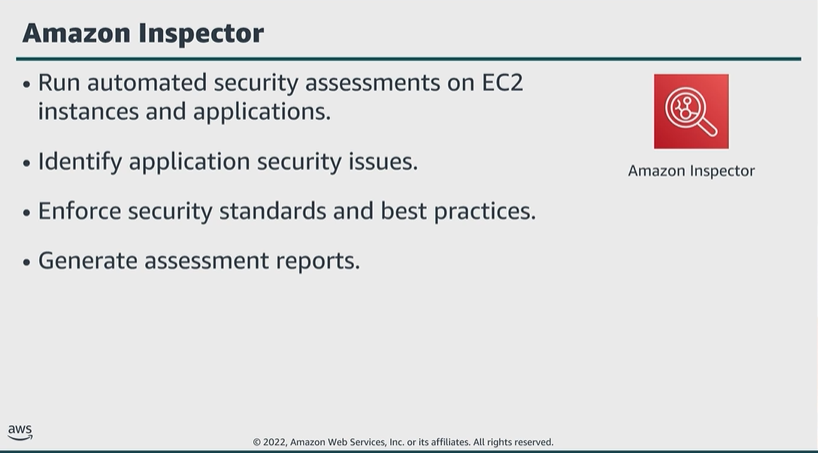

# Module 4: Protecting your compute resources

Favorite: No
Archive: No
Notebook: AWS Cloud Security (../../AWS%20Cloud%20Security%2037a6c6880dca808794ffd649839ae789.md)
Edited: June 11, 2026 3:44 PM
Created: June 11, 2026 3:22 PM

## Amazon Inspector

- Example. The service can help you check for unintended network accessibility of your EC2 instances and for vulnerabilities on those instances.
- Amazon Inspector provides the opportunity to define standards and best practices for your applications, and validate adherence to these standards.
- This simplifies enforcement of your organization’s security standards and best practices, and helps proactively manage security issues before they impact your production application.
- After performing an assessment, Inspector produces a detailed list of security findings, prioritized by level of severity. You can review these findings directly or as part of detailed assessment reports, which are available through AWS Management Console or API.

## Security benefits of Amazon Inspector

- When using Amazon EventBridge events with Amazon Inspector, you can automate tasks to help respond to security issues that Amazon Inspector findings reveal.
- The service provides regular monitoring of your resources.
- Inspector helps to find security vulnerabilities in applications and departures from security best practices, before application is deployed and while running in production. This improves overall security of your AWS hosted applications.
- You benefit from AWS security expertise; Inspector includes a knowledge base of rules charted to common security best practices and vulnerability definitions. AWS constantly updates the security best practices and rules.
- The service helps integrate security into DevOps; Inspector is an API-bound service that analyzes network configurations in your AWS account. The service uses an optional agent for visibility into EC2 instances.
- The agent can help build Amazon Inspector assessments right into existing DevOps process to empower both development and operations teams to make security assessments an essential part of the deployment process.

## AWS Systems Manager

- Systems Manager gives visibility and control of your infrastructure on AWS.
- Systems Manager provides a unified UI, so you can view operational data from multiple AWS services.
- The service includes capabilities that help you automate management tasks.
- You can collect system inventory, apply OS patches, maintain up-to-date antivirus definitions, and configure OS and applications at scale.
- Systems Manager helps keep your systems compliant with your defined configuration policies.

## Key takeaways: Protecting your compute resources

- Amazon Inspector is an automated security assessment service that helps improve the security and compliance of applications deployed on AWS.
- Systems Manager gives visibility and control of your infrastructure on AWS.
- Scan your compute resources regularly for vulnerabilities, and patch them accordingly. You can automate this task by using AWS services such as Lambda and Systems Manager.
