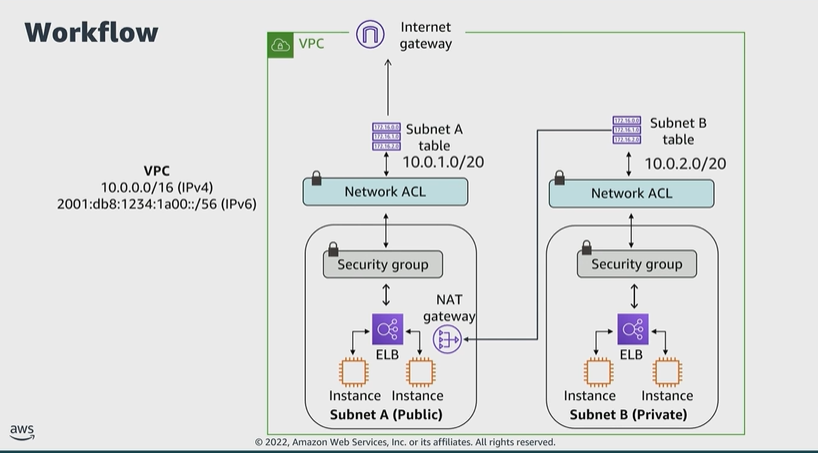

# Module 4: Pulling it all together

Favorite: No
Archive: No
Notebook: AWS Cloud Security (../../AWS%20Cloud%20Security%2037a6c6880dca808794ffd649839ae789.md)
Edited: June 11, 2026 3:10 PM
Created: June 11, 2026 3:02 PM

## Workflow

- The VPC has two subnets.
- Subnet A which is a public subnet, and contains two EC2 instances.
  - Traffic from each instance routes through a load balancer, to a security group, and then to a network ACL.
  - Traffic then routes through a route table to an internet gateway.
- Subnet B, which is a private subnet, contains two EC2 instances.
  - Traffic from each instance routes through a load balancer, to a security group, and then to a network ACL.
  - Traffic then routes through a route table, to a NAT gateway in subnet A, the public subnet.

## Best practices to protect your network

- The first best practice is to apply controls for both inbound and outbound traffic. For a VPC, this includes using security groups, network ACLs, and subnets.
- Use subnets in multiple Availability Zones to separate layers of your application. And configure security groups and network ACLs to only allow necessary traffic inbound and outbound.
- Another best practice is to use threat intelligence and anomaly detection to automate protection mechanisms to provide a self-defending network.
- Limit exposure by only allowing minimum required access.

