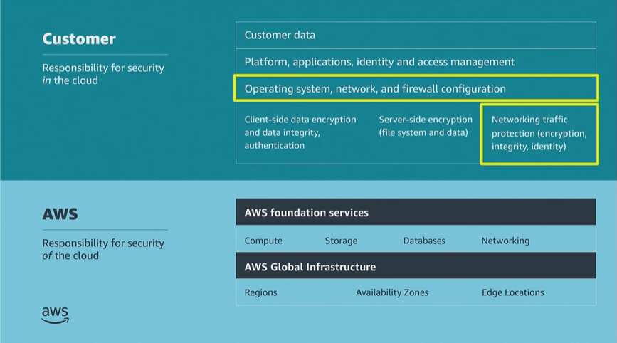

# Module 4: Securing your Infrastructure

Favorite: No
Archive: No
Notebook: AWS Cloud Security (../../AWS%20Cloud%20Security%2037a6c6880dca808794ffd649839ae789.md)
Edited: June 11, 2026 11:04 AM
Created: June 11, 2026 10:47 AM

## Bank Business Scenario

- The developer has realized that the Bank’s security concerns go beyond user access and management.
- To make their case for AWS migration, the developer will need to assume the Bank’s concerns by helping him understand how the Bank’s infrastructure can be properly secured in AWS.
- The developer asked the Bank how they would ensure the security of the infrastructure that any Bank could potentially migrate into AWS.
- The developer decides to focus on using a VPC and applying multiple layers of security to support the network infrastructure.

## Shared Responsibility Model

- This module focuses on the OS, network and firewall configuration and the network traffic protection which the customer is responsible to secure.

