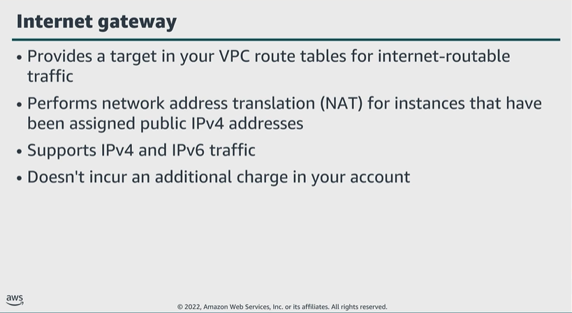

# Module 4: Setting up public and private subnets and internet protocols

Favorite: No
Archive: No
Notebook: AWS Cloud Security (../../AWS%20Cloud%20Security%2037a6c6880dca808794ffd649839ae789.md)
Edited: June 11, 2026 11:56 AM
Created: June 11, 2026 11:30 AM

## Internet Gateway

- To enable access to or from the internet for instances in a VPC subnet, first create an internet gateway and attach it to VPC. Then, add a route to your subnet’s route table that directs internet-bound traffic to the internet gateway. Confirm that each instance in your subnet has a globally unique IP address. And finally, confirm that the network ACL and security group rules allow the relevant traffic to flow to and from the instance.

## NAT Gateway

- To create a NAT gateway, specify the public subnet in which the NAT gateway should reside. You must also specify an elastic IP address to associate with that NAT gateway. After creating the NAT gateway, update the route table to point internet-bound traffic to the NAT gateway, thus instances in private subnets can communicate with the internet.

## Private subnet

- The IP addresses should not overlap with other subnets in the VPC.
- By using an AWS managed NAT gateway. EC2 instances can make outbound requests, such as for patching, and the response from the external resource will be allowed back in.

## Public subnet

## IP addressing

- IP addresses enable resources in the VPC to communicate with each other and with resources over the internet.
- After creating a VPC, you can’t change the CIDR block range in that VPC, so choose carefully.
- Note that CIDR ranges of subnets should not overlap.

## Reserved IP addresses

- When creating a subnet, it requires its own CIDR block. For each CIDR block you specify, AWS reserves 5 IP addresses in that block. You can’t use these 5 addresses.

## Public IP address

- When you create a VPC, every instance in that VPC gets a private IP address automatically.
- You can also request a public IP address to be assigned when you create the instance by modifying the subnet’s auto-assign public IP address properties.

## Elastic IP address

- An elastic IP address is a static, public IP address designed for dynamic cloud computing.
- You can associate an elastic IP address with any instance or network interface for any VPC in your account.
  - By using an elastic IP address, you can mask the failure of an instance or software by rapidly remapping the address to another instance in your account. Alternatively, you can specify the elastic IP address in a DNS record for your domain, so that your domain points to your instance.

## Elastic network interface

- When you move a network interface from one instance to another, network traffic is redirected to the new instance.
- You can’t detach a primary network interface from an instance, but you can create and attach an additional network interface to any instance in your VPC.

## Route tables and routes

- The destination is a CIDR block where you want traffic to go.
- The target is the gateway, network interface, or connection that destination traffic is sent through.
- You can customize route tables by adding routes.
- Each subnet should have its own route table or it will use the main route table of the parent VPC.

## Key takeaways: Setting up public and private subnets and internet protocols

- Public subnets are used when external traffic needs to reach an interface, such as an EC2 instance.
- Private subnets are often used to host database instances that don’t need to be accessed through the public internet.
- Route tables determine where traffic is routed in your VPC.
