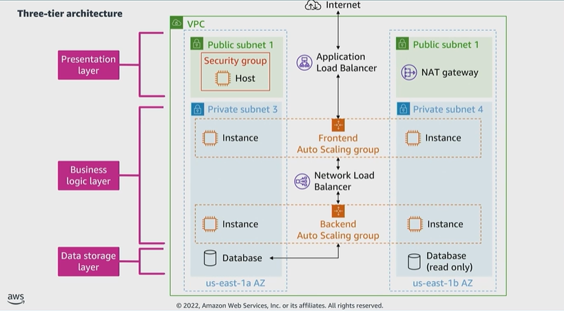

# Module 4: Structure of three-tier web application

Favorite: No
Archive: No
Notebook: AWS Cloud Security (../../AWS%20Cloud%20Security%2037a6c6880dca808794ffd649839ae789.md)
Edited: June 11, 2026 11:12 AM
Created: June 11, 2026 11:08 AM

## Three-tier-architecture

- The three logical tiers:
  - Presentation Layer
  - Business Logic Layer
  - Data Storage Layer
- This architecture is used in a client/server application such as a web app that has a frontend, a backend, and a database.
- Each layer or tier performs a specific task and can be managed independently of each other.
- This represents a shift from the monolithic way of building an application where the frontend, backend, and database are all in one place.

