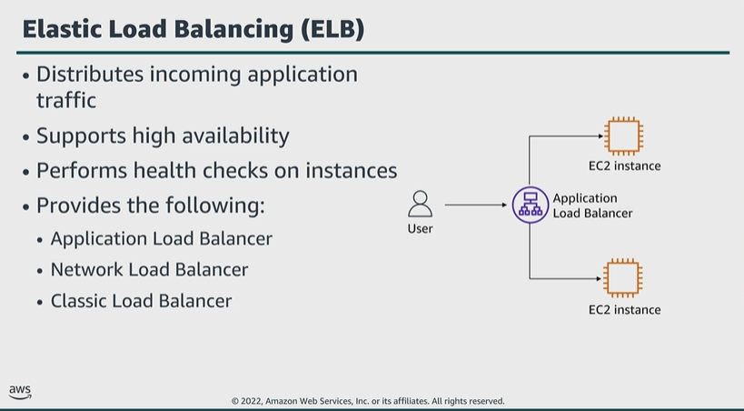

# Module 4: Using AWS Load Balancers

Favorite: No
Archive: No
Notebook: AWS Cloud Security (../../AWS%20Cloud%20Security%2037a6c6880dca808794ffd649839ae789.md)
Edited: June 11, 2026 3:01 PM
Created: June 11, 2026 2:17 PM

## Elastic Load Balancing

- You configure the load balancer to accept incoming traffic by specifying one or more listeners.
- A listener is a process that checks for connection requests.
- ELB scales your load-balancing device as traffic to your application changes over time, and can scale to the vast majority of workloads automatically. This increases the availability and fault tolerance of applications.
- During health checks, the load-balancing device can send requests to only healthy targets.
- When the load balancer detects an unhealthy target, it stops routing traffic to that target. It will only resume when it detects the target is healthy again.
- ELB is integrated with other popular AWS services like:
  - Amazon EC2 Auto Scaling
  - Amazon Elastic Container Service (ECS)
  - AWS CloudFormation
  - AWS Certificate Manager (ACM)
- ELB supports three types of load balancers:
  - **Application**:
    - Operates at request level, and routes traffic to targets such as EC2 instances, containers, IP addresses, and Lambda functions, based on context of request.
    - It’s ideal for advanced load balancing of HTTP and HTTPS traffic.
    - This type of load balancer provides advanced request routing, targeted at delivery of modern application architectures, including microservices and container-based apps.
    - An Application Load Balancer simplifies and improves security of the app, by ensuring latest SSL and TLS ciphers and protocols are always used.
  - **Network**:
    - Operates at connection level, and routes connections to targets such as EC2 instances, microservices, and containers within a VPC based on IP protocol data.
    - It’s ideal for load balancing both TCP and UDP traffic.
    - This type of load balancer is capable of handling millions of requests per second while maintaining ultra-low latency.
    - A Network Load Balancer is optimized to handle sudden and volatile traffic patterns while using a single static IP address per Availability Zone.
  - **Classic**:
    - A Classic Load Balancer provides basic load balancing across multiple EC2 instances, and operates at both the request level and connection level.
    - It is intended for applications that are built within the EC2-Classic network.

## Data protection in ELB (how is data protected in ELB)

- First, a load balancer serves as the single point of contact for clients. The load balancer distributes incoming application traffic across multiple targets in multiple Availability Zones.
- This increases the availability of your app.
- An Application Load Balancer can sustain secure HTTPS communication and certificates for communication with clients. It can optionally terminate the SSL connection at the load balancer level so that you don’t need to handle certificates in your own app.
- Second, if you enable server-side encryption with Amazon S3 managed encryption keys (SSE-S3), for your S3 bucket for ELB access logs, the ELB service automatically encrypts each access log file before storing in your bucket.
- ELB also decrypts the access log files when you access them.
- Each log file is encrypted with a unique key, which is itself encrypted with a key that’s regularly rotated.
- Third, ELB simplifies the process of building secure web applications by terminating HTTPS and TLS traffic from clients at the load balancer.
- The load balancer performs the work of encrypting and decrypting the traffic, instead of requiring each EC2 instance to handle the work for TLS termination.

## Load balancers in action

- The VPC has subnets in two Availability Zones, and each Availability Zone has a public subnet and multiple private subnets.
- Internet traffic goes from an internet gateway to each Availability Zone.
- A load balancer in each public subnet directs traffic to web servers in a private subnet in either Availability Zone.
- Traffic from the web server goes to a load balancer, which directs the traffic to application servers in another private subnet in either Availability Zone.
- Traffic from the application servers goes to the primary database server in another private subnet in the first Availability Zone, and the primary database can communicate with a standby database server in a private subnet in the second Availability Zone.

## Key takeaways: Using AWS load balancers

- ELB automatically distributes incoming application traffic across multiple targets, such as EC2 instances, containers, IP addresses, and Lambda functions.
- ELB can handle the varying loads of your application traffic in a single Availability Zone or across multiple Availability Zones.
- You can add and remove instances from your load balancers as your needs change, without disrupting the overall flow of requests to your application.
