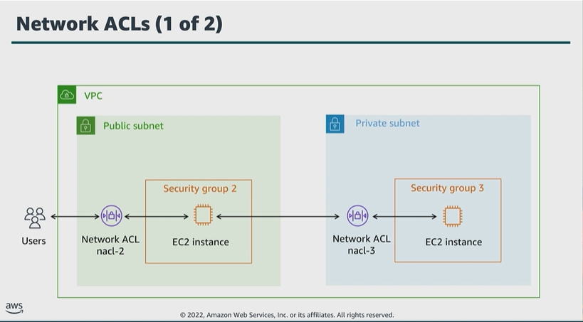

# Module 4: Using AWS Network ACLs

Favorite: No
Archive: No
Notebook: AWS Cloud Security (../../AWS%20Cloud%20Security%2037a6c6880dca808794ffd649839ae789.md)
Edited: June 11, 2026 1:17 PM
Created: June 11, 2026 12:30 PM

## Network ACLs 1

- A network ACL is an optional layer of security for your VPC, and acts as a firewall to control traffic in and out of one or more subnets.
- To add another layer of security to your VPC, you can set up network ACLs with rules that are similar to your security group rules.
- Each subnet in your VPC must be associated with a network ACL. If you don’t explicitly associate a subnet with a network ACL, the subnet is automatically associated with the default network ACL.
- You can associate a network ACL with multiple subnets; however, a subnet can be associated with only one network ACL at a time.
- When you associate a network ACL with a subnet, the previous association is removed.

## Network ACLs 2

- Network ACLs are stateless so responses to inbound traffic are subject to the rules for outbound traffic, and vice versa.
- The table shows a default network ACL for a VPC that supports IPv4 only.
- Rules are evaluated in number order before a decision is made to allow traffic. And, each network ACL also includes a rule whose rule number is an asterisk. This rule ensures that if a packet doesn’t match any of the other numbered rules, it’s denied. You can’t modify or remove this rule.

## Comparing security groups and network ACLs

## VPC security features

- Security groups act as virtual firewalls for your EC2 instances to control inbound and outbound traffic.
- Network ACLs provide an optional layer of security for your VPC. They act as firewalls to control traffic in and out of one or more subnets.
- Subnets make networks more efficient. Through subnetting, network traffic can travel a shorter distance without passing through unnecessary routers to reach its destination. And route tables control where network traffic is directed.
- Another feature of VPCs is VPC Flow Logs. With this feature, you can capture information about the IP traffic going to and from network interfaces in your VPC.
- You can publish flow log data to Amazon CloudWatch Logs or Amazon S3. After you create a flow log, you can retrieve and view its data in the chosen destination.
- You can create a flow log for a VPC, subnet, or network interface.
- If you create a flow log for a subnet or VPC, each network interface in that subnet is monitored.
- Flow log data for a monitored network interface is recorded as flow log records, which are log events consisting of fields that describe the traffic flow.

## Key takeaways: Using AWS network ACLs

- A network ACL is an optional layer of security for your VPC and acts as a firewall to control traffic at the subnet level.
- Each subnet in your VPC must be associated with a network ACL.
- Network ACLs are stateless, which means that responses to inbound traffic are subject to the rules for outbound traffic (and vice versa).
- Rules are evaluated in number order before a decision is made to allow traffic.
