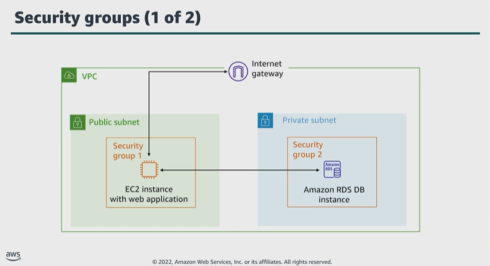

# Module 4: Using AWS security groups

Favorite: No
Archive: No
Notebook: AWS Cloud Security (../../AWS%20Cloud%20Security%2037a6c6880dca808794ffd649839ae789.md)
Edited: June 11, 2026 12:14 PM
Created: June 11, 2026 11:57 AM

## Security groups 1

- A security group acts as a virtual firewall for your instance, and it controls inbound and outbound traffic.
- Security groups act at instance level, not the subnet level. Therefore, each subnet in your VPC can be assigned to a different set of security groups.
- At basic level, a security group is a way to filter traffic to your instances.

## Security groups 2

- When you create a security group, it doesn’t have any inbound rules. Therefore, inbound traffic that originates from another host to your instance isn’t permitted until you add inbound rules to the security group.
- You can remove the default rule which allows all outbound traffic and add outbound rules that allow specific outbound traffic only.
- If your security group doesn’t have any outbound rules, then outbound traffic that originates from your instance isn’t allowed.
- Security groups are stateful which means that safe information is kept even after a request is processed. Thus, if you send a request from your instance, the response traffic for that request is allowed to flow in regardless of inbound security group rules.
- Responses to allowed inbound traffic are allowed to flow out, regardless of outbound rules. All rules are evaluated before a decision is made to allow traffic.
- The table below indicate that inbound traffic is allowed from any network interface assigned to the same security group.
- All outbound traffic is allowed.

## Key takeaways: Using AWS security groups

- A security group acts as a virtual firewall for an instance to control inbound and outbound traffic.
- Security groups are stateful, which means that state information is kept even after a request is processed.
- All rules are evaluated before a decision is made to allow traffic.
