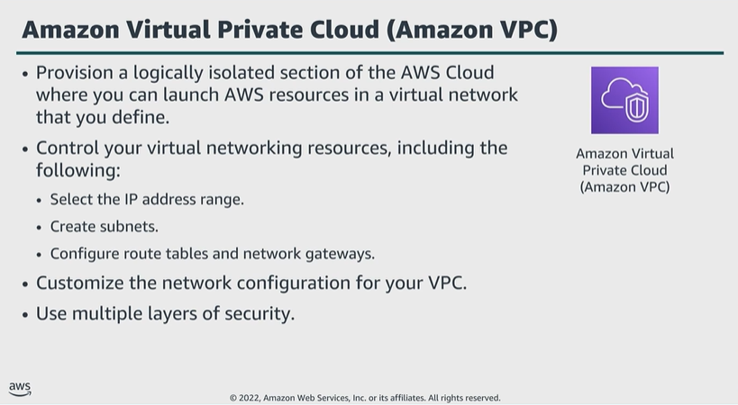

# Module 4: Using a VPC

Favorite: No
Archive: No
Notebook: AWS Cloud Security (../../AWS%20Cloud%20Security%2037a6c6880dca808794ffd649839ae789.md)
Edited: June 11, 2026 11:22 AM
Created: June 11, 2026 11:14 AM

## Amazon VPC

- You can customize network configuration of VPC. Example. You can create a public subnet for your web servers that can access the public internet. You can place backend systems such as databases or application servers, in a private subnet without public internet access.
- You can use multiple layers of security in a VPC to help control access to Amazon Elastic Compute Cloud, or Amazon EC2, instances in the VPC’s subnets.
- Security mechanisms include security groups and network ACLs.

## VPCs and subnets

- After creating a VPC, you can divide into one or more subnets.

