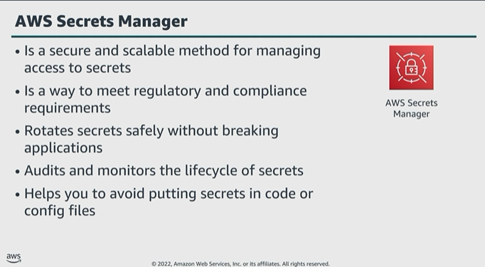

# Module 5: Additional data protection services

Favorite: No
Archive: No
Notebook: AWS Cloud Security (../../AWS%20Cloud%20Security%2037a6c6880dca808794ffd649839ae789.md)
Edited: June 15, 2026 7:32 PM
Created: June 15, 2026 7:03 PM

## AWS Secrets Manager

- AWS Secrets Manager service makes it easier for you to manage secrets. Secrets can be database credentials, passwords, third-party API keys, and arbitrary text. You can store and control access to these secrets centrally by using the AWS CLI, or API and SDKs.
- With Secrets Manager, you can remove hard-coded credentials, including passwords, from your source code, and avoid storing credentials in a configuration file. Instead, you use an API call to Secrets Manager to retrieve the secret programatically. This helps ensure that the secret cannot be compromised by someone examining the code, becasue the secret isn’t even there.
- You can also configure Secrets Manager to automatically rotate the secret for you, according to a schedule that you specify. Therefore, you can replace long-term secrets with short-term ones, which helps to significantly reduce the risk of compromise.

## Using Secrets Manager

- This approach uses an AWS Lambda function, which uses credentials from Secrets Manager to connect to and query a backend Amazon Relational Database Service (RDS).
- This is done without hardcoding the secrets in code or passing them through environment variables. This approach helps secure last-mile secrets and protect your backend databases.

1. Clients call the RESTful API hosted on Amazon API Gateway.
2. API Gateway runs the Lambda function.
3. The Lambda function retrieves the database secrets using the Secrets Manager API.
4. Secrets Manger retrieves the secret, decrypts the protected secret text, and returns it in a function over a secure channel.
5. The Lambda function connects to the RDS database by using database secrets from Secrets Manager, and returns the query results.

## Rotating secrets

- With Secrets Manager, you can automatically rotate passwords for Amazon Aurora, MySQL, MariaDB, PostgreSQL, and Oracle databases hosted on AWS.
- To turn automatic rotation, you need administrator permissions.
- This rotation is done without human intervention through a Lambda function, either on a specified schedule or as needed.
- For Amazon RDS DB engine credentials, this Lambda function already exists. But if you have other credentials with an expiration, such as a SAML login, you might want to create a custom function for use with Secrets Manager.
- The rotation function does the work of rotating the secret. The process to rotate a secret has four steps, which correspond to four steps in the Lambda rotation function.
- Secrets Manager uses staging labels to label secret versions during rotation.

1. The function contacts the database for new credentials.
2. Secrets Manger stores the new credentials with AWSPENDING label.
3. The new credentials are tested.
4. The new credentials are made a default with the AWSCURRENT label.

## Amazon Macie

- Amazon Macie is a security service that uses machine learning to automatically discover, classify, and protect sensitive data in AWS.
- Macie recognizes personally identifiable information, or PII, such as passport numbers, medical ID numbers, and tax ID numbers.
- Currently, Macie only protects data stored in S3 only, and is available in most AWS Regions.
- Macie has dashboards and alerts that give visibility into data access by analyzing S3 resource-based policies and ACLs during sensitive data recovery.
- The service continuously monitors data and generates detailed alerts when it detects risk of unauthorized access or inadvertent data leaks.
- With Macie, you have full control of the service through the Macie API set, and you can centrally manage Macie for multiple accounts.
- You can also use native Macie features for managing multiple accounts, which enables you to manage as many as 1,000 member accounts with a single Macie administrator account.

## Classify data and monitor its access permissions

- Macie can help classify sensitive and business-critical data at S3 bucket level.
- You can further configure these sensitive data discovery jobs. Example. Only classify PDF documents or classify all objects except those with a particular prefix.
- By default, Macie will continuously monitor all buckets in any account in which it is enabled.

## Macie Summary Dashboard

- The Macie summary page in the console provides an overview of the buckets that have been through the Macie discovery process.
- As mentioned, buckets are monitored for allowing public access, not being encrypted, and being shared or replicated outside of your account.

## Macie Findings Dashboard

- A Macie job analyzes data in specific S3 buckets for sensitive data.
- Each job uses managed data identifiers that Macie provides and optionally, custom data identifiers you create.
- The service provides the ability to run one-time, daily, weekly, or monthly sensitive data discovery jobs for all, or a subset of, objects in an S3 bucket.
- For sensitive data discovery jobs, Macie automatically tracks changes to the bucket and only evaluates new or modified objects over time.

## Key takeaways: Additional data protection services

- Secrets Manager helps protect access to applications, services, and IT resources.
- Macie uses machine learning and pattern matching to discover and protect sensitive data in AWS.
