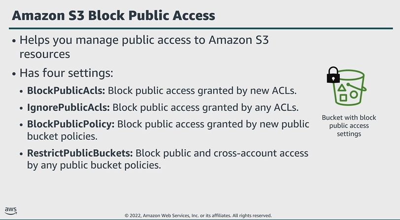

# Module 5: Amazon S3 protection features

Favorite: No
Archive: No
Notebook: AWS Cloud Security (../../AWS%20Cloud%20Security%2037a6c6880dca808794ffd649839ae789.md)
Edited: June 12, 2026 3:11 PM
Created: June 12, 2026 2:18 PM

## Amazon S3 Block Public Access

- By default, new buckets and objects don’t allow public access, but users can modify bucket policies or object permissions to allow public access.
- S3 Block Public Access provides settings that override these policies and permissions so that you can limit public access to these resources.
- BlockPublicACLs:
  - Prevents any new operations to make buckets or objects public through bucket or object ACLs.
  - Existing policies and ACLs for buckets and objects aren’t modified.
- IgnorePublicACLs:
  - Used to ignore all public ACLs on a bucket and any objects in it.
- BlockPublicPolicy:
  - Rejects calls to put a bucket policy if the policy allows public access.
  - Enabling this setting doesn’t affect existing bucket policies.
- RestrictPublicBuckets:
  - Used to restrict access to a bucket with a public policy to only AWS services and authorized users within the bucket owner’s account.
- These settings are independent and can be used in any combination. You can apply each setting to an access point, a bucket, or an entire AWS account.
- You cannot apply these settings on a per object basis.
- If the Block Public Access settings for the access point, bucket, or account differ, then S3 applies the most restrictive combination of the settings.
- When S3 receives a request to access a bucket or object, the service determines whether the bucket or the bucket owner’s account has a Block Public Access setting applied.
- If an existing Block Public Access setting prohibits the requested access, S3 rejects the request.
- In addition to these settings, Amazon S3 console highlights your publicly accessible buckets, indicates the source of public accessibility, and warns you if changes to your bucket policies or bucket ACLs would make your bucket publicly accessible.

## Amazon S3 Versioning

- Versioning in S3 is a method of keeping multiple variants of an object in the same bucket. With this feature, you can preserve, retrieve, and restore every version of every object stored in your buckets.
- By default, S3 versioning is disabled on buckets, and you must explicitly enable it.
- Instead of removing an object permanently when it is deleted, S3 inserts a delete marker, which becomes the current object version, additionally a previous version can be restored.

## Amazon S3 Object Lock

- This feature provides protection for scenarios where it’s imperative that data isn’t changed or deleted.
- You can use Object Lock to meet regulatory requirements that require WORM storage or add an extra layer of protection against object changes and deletion.
- Object Lock works only in versioned buckets.
- Object Lock provides two ways to manage object retention.
  - Retention periods:
    - A retention period specifies a fixed period, during which an object remains locked.
    - During this period, your object is WORM protected and can’t be overwritten or deleted.
  - Legal holds:
    - Legal hold provides same protection as retention period, but has no expiration date. Instead, a legal hold remains in place until explicitly removed.
- You can configure Object Lock in one of two modes:
  - Governance:
    - User’s can’t overwrite or delete an object version or alter its lock settings, unless they have special permissions.
  - Compliance:
    - Stronger immutability to comply with regulations.
    - In compliance mode, a protected object version can’t be overwritten or deleted by any user, including the root user in your AWS account.

## Key takeaways: Amazon S3 protection features

- Block Public Access ensures that objects never have public access, now and in the future.
- Versioning preserves, retrieves, and restores every version of every object stored in an S3 bucket.
- Object Lock prevents an object version from being deleted or overwritten for a fixed amount of time or indefinitely.
