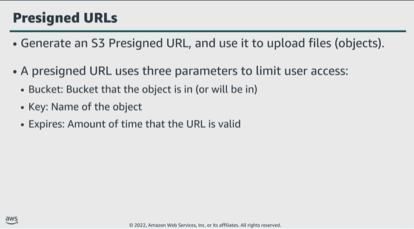

# Module 5: Best practices to protect data in Amazon S3

Favorite: No
Archive: No
Notebook: AWS Cloud Security (../../AWS%20Cloud%20Security%2037a6c6880dca808794ffd649839ae789.md)
Edited: June 15, 2026 6:33 PM
Created: June 15, 2026 6:13 PM

## Presigned URLs

- All objects in an S3 bucket are private by default. Only the object owner has permissions to access these objects. However, the object owner can optionally share objects with others by creating a pre-signed URL using their own security credentials to grant time-limited permissions to upload or download the objects.
- A pre-signed URL grants temporary access to a specific S3 object. By using the URl, a user can read, write, or update the object.
- Example. If you have a video in your bucket, and both bucket and video are private, you can share the video with others by generating a pre-signed URL.
- Similarly, if you want to receive an object from a user without an AWS account, they can upload an object by using a pre-signed URl that you share with them.

## Security considerations and best practices

- Use encryption as an additionall access control to compliment the identity resource, and network-oriented access controls already described.
- AWS provides a number of features that can help easily encrypt data and manage the keys.
- All AWS services offer the ability to encrypt data at rest and in transit.
- Use bucket policies along with IAM policies to protect resources from unauthorized access, and to prevent information disclosure, data integrity compromise, or deletion.
- Enable MFA delete for versioning-enabled buckets to ensure tht files can’t be removed or tampered with.
- Enforce SSE for each PUT request. This would lead to a deny in cases where the end user doesn’t request SSE.
- Authentication and Authorization must be done in the application.
- Set default encryption on a bucket if you want all objects to be encrypted once stored in the bucket.
- While using S3 Object Lock, use appropriate retention mode; governance or compliance. These retention modes apply different levels of protection to your objects. You can apply either retention mode to any object version that’s protected by S3 Object Lock.
- Use S3 Block Public Access to enfore that buckets don’t allow public access to data.
- Use SFTP for file transfer in and out of S3. Using this eliminates the need for managing SFTP-related infrastructure. With the data in S3, you can easily integrate it into workloads that use a broad array of AWS services.
- Use S3 versioning to preserve, retrieve and restore every version of every object stored in your S3 bucket.

