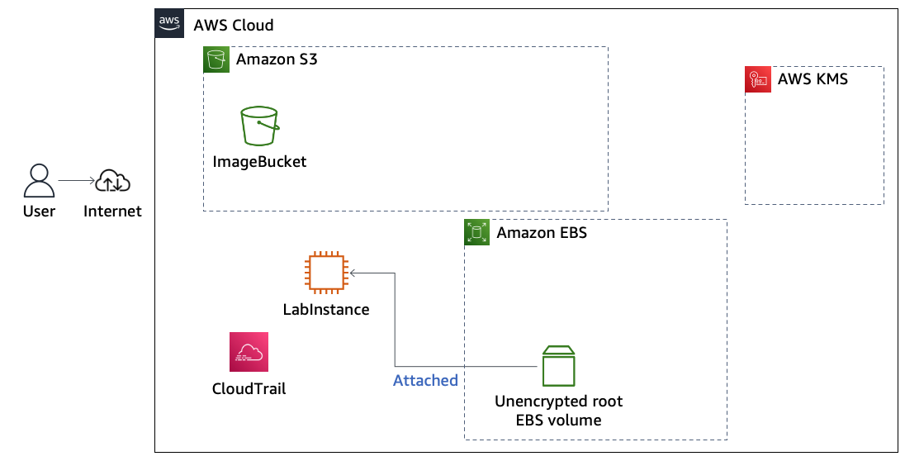

# Module 5: Lab 5.1 - Encrypting Data at Rest by Using AWS KMS

Favorite: No
Archive: No
Notebook: AWS Cloud Security (../../AWS%20Cloud%20Security%2037a6c6880dca808794ffd649839ae789.md)
Edited: June 15, 2026 7:36 PM
Created: June 15, 2026 7:32 PM

# **Lab 5.1: Encrypting Data at Rest by Using AWS KMS**

## **Lab overview and objectives**

In this lab, you will use the AWS Key Management Service (AMS KMS) to encrypt data at rest. You will create an AWS KMS key, use it to encrypt objects stored in Amazon Simple Storage Service (Amazon S3), and use it to encrypt Amazon Elastic Block Store (Amazon EBS) volumes. You will also see how AWS CloudTrail provides an audit log of AWS KMS key usage and how disabling the key affects data access.

After completing this lab, you should be able to do the following:

- Create an AWS KMS customer managed key to encrypt and decrypt data at rest.
- Store an encrypted object in an S3 bucket by using an encryption key.
- Attempt public access and signed access to an encrypted S3 object.
- Monitor encryption key usage by using the CloudTrail event history.
- Encrypt the root volume of an existing Amazon Elastic Compute Cloud (Amazon EC2) instance.
- Disable and re-enable an AWS KMS key and observe the effects on data access.

## **Duration**

This lab will require approximately **75 minutes** to complete.

## **AWS service restrictions**

In this lab environment, access to AWS services and service actions might be restricted to the ones that are needed to complete the lab instructions. You might encounter errors if you attempt to access other services or perform actions beyond the ones that are described in this lab.

## **Scenario**

The following diagram shows the architecture that was created for you in AWS at the _beginning_ of the lab. AWS Cloud resources include an empty S3 bucket named ImageBucket, and an EC2 instance named LabInstance, which has an unencrypted root EBS volume attached.



By the _end_ of this lab, you will have created the architecture shown in the following diagram. This diagram also shows some of the actions you will take and communication that will occur between the Amazon S3, Amazon EBS, AWS KMS, and CloudTrail services during the lab.


**Diagram description:** User connected to AWS Cloud resources through the internet. ImageBucket contains an object encrypted with server-side encryption with AWS KMS, known as SSE-KMS. Bucket also contains an encrypted data key, stored as metadata with the encrypted object. The unencrypted root EBS volume has been detached from LabInstance. A snapshot was created of this volume, and the snapshot was used to create an encrypted root EBS volume. The encrypted volume is attached to LabInstance. Requests to encrypt or decrypt S3 objects and EBS volumes are sent to AWS KMS, where the customer managed key named MyKMSKey is stored. CloudTrail logs AWS KMS key usage as events. **End description.**

## **Accessing the AWS Management Console**

1. At the top of these instructions, choose **Start Lab**.
   - The lab session starts.
   - A timer displays at the top of the page and shows the time remaining in the session.
     **Tip:** To refresh the session length at any time, choose **Start Lab** again before the timer reaches 0:00.
   - Before you continue, wait until the circle icon to the right of the AWS link in the upper-left corner turns green. When the lab environment is ready, the AWS Details panel will also display.
2. To connect to the AWS Management Console, choose the **AWS** link in the upper-left corner, above the terminal window.
   - A new browser tab opens and connects you to the console.
     **Tip:** If a new browser tab does not open, a banner or icon is usually at the top of your browser with the message that your browser is preventing the site from opening pop-up windows. Choose the banner or icon, and then choose **Allow pop-ups**.

## **Task 1: Creating an AWS KMS key**

In this task, you will create a customer managed AWS KMS key. The _AWS KMS key_ that you create will be used later in the lab to generate, encrypt, and decrypt _data keys_. The data keys will be shared with other AWS services, including Amazon S3 and Amazon EC2. The data keys will be used to encrypt the actual data stored in an S3 bucket and on EBS volumes.

1. Create a customer managed AWS KMS key.
   - In the AWS Management Console, in the search box to the right of **Services**, search for `KMS` and choose **Key Management Service** to open the AWS KMS console.
   - In the navigation pane, choose **Customer managed keys**.
     **Tip:** To open the navigation pane, choose the menu icon in the upper-left corner.
   - Choose **Create key**.
   - For **Key type**, choose **Symmetric**.
     **Note:** Symmetric keys never leave AWS KMS unencrypted. The key that you create will be a 256-bit secret key.
   - Choose **Next**.
   - For **Alias**, enter `MyKMSKey`
   - Choose **Next**.
   - For **Key administrators**, search for and choose the `voclabs` role.
     **Note:** _Key administrators_ are users or roles that will _manage access to_ the encryption key. You are currently logged in to the console with the voclabs role. This user role is displayed in the upper-right corner of the console, to the left of the AWS Region.
   - Choose **Next**.
   - On the **Define key usage permissions** page, search for and choose the `voclabs` role again.
     **Note:** _Key users_ are the users or roles that can _use the key_ to encrypt and decrypt data.
   - Choose **Next**.
   - At the bottom of the **Review** page, choose **Finish**.
     Your key displays in the list of customer managed keys.
     **Note:** If you attempted this lab within the past 7 days, you might see an older key or older keys in this list, with the status _Pending deletion_. The minimum amount of time that must transpire between when you request that a key be scheduled to be deleted and when it's actually deleted is 7 days.

In this task, you created an AWS KMS key, which you will use in the next task.

## **Task 2: Storing an encrypted object in an S3 bucket**

In this task, you will upload an image file to an S3 bucket. You will encrypt the file by using the encryption key that you created in the previous task.

1. To download the file named clock.png to your computer, choose the following link: [Download](https://aws-tc-largeobjects.s3.us-west-2.amazonaws.com/CUR-TF-100-ACSECF-1-DEV/lab-5.1-kms/s3/clock.png).
2. Locate the S3 bucket and analyze its encryption settings.
   - In the search box to the right of **Services**, search for and choose **S3** to open the Amazon S3 console.
   - In the navigation pane, choose **Buckets**.
   - Choose the link for the bucket name that contains **imagebucket**.
   - Choose the **Properties** tab.
   - In the **Default encryption** section, notice that the setting is currently enabled.
     When this setting is enabled, new objects that are stored in the bucket are automatically encrypted. This setting is enabled by default.
3. Upload a file to the bucket and store it as an encrypted object.
   - At the top of the page, choose the **Objects** tab.
   - Choose **Upload**.
   - Choose **Add files**.
   - Browse to and select the **clock.png** file on your computer.
   - Expand the **Properties** section, and configure the following:
     - In the **Server-side encryption settings** section, choose **Specify an encryption key**.
     - **Encryption key type:** Choose **AWS Key Management Service key (SSE-KMS)**.
     - **AWS KMS key:** Select **Choose from your AWS KMS keys**.
     - **AWS KMS key** dropdown menu: Choose **MyKMSKey**.
   - At the bottom of the page, choose **Upload**.
   - After the upload completes, choose **Close** in the upper-right corner.
     Notice that clock.png is now listed as an object in the bucket.
     The following diagram and description explain what transpired when you uploaded the file to Amazon S3.
     

| **Step** | **Explanation**                                                                                                                                                                |
| -------- | ------------------------------------------------------------------------------------------------------------------------------------------------------------------------------ |
| 1        | The user requested to upload a file and store it as an encrypted object in ImageBucket.                                                                                        |
| 2        | Amazon S3 requested a data key from AWS KMS to use to encrypt the file.                                                                                                        |
| 3        | AWS KMS generated a plaintext data key and encrypted the data key by using the customer managed key MyKMSKey.                                                                  |
| 4        | AWS KMS sent both copies of the data key to Amazon S3.                                                                                                                         |
| 5        | Amazon S3 encrypted the object by using the plaintext data key, stored the object, and then deleted the plaintext data key. The encrypted key was kept in the object metadata. |

1. Analyze the encryption settings on the object.
   - Choose the link for the **clock.png** object.
   - On the **Properties** tab, find the **Server-side encryption settings** section.
     Notice that server-side encryption using SSE-KMS is enabled on this object.

In this task, you analyzed the encryption settings on the bucket. You then uploaded an object to the bucket. Although the bucket's settings do not automatically encrypt objects that you upload, you had the _option_ to encrypt an object that you uploaded.

## **Task 3: Attempting public access to the encrypted object**

In this task, you will attempt to access the encrypted object by using the S3 object URL. This URL is a method to access an S3 object from the public internet.

1. Attempt to open the image by using the S3 object URL.
   - In the **Object overview** section at the top of the page, copy the **Object URL** to your clipboard.
     **Note:** Notice that the URL is in the following format: _https://.s3.amazonaws.com/_.
   - Paste the object URL into a new browser tab, and attempt to load the page.
     You receive the following _Access Denied_ error.
     
     **Note:** The S3 object URL is one method to provide public internet access to an S3 object. However, by default, when you create an S3 bucket, public access to objects is not allowed. The default _Block all public access_ security setting is applied to this bucket and all objects stored in it.
   - Keep the browser tab open, because you will return to this page in a moment. Return to the browser tab where the Amazon S3 console is open.
2. Modify the public access permissions for the _bucket_.
   - In the breadcrumbs, which are located in the upper-left corner of the page, choose the bucket name, which contains **imagebucket**.
   - Choose the **Permissions** tab.
   - In the **Block public access** section, choose **Edit**.
   - Clear **Block _all_ public access**.
   - Choose **Save changes**.
   - When prompted, enter `confirm` and choose **Confirm**.
3. Modify the access settings for the _object_.
   - Choose the link for the bucket name that contains **imagebucket** and choose the **Permissions** tab.
   - Under **Object Ownership** choose edit. Choose **ACLs enabled**.
   - Select the checkbox for the acknowledgement. Keep **Bucket owner preferred** selected, and choose **Save changes**.
   - Choose the **Objects** tab, and then select **clock.png**.
   - Choose **Actions** > **Make public using ACL**.
   - Choose **Make public**.
     A banner displays to indicate that the public access settings were successfully edited.
   - Choose **Close**.
4. Test access to the object again by using the S3 object URL.
   - Return to the browser tab that you opened earlier and attempted to load the S3 object URL.
   - Refresh the page.
     You now see a different error display. Instead of the Access Denied error that you saw earlier, you now see the following _Invalid Argument_ error.
     
     **Analysis:** _Access_ to the object is now granted to the public internet (through the object URL); however, because the image is encrypted, you are still not able to view it.
     This is a good thing, because it demonstrates an important reason that you might choose to encrypt data. In cases where access to data might be accidentally granted to someone who should not have access, the person won't be able to read the data unless they _also_ have access to the encryption key. The encryption key is needed to decrypt the data and make it human readable again.
     The error message indicates that _Requests specifying Server Side Encryption with AWS KMS managed keys require AWS Signature Version 4._ Signature Version 4 is the process to add authentication information to AWS requests.

- Close the browser tab where you loaded the S3 object URL.

In this task, you experienced how the encrypted object that is stored in Amazon S3 was first not accessible through the internet. Then, you discovered that, even when you made the object available to the internet, you weren't able to successfully access the object. This happened because requests that specify SSE-KMS require AWS Signature Version 4, and you did not sign the request.

## **Task 4: Attempting signed access to the encrypted object**

In this task, you attempt to decrypt the encrypted object from within the Amazon S3 console as an authenticated user.

1. Open the stored encrypted object.
   - In the Amazon S3 console, make sure you are on the **Objects** tab for the bucket with **imagebucket** in its name.
   - Select **clock.png**, and then choose **Open**.
     The following image opens in a new tab or window.
     
2. Analyze the URL that was used to successfully decrypt the object.
   - Notice the URL in the browser tab where the image is open. The format is similar to the following (where the `...` values contain credentials information).
     ```
     https://c46588a730572l1728517t1w501832962033-imagebucket-gmnhbh84muj.s3.us-east-1.amazonaws.com/clock.png?response-content-disposition=inline&X-Amz-...&X-Amz-...&X-Amz-...&X-Amz-...&X-Amz-...&X-Amz-...&X-Amz-...
     ```
   - Close the browser tab where the image is loaded, and return to the Amazon S3 console.
     The following diagram and description explain what transpired when you requested to open the stored encrypted object.
     

| **Step** | **Explanation**                                                                                                                                                                                                                                    |
| -------- | -------------------------------------------------------------------------------------------------------------------------------------------------------------------------------------------------------------------------------------------------- |
| 1        | You requested to open the object.                                                                                                                                                                                                                  |
| 2        | Next, Amazon S3 noticed that the requested object was encrypted. Because you were authenticated to the AWS account when using the Amazon S3 console, the Signature Version 4 authentication information was automatically included in the request. |
| 3        | Amazon S3 then sent the encrypted copy of the *data key* that the object was encrypted with to AWS KMS.                                                                                                                                            |
| 4        | AWS KMS then *decrypted the data key* by using the MyKMSKey *AWS KMS key* (which never leaves the AWS KMS service).                                                                                                                                |
| 5        | AWS KMS then sent the *plaintext data key* back to Amazon S3.                                                                                                                                                                                      |
| 6        | Finally, Amazon S3 decrypted the ciphertext of the data object, allowed you to open the object, and deleted the plaintext copy of the data key.                                                                                                    |

## **Task 5: Monitoring AWS KMS activity by using CloudTrail**

In this task, you will access the CloudTrail event history to find events that are related to your encryption operations. The CloudTrail audit log functionality provides an important security feature, and it's a good idea to monitor how AWS KMS keys are used in your account.

1. Access the CloudTrail event history.
   - In the search box to the right of **Services**, search for and choose **CloudTrail** to open the CloudTrail console.
   - In the navigation pane, choose **Event history**.
     **Tip:** To open the navigation pane, choose the menu icon in the upper-left corner.
     **Note:** CloudTrail provides an audit log of API calls that are made in the AWS account. The event history provides access to events from the last 90 days of account activity.
   - Notice the column named **Event source**.
     Each time that an API call to an AWS service occurs within the Region that you have selected, if that service reports such events to CloudTrail, then the event and the AWS service that reported the event are listed.
2. Filter the event history to display only events that the AWS KMS service reported.
   - Choose the dropdown menu on the left that currently displays **Read-only**, and choose **Event source**.
   - In the _Enter an event source_ search box, search for `kms` and choose **kms.amazonaws.com**.
3. Analyze the GenerateDataKey event.
   - Choose the link for the **GenerateDataKey** event name.
   - In the **Event record** section, observe the details of the event.
     The details are similar to the following image. In this image, essential details of the event record are highlighted.
     
     **Analysis:** This event was generated when you requested to upload the clock.png file to Amazon S3. Your action prompted AWS KMS to generate a new data key. If you go to the AWS KMS console and look at the key ID of the AWS KMS key that you created in task 1, you will find that it matches the keyId in the event record. Notice also that the event specifies the ARN of the object that Amazon S3 planned to encrypt with the data key, after it received the data key from AWS KMS. The event details also list the identity (principleId) of the user or role who made the request.
4. Analyze the Decrypt event.
   - In the breadcrumbs at the top of the page, choose **Event history**.
     **Note:** The events should still be filtered by the _kms.amazonaws.com_ event source.
   - Choose the link for the **Decrypt** event name.
   - As you did previously, observe the details in the **Event record** section.
     **Analysis:** This event was generated when you successfully opened the clock.png file from the Amazon S3 console. Notice that the record again details who made the request, which AWS KMS key provided the unencrypted _data key_ back to Amazon S3, and which S3 object was decrypted with the plaintext data key.
     CloudTrail logs all AWS KMS API activity. By evaluating these log entries, you might be able to determine the past usage of a particular AWS KMS key. If you want to be able to analyze events that occurred more than 90 days ago, you can create a CloudTrail trail.

## **Task 6: Encrypting the root volume of an existing EC2 instance**

In this task, you will encrypt the root volume of an existing EC2 instance.

To encrypt an unencrypted volume, you need to complete multiple steps. The following diagram and description explain these steps.


| **Step** | **Explanation**                                               |
| -------- | ------------------------------------------------------------- |
| 1        | Stop the instance.                                            |
| 2        | Detach the volume.                                            |
| 3        | Create a snapshot of the unencrypted root volume.             |
| 4        | Create a new encrypted volume from that snapshot.             |
| 5        | Swap the encrypted volume in as the new instance root volume. |
| 6        | And finally, start the instance.                              |

1. Observe the current storage settings on an existing EC2 instance.
   - In the search box to the right of **Services**, search for and choose **EC2** to open the Amazon EC2 console.
   - In the navigation pane, choose **Instances**.
   - Choose the link for the **LabInstance** instance ID.
   - Choose the **Storage** tab.
   - In the **Block devices** section, notice that the volume that is attached indicates it is _not_ encrypted. This is the root volume, which contains the guest OS installation.
     **Note:** You can encrypt a volume attached to an EC2 instance when you first create the instance. You can also encrypt a volume that is attached to an existing EC2 instance, including to the root volume, but it requires a few more steps. You will complete those steps in this task.
2. Stop the instance.
   - In the breadcrumbs at the top of the page, choose **Instances**.
   - Select **LabInstance**, and choose **Instance state** > **Stop instance**.
   - To confirm the action, choose **Stop**.
3. Create a _snapshot_ of the root EBS volume of the existing EC2 instance.
   - Choose the **Storage** tab.
   - In the **Block devices** section, choose the link for the **Volume ID**.
   - Choose the link for the **Volume ID** again.
   - Note the Availability Zone where the volume exists (for example, us-east-1a or us-east-1b).
     **Important:** You will need this information in a moment.
   - Choose **Actions** > **Create snapshot**.
   - Choose **Add tag**, and add a tag with the following information:
     - **Key:** Enter `Name`
     - **Value:** Enter `Unencrypted Root Volume`
   - Choose **Create snapshot**.
4. Create an _encrypted_ volume from the _unencrypted_ snapshot.
   - In the navigation pane, under **Elastic Block Store**, choose **Snapshots**.
   - Choose the link for the **Unencrypted Root Volume** snapshot ID that you just created.
   - Wait until the **Snapshot status** shows _Completed_.
   - Notice that the encryption status of the snapshot is _Not encrypted_.
   - Choose **Actions** > **Create volume from snapshot**, and configure the following:
     - **Availability Zone:** Choose the Availability Zone where the existing volume exists.
     - Select **Encrypt this volume**.
     - **KMS key:** Choose **MyKMSKey**.
   - Choose **Create volume**.
5. Label the volumes.
   - In the navigation pane, under **Elastic Block Store**, choose **Volumes**.
   - Notice that two volumes are now listed.
   - For the volume with a **Volume state** of _In-use_, change the volume name:
     - Hover on the **Name** field, and choose the pencil and paper icon.
     - In the **Edit Name** box, enter `Old unencrypted root volume`
     - Choose **Save**.
   - Follow the same steps to change the name of the volume with a **Volume state** of _Available_ to `New encrypted root volume`
6. Swap the root volume that the EC2 instance uses.
   - Select **Old unencrypted root volume**, and then choose **Actions** > **Detach volume**.
   - To confirm, choose **Detach**.
   - Select **New encrypted root volume**, and then choose **Actions** > **Attach volume** and configure the following:
     - **Instance:** Choose **(LabInstance) (stopped)**.
     - **Device name:** Enter `/dev/xvda`
       **Note:** This is the device name where the existing instance expects to find the root volume.
   - Choose **Attach volume**.
7. Notice that the root volume is now encrypted.
   - Return to the **Instances** screen, and select **LabInstance**.
   - Choose the **Storage** tab, and notice that the attached volume is now encrypted and has a AWS KMS key ID.
     **Note:** You might need to refresh the page to see the latest information for the attached volume.
     **Important:** Don't start the instance yet. You will do that in the next task.

In this task, you encrypted the root volume of an existing instance so that the data on it is now more secure.

## **Task 7: Disabling the encryption key and observing the effects**

In this task, you will temporarily disable the AWS KMS key that you previously used to encrypt an object in Amazon S3 and encrypt an EBS volume. You will then observe the effects that disabling the key has on accessing encrypted data.

1. Disable the AWS KMS key that you used to encrypt the S3 object and EBS volume.
   - Navigate to the AWS KMS console.
   - In the navigation pane, choose **Customer managed keys**.
   - Select **MyKMSKey**, and then choose **Key actions** > **Disable**.
   - To confirm the action, select _Confirm that you want to disable this key_, and then choose **Disable key**.
2. Try to start the EC2 instance.
   - Navigate to the Amazon EC2 console.
   - Select **LabInstance**, and then choose **Instance state** > **Start instance**.
   - Use the refresh icon to monitor the **Instance state**.
     It will quickly fail to start and the instance state will change from _Pending_ to _Stopped_ again.
3. Try to access the S3 object by using the object URL.
   - Navigate to the Amazon S3 console.
   - In the navigation pane, choose **Buckets**.
   - Choose the link for the bucket name that contains **imagebucket**.
   - Select **clock.png**, and then choose **Open**.
     The image fails to open, and a KMS.DisabledException error displays, even though this approach to decrypting the object was successful for you earlier in the lab.
4. Analyze the CloudTrail event history.
   - Navigate to the CloudTrail console.
   - In the navigation pane, choose **Event history**.
   - Choose the link for the **DisableKey** event name.
   - Examine the event details.
     The details show that you disabled the AWS KMS key a few minutes ago.
   - Examine the **StartInstances** event, which occurred just after the **DisableKey** event.
     The request to start the instance was successful. However, as you experienced, the instance never reached the _Running_ state.
   - Examine the **CreateGrant** event, which occurred just after the **StartInstances** event. The event record is similar to the following
     
     Notice that the event details reveal an error. The EC2 instance start process noticed that the root volume was encrypted with the MyKMSKey, so Amazon EC2 contacted AWS KMS to provide the plaintext data key so it could decrypt the volume. But AWS KMS denied the request because the AWS KMS key that was used to encrypt the data key that the EBS volume was encrypted with was disabled. The instance can't start because the files on the root volume that the guestOS needs to start couldn't be decrypted.
5. Return to the AWS KMS console, and re-enable the MyKMSKey customer managed AWS KMS key.
6. Return to the Amazon EC2 console, and start the LabInstance again.

   The instance successfully starts now.

   **Important:** Before you submit your work for the lab, wait for the **Instance state** to display _Running_.

## **Submitting your work**

1. To record your progress, choose **Submit** at the top of these instructions.
2. When prompted, choose **Yes**.

   After a couple of minutes, the grades panel appears and shows you how many points you earned for each task. If the results don't display after a couple of minutes, choose **Grades** at the top of these instructions.

   **Tip:** You can submit your work multiple times. After you change your work, choose **Submit** again. Your last submission is recorded for this lab.

3. To find detailed feedback about your work, choose **Submission Report**.

## **Lab complete**

Congratulations! You have completed the lab.

1. At the top of this page, choose **End Lab**, and then choose **Yes** to confirm that you want to end the lab.

   A message panel indicates that the lab is terminating.

2. To close the panel, choose **Close** in the upper-right corner.
