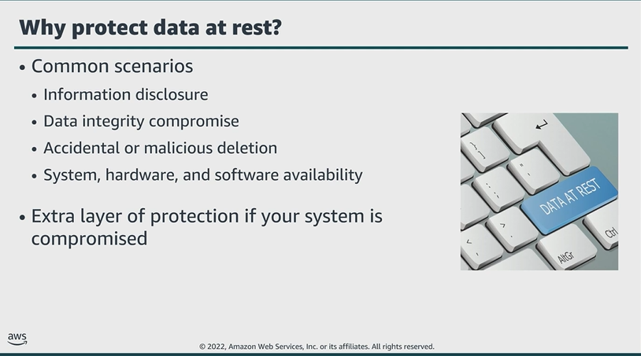

# Module 5: Protect data at rest

Favorite: No
Archive: No
Notebook: AWS Cloud Security (../../AWS%20Cloud%20Security%2037a6c6880dca808794ffd649839ae789.md)
Edited: June 12, 2026 2:16 PM
Created: June 12, 2026 11:24 AM

## Why protect data at rest?

- It’s important to encrypt data at rest so that security of the data is ensured, even if an unauthorized party gains access to it.
- Encrypting data at rest makes it difficult for attackers to compromise data, even if they can compromise an endpoint.
- You might need to also protect your data at rest due to business or compliance requirements.
- **How to prevent?**
  - **Information disclosure:**
    - Limit the number of users who can access the data, and use policies to manage access to resources.
    - Use encryption to protect confidential data.
  - **Data integrity compromise:**
    - Use resource permissions to limit the scope of users who can modify data.
    - Implement digital signature and encryption.
    - If data is compromised, restore it from backup or previous object version.
  - **Accidental or malicious deletion:**
    - Use correct permissions and the principle of least privilege.
    - If an issue occurs, restore data from backup or previous object version.
  - **System, hardware, software availability:**
    - In case of system failure or natural disaster, restore data from replicas.

## Data at rest in Amazon S3

- By default, all Amazon S3 resources, buckets, objects, and related sub-resources; example, lifecycle configuration and website configuration, are private.
- Only the resource owner, meaning the AWS account that created it, can access the resource.
- The resource owner can grant access permissions to others by writing an access policy.
- You can modify buckets to allow additional access, and AWS provides a number of tools to configure buckets for a wide variety of workloads.
- Example. The S3 Block Public Access feature acts as an additional layer of protection to prevent accidental exposure of data.
- Consider encrypting data at rest in Amazon S3.

## Granting permissions

- Amazon S3 supports two types of access control mechanisms:
  - Identity or User Based
  - Resource Based
- Both access control mechanisms are identical in appearance and function, but have slight syntax differences.
  - The biggest difference is where they are applied.
- Identity-based permissions are attached to an AWS IAM user and indicate what the user is permitted to do.
- Resource-based permissions are attached to a resource and indicate what a specified user, or group of users, is permitted to do with the resource.
  - Example. You can attach resource-based policies to S3 buckets; VPC endpoints and AWS KMS encryption keys.
- Resource-based policies are a way to restrict access on a resource basis.

- In the example below, an IAM user named Bob has an identity-based policy attached. The policy allows him to use GET, PUT, LIST APIs for Bucket X, however, the resource-based policy for Bucket X allows him to use GET and LIST but denies PUT.
  - This means Bob cannot PUT objects into Bucket X, even though his identity-based policy allows
- For Bucket Y, Bob’s identity-based policy allows LIST action. The policy doesn’t explicitly allow or deny GET and PUT actions. The resource-based policy for Bucket Y allows him to use GET and LIST, but does not specify for PUT.
  - This means Bob can read objects from the Bucket, even though his identity-based policy doesn’t explicitly allow it.

## Key takeaways: Protect data at rest

- Encrypting data at rest makes it more difficult for attackers to compromise data.
- Data stored in Amazon S3 is private by default and requires AWS credentials for access.
- Amazon S3 supports two types of access control mechanisms:
  - Identity or User Based
  - Resource Based
