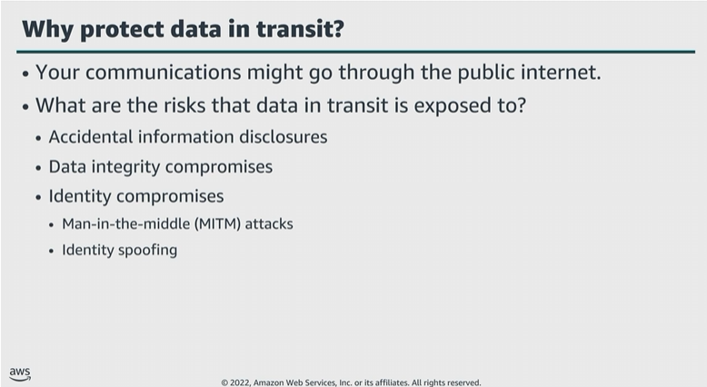

# Module 5: Protect data in transit

Favorite: No
Archive: No
Notebook: AWS Cloud Security (../../AWS%20Cloud%20Security%2037a6c6880dca808794ffd649839ae789.md)
Edited: June 15, 2026 6:11 PM
Created: June 15, 2026 5:37 PM

## Why protect data in transit?

## Protecting data in transit

- You can limit access from an S3 bucket from a specific VPC endpoint or set of endpoints, by using S3 bucket policies.
- To protect data in transit, AWS encourages customers to use a multi-level approach.
- All network traffic between AWS data centers is transparently encrypted at the physical layer. All traffic within a VPC, and between peered VPCs across AWS Regions, is transparently encrypted at the network layer when using supported EC2 instances.
- At the application layer, customers have a choice about whether and how to use encryption by using a protocol such as TLS.
- All AWS service endpoints support TLS to create a secure HTTPS connection to make API requests.

## Protecting remote connection to servers

- Users who access Windows Terminal Services in the public cloud usually use Microsoft RDP.
- For optimal protection, the Windows server being accessed should issue a trusted X.509 certificate to protect from identity spoofing or MiTM attacks.
- By default Amazon Machine Images (AMIs) that AWS and most vendors from AWS Marketplace provide don’t allow the root user to log in from an SSH terminal. Instead, the default configuration is logging in using an SSH key pair with password auth deactivated.

## AWS Certificate Manager

- With AWS Certificate Manager (ACM), you can provision, manage, and deploy public and private SSL and TLS certificates for use with AWS services and your internal connected resources.
- Managed renewal and deployment through ACM can help avoid downtime due to expired certificates.

## AWS Certificate Manager Private Certificate Authority

- AWS Certificate Manager Private Certificate Authority (ACM Private CA), creates private certificate authority hierarchies, without the investment and maintenance costs of operating an on-premises CA.
- Your private CAs can issue end-entity X.509 certificates, which are useful in scenarios such as creating encrypted TLS communication channels; authenticating users, computers, API endpoints, and IoT devices; and cryptographically signing code.
- These certificates are also helpful for implementing Online Certificate Status Protocol (OCSP) to obtain certificate revocation status. ACM Private CA is for enterprise customers who are building a public key infrastructure (PKI) inside the AWS Cloud.
- The service is intended for private use within an organization.
- Certificates that a private CA issues are trusted only within your organization, not on the internet.
- After creating a private CA, you have the ability to issue certificates directly, that is, without obtaining validation from a third-party CA, and to customize them to meet your organization’s internal needs.
- Example: ACM Private CA
  1. The CA administrator creates a subordinate CA to issue certificates.
  2. The subordinate CA sends the certificate to be signed. The on-premises CA or AWS CA signs the certificate.
  3. ACM Private CA issues the signed certificate to resources.

## ACM Private CA considerations

- These HSMs adhere to FIPS 140-2 Level 3 security standards to help protect your private CA against key compromises.
- CA administrators an also control access to the service by using IAM policies.
- ACM Private CA publishes and updates certificate revocation lists to an S3 bucket automatically, to help prevent the use of revoked certificates. Example. An IoT application can check if the private certificate for a sensor is valid before accepting data from the sensor.
- ACM Private CA creates another S3 bucket that provides the ability to generate audit reports.

## Key takeaways: Protect data in transit

- Protect data in transit by using SSL or client-side encryption when you run applications in the Cloud.
- Use VPC endpoints to limit acces to S3 buckets.
- The ACM service handles the complexity of creating and managing public SSL/TLS certificates for your AWS based websites and applications.
- ACM Private CA can manage the lifecycle of your private certificates centrally and in a highly available way.
