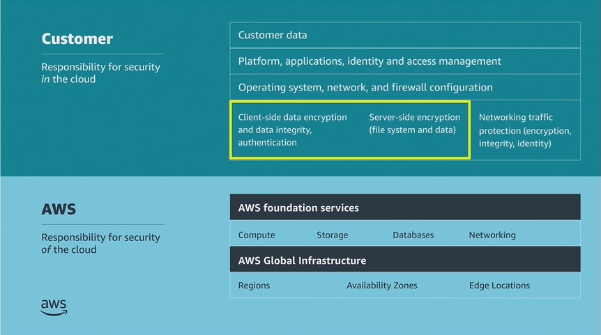

# Module 5: Protecting Data in your Application

Favorite: No
Archive: No
Notebook: AWS Cloud Security (../../AWS%20Cloud%20Security%2037a6c6880dca808794ffd649839ae789.md)
Edited: June 12, 2026 11:24 AM
Created: June 12, 2026 11:17 AM

## Bank Business Scenario

- The Bank was receptive to the developer’s presentation and appears supportive of the developer’s plan to secure the Bank’s assets from outside attacks. However, the developer noticed the Bank still seemed unsure of the security inherent to AWS.
- The Bank explains that at previous experience, a disgruntled employee had accessed some inadequately secured user data inappropriately. This wasn’t discovered until after the employee had left the company.
  - This breach cost the company a large amount of money in fines and settlements.
- For the Bank to be comfortable with migrating to the cloud, they need to understand how user data would be protected in the Cloud.
- For their next meeting, the developer wants to explain how they can secure user data that’s stored in the Cloud.

## Shared responsibility model

- The customer is responsible to secure these portions (yellow box).

