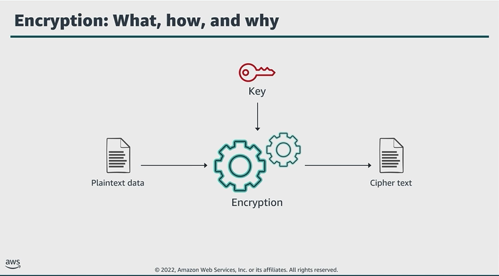

# Module 5: Protection through encryption

Favorite: No
Archive: No
Notebook: AWS Cloud Security (../../AWS%20Cloud%20Security%2037a6c6880dca808794ffd649839ae789.md)
Edited: June 12, 2026 3:55 PM
Created: June 12, 2026 3:25 PM

## Encryption: what, how, why

- Encryption is the process of converting plaintext, readable data to an unreadable form called ciphertext, to protect it.
- For an encryption algorithm to be effective, it must be almost impossible to reverse without knowing the inputs to the algorithm. Inputs might include an encryption key.

## Comparing client-side and server-side encryption

- The approaches differ in when, where, and who, encrypts and decrypts the data.

## Client-side encryption (CSE)

- Client-side encryption takes place before data is submitted to AWS, and decryption occurs after data is retrieved from AWS.
- To enable CSE, you can use a key stored in AWS KMS or use a key that you store within your application.

## Server-side encryption (SSE)

- In SSE, your source data comes from systems in your data center or an Amazon EC2 instance.
- You can upload that data over an HTTPS connection to any of the AWS services that support automatic server-side encryption.
- The service endpoint handles the encryption and key management processes for you.

## Types of Amazon S3 server-side encryption

## Encryption overview

1. You request to upload a file and store it as an encrypted object in an S3 bucket.
2. S3 requests a data key from AWS KMS to use to encrypt the file.
3. AWS KMS generates a plaintext data key and encrypts the data key by using the customer managed key.
4. AWS sends both copies of the data key to S3.
5. S3 encrypts the object by using the plaintext data key, stores the object, and then deletes the plaintext data key.

- The encrypted key is kept in the object metadata.

## Decryption overview

1. Request to open the object.
2. S3 notices that the requested object is encrypted.
3. S3 sends the encrypted copy of the data key that the object is encrypted with to AWS KMS.
4. AWS KMS decrypts the data key by using the customer managed key, which never leaves AWS KMS.
5. AWS KMS sends the plaintext data key back to S3.
6. S3 finally decrypts the ciphertext of the data object, allows to open the object, and deletes the plaintext copy of the data key.

## AWS Key Management Service (KMS)

AWS KMS example with Amazon EBS

- Amazon EBS encryption is an encryption solution for EBS resources associated with your EC2 instances.
- You aren’t required to build and manage your own key management infrastructure.
- EBS encryption uses KMS keys when creating encrypted volumes and snapshots. Each volume is encrypted using AES-256-XTS.
- The data key is encrypted under a KMS key in your account, and EBS must have access to this key.
- Encryption and Decryption steps:

1. EBS obtains an encrypted data key under a customer managed key through AWS KMS and stores the encrypted key with the encrypted data.
2. The servers that host the EC2 instances retrieve the data key from storage.
3. A call is made to AWS KMS over TLS to decrypt the encrypted data key.
4. AWS KMS identifies the KMS key, makes an internal request to the HSM to decrypt the data key, and returns the key to the customer over the TLS session.
5. The decrypted data key is stored in memory and used to encrypt and decrypt all the data going to and from the attached EBS volume.

- EBS retains the encryption data key for later use in case the key in memory is no longer available.

## Key takeaways: Protection through encryption

- AWS supports both client-side and server-side encryption.
  - CSE: You encrypt data before sending it to AWS.
  - SSE: AWS encrypts your data on your behalf after receiving it.
- AWS provides 3 types of SSE:
  - SSE with customer provided keys (SSE-C)
  - SSE with Amazon S3 managed keys (SSE-S3)
  - SSS with AWS KMS keys (SSE-KMS)
- AWS KMS can create and control the keys used to encrypt your data.
