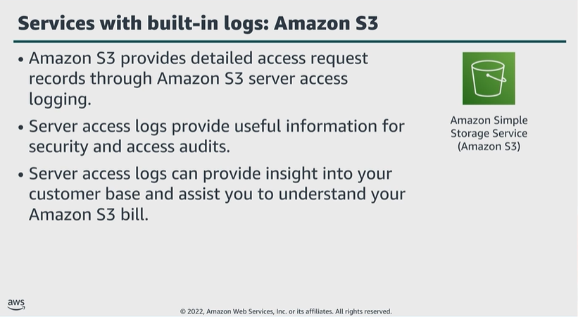

# Module 6: AWS services with built-in logs

Favorite: No
Archive: No
Notebook: AWS Cloud Security (../../AWS%20Cloud%20Security%2037a6c6880dca808794ffd649839ae789.md)
Edited: June 16, 2026 10:37 AM
Created: June 16, 2026 10:29 AM

## Amazon S3

- Amazon S3 provides built-in logging feature in the form of server access logging.
- These logs provide a range of useful metrics, which can assist you in multiple tasks, from security and access auditing, to customer base insights.
- Server access logs can provide you with insights to your data storage, which can help better understand your S3 bill.

## Amazon VPC

- Flow logs is a built-in feature of the Amazon VPC service.
- Flow logs can assist you in troubleshooting issues, monitoring VPC environment, and analyzing the flow of IP traffic throughout that environment.
- It’s important to note that flow log data is collected outside the path of your network traffic, which means it has no impact on the throughput, latency, or overall performance of your network assets.

## Elastic Load Balancing (ELB)

- The information ELB logs provides includes the time of request receipt, IP address of the client, network latencies, request paths, and server responses.
- You can use ELB logs to assist you in troubleshooting network issues and analyzing traffic on your network.

