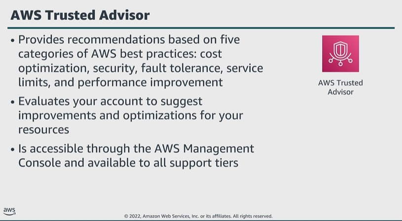

# Module 6: Additional AWS services for logging and monitornig

Favorite: No
Archive: No
Notebook: AWS Cloud Security (../../AWS%20Cloud%20Security%2037a6c6880dca808794ffd649839ae789.md)
Edited: June 16, 2026 11:24 AM
Created: June 16, 2026 11:07 AM

## AWS Trusted Advisor

- Trusted Advisor evaluates your account by using checks based on five categories of AWS best practices. The checks identify ways to optimize your AWS infrastructure, improve security and performance, reduce costs, and monitor service quotas. You can then follow recommendations to optimize your services and resources.
- Trusted Advisor is available on all AWS Support plans. AWS Basic Support and AWS Developer Support customers can access core security checks and all checks for service quotas.
- AWS Business Support and AWS Enterprise Support customers can access all checks, including cost optimization, security, fault tolerance, performance, and service quotas.

## Amazon EventBridge

- The service connects applications using events, which are signals that a system’s state has changed.
- There are no servers to provision, patch, or manage, and there is no software to install or maintain.
- EventBridge automatically scales based on the number of events ingested and has built-in fault tolerance.

AWS Security Hub

- Assists you in monitoring your cloud security posture through the use of automated, continuous security best practice checks against your AWS resources.
- You can also use Security Hub to create automated response, remediation, and enrichment workflows by taking advantage of Security Hub’s integration with EventBridge.
- Security Hub provides a security score for each enabled standard, as well as a total score for all accounts associated with your administrator account. This information can assist you in monitoring overall security posture.

## AWS Config

- You can use AWS Config to view AWS IAM policies assigned to IAM users, groups, or roles at any time AWS Config was recording.
- This capability can aid in determining what permissions belonged to what user at that specific time.
- AWS Config can assist in maintaining auditing and compliance by providing historical resource configurations.
- With the wide range of capabilities that AWS Config offers, you can simplify compliance auditing, security analysis, change management, and operational troubleshooting in your AWS environment.

