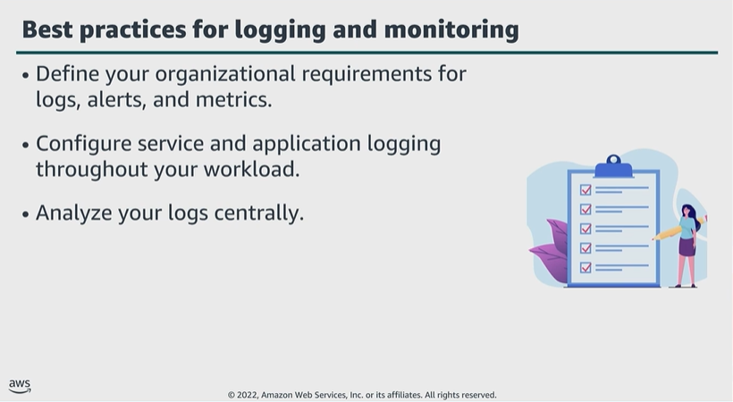

# Module 6: Best practices for logging and monitoring

Favorite: No
Archive: No
Notebook: AWS Cloud Security (../../AWS%20Cloud%20Security%2037a6c6880dca808794ffd649839ae789.md)
Edited: June 16, 2026 11:01 AM
Created: June 16, 2026 10:53 AM

## Best practices for logging and monitoring

- To develop an effective logging and monitoring solution, you must define organizational requirements. You need to identify the resources, applications, and services you want to maintain logs for.
- Your logging requirements will vary, based on a number of factors. So, you need to determine what the organizational, legal, and compliance requirements are for your workloads.
- Evaluate and identify the resources that AWS has available to assist you.
- When you collect these metrics and define baselines, you can gain insights into potential security threats.
- Once you establish your logging and monitoring needs, you need to define who should receive alerts and what they should do with the alerts received.
- Collect logs centrally using the automation capabilities from services like CloudWatch to detect and analyze any anomalies or indications of malicious activity.

