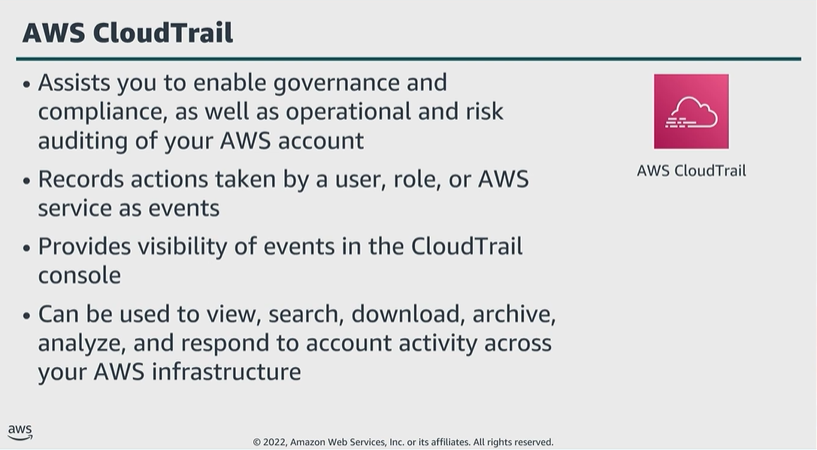

# Module 6: Capture and collect

Favorite: No
Archive: No
Notebook: AWS Cloud Security (../../AWS%20Cloud%20Security%2037a6c6880dca808794ffd649839ae789.md)
Edited: June 16, 2026 10:26 AM
Created: June 16, 2026 10:06 AM

## AWS CloudTrail

- AWS CloudTrail helps implement governance and compliance, while also helping conduct operational and risk auditing.
- The information from CloudTrail (events) helps you maintain a log of who is doing what, and when they are doing it.
- CloudTrail events will inform you about actions taken in the AWS Management Console, AWS CLI, and AWS APIs and SDKs.
- You can integrate CloudTrail into applications by using the API, automate trail creation for your organization, check the status of trails that you create, and control how users view CloudTrail events.

## API security-relevant information

- CloudTrail records information about each API call. This information includes the API, identity of the caller, time of the API call, location of where the call originated from, request paremeters, and response elements returned by the AWS service.
- This information helps track changes made to your AWS resources, troubleshoot operational issues, and ensure compliance with internal policies and regulatory standards.

## Activity: Reading a Log File

### Reading a log: Identity of he caller

- This log file was generated when someone or something performed some kind of action.

### Reading a log: Time and origin of request

- When the call was made.

### Reading a log: Request parameters and response elements

- What was involved in the request.

## Key takeaways: Capture and collect

- CloudTrail helps you enable governance, compliance, and auditing of your AWS account.
- Actions taken by a user, role, or an AWS service are recorded as events.
- CloudTrail records important information about each API call, including the identity of the caller, time of the API call in UTC, and origin of the call.
