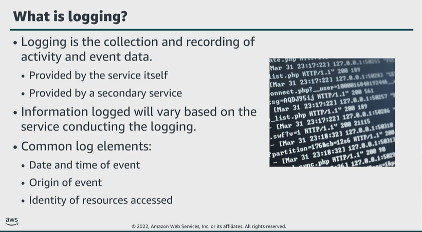

# Module 6: Importance of logging and monitoring

Favorite: No
Archive: No
Notebook: AWS Cloud Security (../../AWS%20Cloud%20Security%2037a6c6880dca808794ffd649839ae789.md)
Edited: June 16, 2026 10:06 AM
Created: June 16, 2026 9:53 AM

## What is logging?

- The service itself can provide logging capabilities, as with Amazon VPC, Flow Logs, and Amazon S3 server access logs.
- Or a secondary service might provide logging, like AWS CloudTrail.

## Why is logging important?

- A comprehensive logging methodology can help you in every phase of your incident response strategy.
- Log files are a primary focus point in incident response because they record events at a specific point in time.
- Their ability to provide detailed, time-stamped records makes them a valuable asset to investigators and incident responders.
- Log files can assist you in troubleshooting performance issues within your AWS Cloud, as well as on-premises environment.
- These log files are also vital in the performance of security audits and for adherence to record keeping requirements to maintain to regulatory compliance.

## What is monitoring?

- AWS CloudTrail can provide a record of actions taken within your environment.
  - You can use the service to log information like action type, user identity, and date and time an action was taken.
  - With this information, you can monitor what is happening, who or what is doing it, and when it is being done.
- Amazon CloudWatch, you can monitor resources and applications in real-time.
  - The service provides you with system-wide visibility into resource utilization, application performance, and operational health.
  - When paired with a solid incident response plan, monitoring service and tools can help you mitigate the effects of a system outage or malicious actor.
- In many cases, monitoring can help you spot an issue before it has any operational impact.

## Key takeaways: Importance of logging and monitoring

- Logging is the collection and recording of activity and event data.
- Monitoring is the continuous verification of the security and performance of your resources, applications, and data.
- AWS provides several services that you can use to log and monitor your resources.
