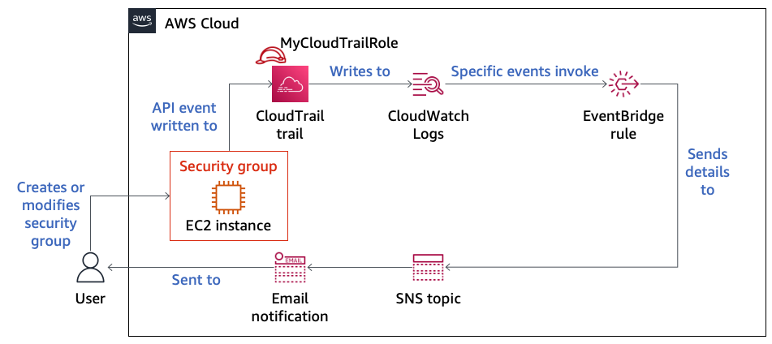

# Module 6: Lab 6.1 - Monitoring and Alerting with CloudTrail and CloudWatch

Favorite: No
Archive: No
Notebook: AWS Cloud Security (../../AWS%20Cloud%20Security%2037a6c6880dca808794ffd649839ae789.md)
Edited: June 16, 2026 11:38 AM
Created: June 16, 2026 11:35 AM

# **Lab 6.1: Monitoring and Alerting with CloudTrail and CloudWatch**

## **Lab overview and objectives**

In this lab, you will configure logging and monitoring in an AWS account. You will understand how to create an AWS CloudTrail trail, which will be an audit log of API calls made in the account. You will then create an Amazon Simple Notification Service (Amazon SNS) topic. By subscribing your email to the topic, you will be alerted when particular events occur. Next, you will define an Amazon EventBridge rule. The rule will notice any time that someone modifies a security group and will send you an email alert about the incident. Finally, you will create an Amazon CloudWatch alarm to notice whenever multiple failed login attempts occur for the AWS Management Console.

After completing this lab, you should be able to do the following:

- Analyze event details in the CloudTrail event history.
- Create a CloudTrail trail with CloudWatch logging enabled.
- Create an SNS topic and an email subscription to it.
- Configure an EventBridge rule to monitor changes to resources in an AWS account.
- Create CloudWatch metric filters and CloudWatch alarms.
- Query CloudTrail logs by using CloudWatch Logs Insights.

## **Duration**

This lab will require approximately **75 minutes** to complete.

## **AWS service restrictions**

In this lab environment, access to AWS services and service actions might be restricted to the ones that are needed to complete the lab instructions. You might encounter errors if you attempt to access other services or perform actions beyond the ones that are described in this lab.

## **Scenario**

The lab starts with an Amazon Elastic Compute Cloud (Amazon EC2) instance that is associated with a security group. In one of the lab tasks, you will test whether modifying the security group successfully invokes a rule and sends you an email notification. The lab also starts with a preconfigured CloudTrail trail that writes to CloudWatch Logs. The lab also includes a preconfigured AWS Identity and Access Management (IAM) user, which you will use to test alerting for failed console login attempts.

By the end of Task 3, you will have created and configured more resources in the account. The environment will look like the following architecture diagram:



By the end of Task 5, you will have created the architecture shown in the following diagram:


## **Accessing the AWS Management Console**

1. At the top of these instructions, choose **Start Lab**.
   - The lab session starts.
   - A timer displays at the top of the page and shows the time remaining in the session.
     **Tip:** To refresh the session length at any time, choose **Start Lab** again before the timer reaches 0:00.
   - Before you continue, wait until the circle icon to the right of the AWS link in the upper-left corner turns green. When the lab environment is ready, the AWS Details panel will also display.
2. To connect to the AWS Management Console, choose the **AWS** link in the upper-left corner, above the terminal window.
   - A new browser tab opens and connects you to the console.
     **Tip:** If a new browser tab does not open, a banner or icon is usually at the top of your browser with the message that your browser is preventing the site from opening pop-up windows. Choose the banner or icon, and then choose **Allow pop-ups**.

## **Task 1: Creating a CloudTrail trail with CloudWatch Logs enabled**

In this task, you will analyze the type of event information that is available in the CloudTrail event history. You will also create a CloudTrail trail with CloudWatch logging enabled.

1. Analyze the information available in the CloudTrail event history.
   - In the console, in the search box to the right of **Services**, search for and choose **CloudTrail** to open the CloudTrail console.
   - In the navigation pane, choose **Event history**.
   - From the **Read-only** dropdown menu under the **Event history** section heading, choose **Event source**.
   - In the search box to the right of **Event source**, start typing `cloudformation.amazonaws.com` and choose it when it appears.
     The events in the event history are filtered so that only audit trail events where the source of the event was AWS CloudFormation are displayed.
   - Choose the most recent **CreateStack** event.
     The event record from the chosen event displays.
     **Analysis:** The CreateStack event occurred when you started this lab. The stack created resources in the account. Notice that the record includes details such as the `userIdentity` for the person who made the API call, `eventTime`, and `awsRegion`. Other essential audit record details are also provided.
     **Note:** The event history exists by default in each Region. The history shows events _from the last 90 days_ for the Region that you are viewing. This view is limited to management events with create, modify, and delete API calls and account activity. To maintain a record of account activity that extends past 90 days, including all management events with the option to include data events and read-only activity, you need to configure a CloudTrail _trail_. You will do this in the next step.
2. Create a CloudTrail trail with CloudWatch Logs enabled.
   - In the navigation pane, choose **Trails**.
   - Choose **Create trail**.
   - On the **Choose trail attributes** page, configure the following:
     - **Trail name:** Enter `MyLabCloudTrail`
     - **Storage location:** Choose **Create a new S3 bucket**, and accept the default bucket name, which includes **aws-cloudtrail-logs**.
     - **Log file SSE-KMS encryption:** Clear the check box (to disable this option).
     - **CloudWatch Logs:** Select **Enabled**.
     - **Log group:** Choose **New**, and accept the default log group name.
     - **IAM Role:** Choose **Existing**.
     - **Role name:** Choose **LabCloudTrailRole**.
     - Keep the other default trail attributes, and choose **Next**.
   - On the **Choose log events** page, configure the following:
     - **Event type:** Keep **Management events** selected, and don't select **Data events** or **Insights events**.
     - **API activity:** Keep **Read** and **Write** selected.
     - Choose **Next**.
   - Scroll down to the bottom of the page.
     **Important:** This is where you would complete the process to create the trail. However, the user that you are logged in as does not have the necessary permissions to create a CloudTrail with CloudWatch Logs enabled. This is because of the security restrictions placed on AWS accounts that are used for labs.
   - Instead, choose **Cancel**.
3. Analyze the existing CloudTrail trail.

   Notice that a trail named _LabCloudTrail_ already exists. It is configured with the same settings that you chose in the previous step, except for minor differences such as the Amazon Simple Storage Service (Amazon S3) bucket name and log group name.

   This CloudTrail trail, with CloudWatch logging enabled, is an essential component of the monitoring and alerting solutions that you will build in the rest of this lab.

Congratulations! In this task, you learned how to access event details in the CloudTrail event history and how to create a CloudTrail trail.

## **Task 2: Creating an SNS topic and subscribing to it**

Amazon SNS is a fully managed messaging service for both application-to-application (A2A) and application-to-person (A2P) communication. The A2P functionality provides the ability to send messages to users at scale through SMS, mobile push, and email.

In this task, you will create an SNS topic and subscribe your email address to the topic. The topic will be used in later tasks to deliver email alerts to you about important activity that occurs in the AWS account.

1. Create an SNS topic.
   - In the search box to the right of **Services**, search for and choose **Simple Notification Service** to open the Amazon SNS console.
   - To open the navigation pane, choose the menu icon in the upper-left corner.
   - In the navigation pane, choose **Topics**.
   - Choose **Create topic**, and configure the following:
     - **Type:** Choose **Standard**.
     - **Name:** Enter `MySNSTopic`
     - Expand the **Access policy - _optional_** section.
     - **Specify who can publish messages to the topic:** Choose **Everyone**.
     - **Specify who can subscribe to this topic:** Choose **Everyone**.
     - At the bottom of the page, choose **Create topic**.
2. To create an email subscription to the SNS topic, choose **Create subscription**, and configure the following:
   - **Topic ARN:** Notice that the Amazon Resource Number (ARN) of the topic that you just created is already filled in.
   - **Protocol:** Choose **Email**.
   - **Endpoint:** Enter an email address where you can receive emails during this lab.
   - Scroll to the bottom of the page, and choose **Create subscription**.
3. Check your email and confirm the subscription.
   - Check your email for a message from AWS Notifications.
   - In the email body, choose the **Confirm subscription** link.
   - A webpage opens and displays a message that the subscription was successfully confirmed.

In this task, you successfully created an SNS topic and an email subscription to the topic. You will use this configuration in the next tasks.

## **Task 3: Creating an EventBridge rule to monitor security groups**

In this task, you will create an EventBridge rule. The rule will notice whenever inbound rule changes are made to a new or existing security group in the same Region in your AWS account. Whenever the rule conditions are met, the rule will publish a message to the SNS topic that you created.

1. Create a rule to monitor changes to EC2 security groups.
   - In the console, in the search box to the right of **Services**, search for and choose **Amazon EventBridge** to open the EventBridge console.
   - Choose **Create rule**.
   - In the **Define rule detail** screen, enter the following details:
     - Name: `MonitorSecurityGroups`
     - Event bus: **default**
     - Rule type: **Rule with an event pattern**.
   - Choose **Next**
   - In the **Build event pattern** screen, enter the following details:
     - Event source: **AWS events or EventBridge partner events**
     - Leave the Sample event - optional default settings
     - Under _Event pattern_, choose **Custom patterns (JSON editor**
     - Copy and paste the following code into the _Enter the event JSON_ field
       ```json
       {
         "source": ["aws.ec2"],
         "detail-type": ["AWS API Call via CloudTrail"],
         "detail": {
           "eventSource": ["ec2.amazonaws.com"],
           "eventName": [
             "AuthorizeSecurityGroupIngress",
             "ModifyNetworkInterfaceAttribute"
           ]
         }
       }
       ```
     - Choose **Next**.
       **Important:** To record events with a `detail-type` value of `AWS API Call via CloudTrail`, a CloudTrail trail with logging enabled is required. The trail that was created for you fulfills this necessary condition.
     - In the **Select targets** section, configure the following for Target 1:
       - **Target types:** AWS service
       - **Select a target**: Choose **SNS topic**.
       - **Topic:** Choose **MySNSTopic**.
       - **Permissions:** **UnCheck** **Use execution role (recommended)**
       - Expand **Additional settings**
       - For **Configure target input**, choose **Input transformer**.
       - Choose **Configure input transformer**.
       - Scroll down to the _Target input transformer_ section.
       - In the **Input path** field (first box), copy and paste the following code:
         ```

         {"name":"$.detail.requestParameters.groupId","source":"$.detail.eventName","time":"$.time","value":"$.detail"}
         ```
       - In the **Template** field (second box), copy and paste the following text:
         ```

         "The <source> API call was made against the <name> security group on <time> with the following details:"" <value> "
         ```
         **Analysis**: The _Input path_ you are setting defines four variables: name, source, time, and value. For each variable, a value is set by referencing data contained in the JSON structure of CloudTrail events that match the _event pattern_ that you also defined. The _Input template_ that you are setting defined the information that will be passed to the target, which in this case is an SNS topic. Notice that the template includes the names of the four variables defined in the Input path.
     - Choose **Confirm** then choose **Next**.
     - In the _Configure tags_ screen choose **Next**.
     - At the _Review and create_ screen, scroll to the botton and choose **Create rule**.

```

  <!--GRADING TASK 3: verify a EventBridge rule named MonitoringRule was created.-->
```

1. To test the EventBridge rule, modify a security group that is associated with an EC2 instance.
   - In the search box to the right of **Services**, search for and choose **EC2** to open the Amazon EC2 console.
   - In the navigation pane, choose **Instances**.
   - Select the check box for **LabInstance**
     This instance was created for you when you started the lab.
   - In the lower pane, choose the **Security** tab.
   - Under **Security groups**, choose the link for the security group name that contains **LabSecurityGroup**.
     Details for this security group display.
   - On the **Inbound rules** tab, choose **Edit inbound rules**.
   - Choose **Add rule**, and configure the following:
     - **Type:** Choose **SSH**.
     - **Source:** Choose **Anywhere-IPv4**.
     - Choose **Save rules**.
2. Check the CloudTrail event history.
   - Navigate to the CloudTrail console.
   - In the navigation pane, choose **Event history**.
     Notice the most recent entries that appear. One event should look similar to the one in the following screenshot.
     
     **Note:** If an AuthorizeSecurityGroupIngress event has not appeared yet, you might need to wait a minute or two and then refresh the history. To refresh the history, choose the refresh icon.
   - Choose the **AuthorizeSecurityGroupIngress** link. _In the Event record make sure the fromPort and toPort show 22 and not 80_
     In the **Event record** section, notice that details of this event match some of the details that you set in the EventBridge rule that you created a moment ago. Specifically, the `"eventSource": "ec2.amazonaws.com"` and `"eventName": "AuthorizeSecurityGroupIngress"` name-value pairs in the event match the event pattern that you defined in the rule. Therefore, this event should result in a message being published to the SNS topic that you created.
3. Check the inbox of the email address that you subscribed to the SNS topic.

   You should have received a message from AWS Notifications indicating that an AuthorizeSecurityGroupIngress API call was made. The API call occurred when you modified the security group.

   **Note:** Recall that you subscribed your email address to the SNS topic, which is why you received the email.

In this task, you successfully created an EventBridge rule to monitor changes to Amazon EC2 security groups in the Region. You also tested that modifying a security group invokes the rule, which then publishes a message to the SNS topic. Finally, you verified that you received an email with details about the event, because you previously subscribed your email to the topic.

## **Task 4: Creating a CloudWatch alarm based on a metrics filter**

So far in this lab, you have used CloudTrail and EventBridge to alert you whenever someone modifies the inbound rules for a security group in one of the Regions in your account. In this task, you will use a different service, CloudWatch, to notify you when a user fails to log in to the AWS Management Console a specific number of times.

1. Create a CloudWatch metric filter.
   - In the search box to the right of **Services**, search for and choose **CloudWatch** to open the CloudWatch console.
   - In the navigation pane, expand **Logs**, and then choose **Log groups**.
   - Select the check box for **CloudTrailLogGroup**.
     **Note:** Recall that when you created the CloudTrail trail, you configured it to create this log group.
   - Choose **Actions** > **Create metric filter**, and then configure the following:
     - **Filter pattern:** Copy and paste the following code:
       ```

       { ($.eventName = ConsoleLogin) && ($.errorMessage = "Failed authentication") }
       ```
     - Choose **Next**.
     - **Filter name:** Enter `ConsoleLoginErrors`
     - **Metric namespace:** Enter `CloudTrailMetrics`
     - **Metric name:** Enter `ConsoleLoginFailureCount`
     - **Metric value:** Enter `1`
   - At the bottom of the page, choose **Next**.
   - Choose **Create metric filter**.
2. Create a CloudWatch alarm based on the metric filter.
   - On the **Metric filters** tab, select the check box to the right of the **ConsoleLoginErrors** metric filter that you just created.
   - Choose **Create alarm**.
     A new browser tab opens.
   - On the **Specify metric and conditions** page, in the **Conditions** section, configuring the following alarm details:
     - **Whenever ConsoleLoginFailureCount is:** Choose **Greater/Equal**.
     - **than...:** Enter `3`
       Observe the settings. This alarm will be invoked whenever the sum of the ConsoleLoginFailureCount metric that you defined is greater than or equal to 3 within any 5-minute period.
     - Choose **Next**.
   - On the **Configure actions** page, configure the following:
     - **Select an SNS topic:** Choose **Select an existing topic**.
     - **Send a notification to...:** Choose **MySNSTopic**.
     - Choose **Next**.
   - On the **Add name and description** page, configure the following:
     - **Alarm name:** Enter `FailedLogins`
     - Choose **Next**.
   - Scroll to the bottom of the page, and choose **Create alarm**.
3. Test the CloudWatch alarm by attempting to log in to the console with incorrect credentials at least three times.
   - In the search box to the right of **Services**, search for and choose **IAM** to open the IAM console.
   - In the navigation pane, choose **Users**.
   - Choose the link for the **test** user name.
   - Choose the **Security credentials** tab, and then copy the **Console sign-in link**.
   - Paste the copied link into a new browser tab to load the console sign-in page.
   - Enter credentials, including an **incorrect** password, and attempt to sign in. _Repeat this at least three times_:
     - **IAM user name:** Enter `test`
     - **Password:** `test`
     - Choose **Sign in**.
       **Note:** Each time that you attempt to log in, you will see a message indicating that your authentication information is incorrect. This is expected!
4. Re-establish your access to the AWS account.
   - Close all browser tabs where you have the AWS Management Console open.
   - On the lab instructions page, choose the **AWS** link above these instructions to log in again as the voclabs user.
     **Important:** Your attempts to log in to the console as the test user cleared the previous authentication information from your browser's cache. Therefore, you need to re-authenticate to gain access to the console.
5. Graph the metric that you created.
   - Navigate to the CloudWatch console.
   - In the navigation pane, expand **Metrics**, and then choose **All metrics**.
   - In the **Metrics** section, under **Custom namespaces**, choose **CloudTrailMetrics**.
     **Note:** If CloudTrailMetrics does not yet appear, wait until the SNS notification is received.
   - Choose **Metrics with no dimensions**.
   - Choose **ConsoleLoginFailureCount**.
     In the graph area at the top of the page, a small blue dot should appear. The dot indicates that a login failure was detected.
6. Check the alarm status and details in the CloudWatch console.
   - In the navigation pane, expand **Alarms**, and then choose **All alarms**.
     The **State** for the FailedLogins alarm should be _In alarm_.
     **Note:** If the alarm doesn't show this state, wait a minute or two. To refresh the page, choose the refresh icon.
     **Tip:** To find out if the alarm was invoked recently, choose the link for the **FailedLogins** alarm name, and then choose the **History** tab.
7. Check the inbox of the email address that you subscribed to the SNS topic.

   You should have received a message about multiple failed login attempts, with content that is similar to the following image.

   

## **Task 5: Querying CloudTrail logs by using CloudWatch Logs Insights**

In this final task in the lab, you will use CloudWatch Logs Insights to query CloudTrail logs.

CloudWatch Logs Insights enables you to interactively search and analyze your log data in Amazon CloudWatch Logs. You can perform queries to help you more efficiently and effectively respond to operational issues.

1. Run a CloudWatch Logs Insights query.
   - In the CloudWatch console, in the navigation pane, choose **Logs Insights**.
   - From the **Selection criteria** dropdown menu under the **Logs Insights** section heading, select **CloudTrailLogGroup**.
   - Delete the existing content from the query field, and then copy and paste the following code into the query field:
     ```

     filter eventSource="signin.amazonaws.com" and eventName="ConsoleLogin" and responseElements.ConsoleLogin="Failure"| stats count(*) as Total_Count by sourceIPAddress as Source_IP, errorMessage as Reason, awsRegion as AWS_Region, userIdentity.arn as IAM_Arn
     ```
   - Choose **Run query**.
     The output should look similar to the following graph:
     

Congratulations! In this task, you successfully queried CloudTrail logs by using CloudWatch Logs Insights.

## **Submitting your work**

1. To record your progress, choose **Submit** at the top of these instructions.
2. When prompted, choose **Yes**.

   After a couple of minutes, the grades panel appears and shows you how many points you earned for each task. If the results don't display after a couple of minutes, choose **Grades** at the top of these instructions.

   **Tip:** You can submit your work multiple times. After you change your work, choose **Submit** again. Your last submission is recorded for this lab.

3. To find detailed feedback about your work, choose **Submission Report**.

## **Lab complete**

Congratulations! You have completed the lab.

1. At the top of this page, choose **End Lab**, and then choose **Yes** to confirm that you want to end the lab.

   A message panel indicates that the lab is terminating.

2. To close the panel, choose **Close** in the upper-right corner.
