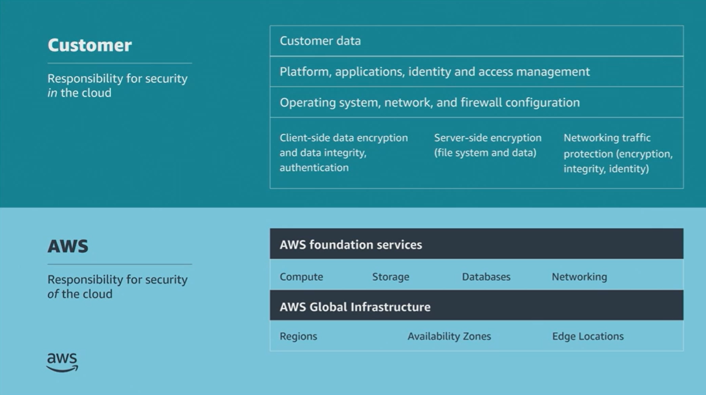

# Module 6: Logging and Monitoring

Favorite: No
Archive: No
Notebook: AWS Cloud Security (../../AWS%20Cloud%20Security%2037a6c6880dca808794ffd649839ae789.md)
Edited: June 16, 2026 9:52 AM
Created: June 16, 2026 9:40 AM

## Bank business scenario

- The Bank’s story of an insider threat with previous experience gave the Developer an idea.
- At the next meeting, the developer plans to discuss how to use the logging and monitoring capabilities AWS provides.
- These capabilities can help an organization to identify, mitigate, and remediate security threats.
- The developer creates a list of AWS logging and monitoring services.
- The developer will discuss these AWS offerings with the Bank and explain potential benefits, and if necessary, potential costs.
- The developer wants to align each service with the threat it could help mitigate, so they are prepared for any cyber threat scenario.

## Shared responsibility model

