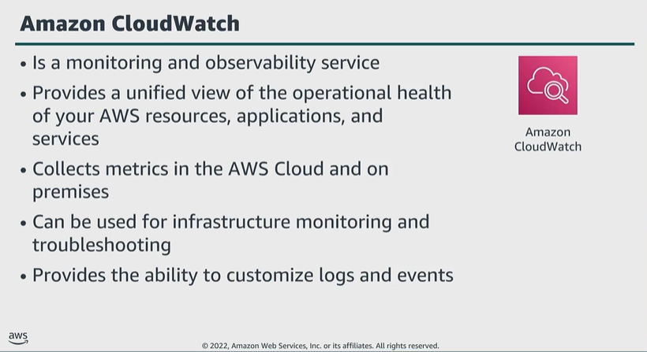

# Module 6: Monitor and report

Favorite: No
Archive: No
Notebook: AWS Cloud Security (../../AWS%20Cloud%20Security%2037a6c6880dca808794ffd649839ae789.md)
Edited: June 16, 2026 10:52 AM
Created: June 16, 2026 10:38 AM

## Amazon CloudWatch

- Built for DevOps engineers, developers, SREs, IT managers, and product owners.
- CloudWatch collects monitoring and operational data in the form of logs, metrics, and events.
- As part of the CloudWatch service, you can use CloudWatch Events to deliver near real-time stream of systems events that describe changes to your AWS resources.
- CloudWatch Events becomes aware of these changes as they occur, responding to them and taking corrective actions you stipulate as necessary.
- Note that CloudWatch Events is currently being replaced by Amazon EventBridge.
- Another element of CloudWatch, CloudWatch Logs, provides the ability to monitor, store, and access your log files from your EC2 instances, CloudTrail, Amazon Route 53, and other sources.
- With CloudWatch Logs, you can centralize the logs from all of your systems, applications, and enterprise services that you use into a single, scalable service.
- By using CloudWatch, you can easily view, search, filter, and archive logs. You can see all of your logs, regardless of source, as a single consistent flow of events ordered by time.
- You can query your logs and sort them based on other dimensions, group them by specific fields, create custom computations, and visualize log data in dashboards.

## Comparing CloudTrail and CloudWatch

- When used together, you can create custom CloudWatch alarms and notifications for specific CloudTrail events, enabling you to respond quickly to key operational issues.

## Key takeaways: Monitor and report

- CloudWatch provides a unified view of the operational health of your AWS resources, applications, and services.
- CloudWatch collects monitoring and operational data as logs, metrics, and events.
- CloudTrail monitors actions, and CloudWatch monitors performance.
- Create custom dashboards, alarms, and notifications for key metrics.
