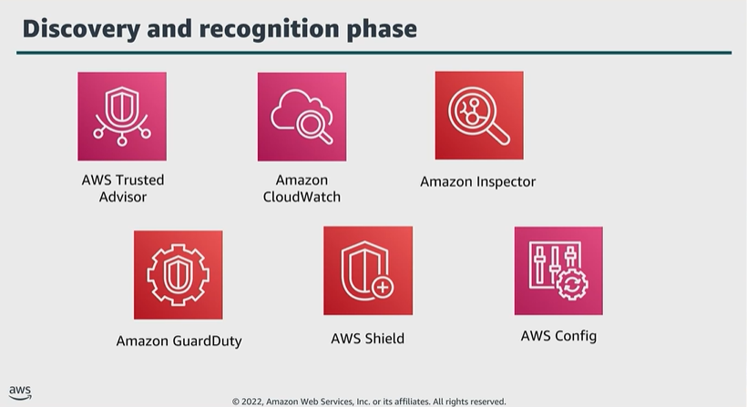

# Module 7: AWS services that support the discovery and recognition phase

Favorite: No
Archive: No
Notebook: AWS Cloud Security (../../AWS%20Cloud%20Security%2037a6c6880dca808794ffd649839ae789.md)
Edited: June 16, 2026 1:15 PM
Created: June 16, 2026 12:53 PM

## Discovery and recognition phase

- These services help an enterprise identify an attack.

## AWS Trusted Advisor

- If you have an AWS Basic Support or Developer Support plan, you can use the AWS Management Console to access core security checks and all checks for service quarters.
- If you have a Business, Enterprise On-Ramp, or Enterprise Support plan, you can use the console; AWS Support API and AWS CLI to access all checks.
- This includes checks for cost optimization, security, fault tolerance, performance, and service quotas.
- You can also use Amazon EventBridge to monitor the status of Trusted Advisor checks.

## Amazon CloudWatch

- By using CloudWatch, you don’t need to set up, manage, and scale your own monitoring systems and infrastructure.
- You can also create custom dashboards to display metrics about your custom applications and display custom collections of metrics that you choose.
- You can create alarms that watch metrics and send notifications, or automatically make changes to the resources you are monitoring, when a threshold is breached.
- With CloudWatch, you gain system-wide visibility into resource utilization, application performance, and operational health.

## Amazon Inspector

- When Amazon Inspector discovers a software vulnerability or network issue, the service creates a finding.
  - A finding describes the vulnerability, identifies the affected resource, rates the severity of the vulnerability, and provides remediation guidance.

## Amazon GuardDuty

- Uses threat intelligence feeds such as lists of malicious IP addresses and domains, and machine learning to identify potential harmful activities within your AWS environment.
- This can include issues such as escalations of privileges, use of exposed credentials, or communication with malicious IP addresses or domains.
- Example:
  - GuardDuty can detect compromised EC2 instances serving malware or mining Bitcoin.
- The service also monitors AWS account access behavior for signs of compromise, such as unauthorized infrastructure deployments.
- Example:
  - Instances being deployed in a Region that has never been used.
- The service also monitors for unusual API calls, such as a password policy change to reduce password strength.

## AWS Shield

- A DDoS attack is a malicious attempt to disrupt the normal traffic of a targeted server, service, or network by overwhelming the target or its surrounding infrastructure with a flood of internet traffic.
- When you build your app on AWS, you receive automatic protection from againsg common DDoS attacks.
- Additionally, you can use the AWS Shield Advanced managed threat protection service to improve your security posture with additional DDoS detection, mitigation, and response capabilities.

## AWS Config

- You can view current and historic configurations of a resource, and use this information to troubleshoot outages and conduct security attack analysis.
- You can also view the configuration at any point in time, and use that information to reconfigure your resources and bring them into a steady state during an outage situation.

## Evaluation rules (How AWS Config works)

- As configuration changes occur in your AWS resources, the service records and normalize the changes into a consistent format.
- AWS Config automatically evaluates the recorded changes against the rules you’ve set.
- You can then access the change history and compliance results by using the console or API.
- You can configure Systems Manager or Amazon SNS to be invoked, and remediate or alert you when changes happen.
- You can also deliver the change history and snapshot of files of the monitored resources to an S3 bucket for analysis.

## Key takeaways: AWS services that support the discovery and recognition phase

AWS offers several services that support the discovery and recognition phase, including the following:

- Trusted Advisor
- CloudWatch
- AWS Config
- Amazon Inspector
- Shield
- GuardDuty
