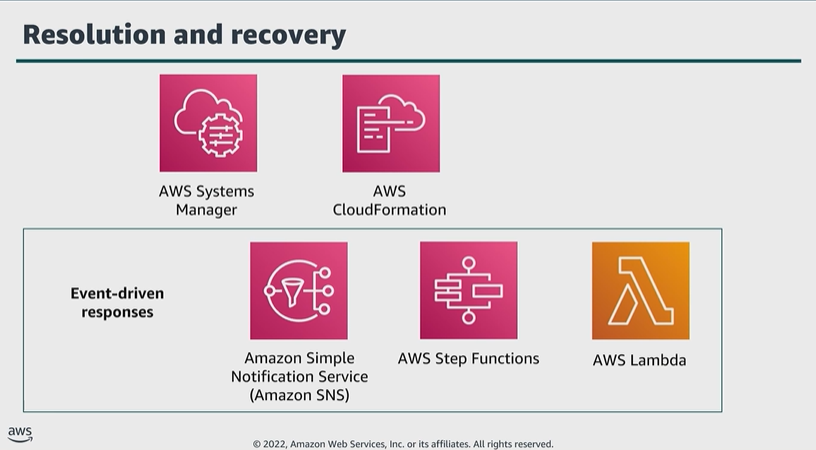

# Module 7: AWS services that support the resolution and recovery phase

Favorite: No
Archive: No
Notebook: AWS Cloud Security (../../AWS%20Cloud%20Security%2037a6c6880dca808794ffd649839ae789.md)
Edited: June 16, 2026 1:59 PM
Created: June 16, 2026 1:16 PM

## Resolution and recovery

## AWS Systems Manager

## AWS CloudFormation

- You create a template that describes all the AWS resources that you want, and CloudFormation takes care of provisioning and configuring those resources for you.
- An enterprise can use CloudFormation to recreate a staging environment inside an isolated, or forensic VPC.
- Once the system is isolated, the team can deep dive and discover the issue, possibly reproduce the issue, apply a fix, and test.
- The team can push any new infrastructure as code, or any new application code to production.

## Amazon SNS

- An enterprise could use Amazon SNS to receive notifications of potential exploits.

## AWS Step Functions

- Step Functions is a low-code, visual workflow service that developers use to build distributed applications, automate IT and business processes, and build data and machine learning pipelines using other AWS services.
- When your enterprise experiences abnormality, implementing Step Functions can help to create complex business logic in event-driven workflows that connect services, systems, or people within minutes.

## AWS Lambda

- With Lambda, you can run any code for virtually any type of application or backend service, all with no administration.
- Lambda takes care of everything required to run and scale your code with high availability.
- You can set up your code to be automatically invoked from other AWS services or call it directly from any web or mobile app.
- Lambda functions are stateless. This means Lambda can rapidly launch as many copies of the function as needed to scale to the rate of incoming events.
- After you upload your code to Lambda, you can associate your function with specific AWS resources.
  - When the resource changes, Lambda runds your function and manages the compute resources as neeeded to keep up with incoming requests.

## Lambda for incident response

- With an event-driven response system, a detective mechanism invokes a responsive mechanism to automatically remediate the event.
- **Example** using Lambda in an event-driven architecture to respond to an incident:
  - Assume that you have an AWS account with AWS CloudTrail enabled.
  - If CloudTrail is ever disabled, the response procedure is to enable the service again and investigate the user who disabled it.
  - You can use EventBridge to monitor for the specific _cloudtrail:StopLogging_ event and invoke a Lambda function off of it.
  - The function collects the details of the specific event, such as the identity of the principal that disabled CloudTrail, when it was disabled, and the specific resource that was affected.
  - This processed information could then be sent as a notification through Amazon SNS.
  - You can use this information to essentially perform a log dive and then generate a notification or alert with only the specific values that a response analyst would require.
  - Another Lambda function could also be invoked to automatically restart the logging.

## Working together for incident response

- Below is an example of how to use services together to remediate a compromised instance.
- A script or third-party tool pushes an instance ID to an SNS topic.
- A Lambda function verifies the ID and if compromised, initiates a Step Functions Workflow.

1. The instance is removed from its Auto Scaling group, and a snapshot is created of any attached Amazon EBS volumes.
2. The instance is isolated by removing all its previously associated security groups.
3. A new forensics security group is assigned to the instance with no inbound or outbound permissions.
4. A CloudFormation template is used to create a new environment, including a new VPC that contains a forensics instance with prebuilt tools attached to a copy of any volumes from snapshots.
5. A basic forensics investigation is performed on the attached volumes.
6. A report is generated with results from the investigation and sent to the team through an SNS topic.

## Key takeaways: AWS services that support the resolution and recovery phase

AWS offers several services that support the resolution and recovery phase, including the following:

- Systems Manager
- CloudFormation
- Lambda
- Amazon SNS
- Step Functions
