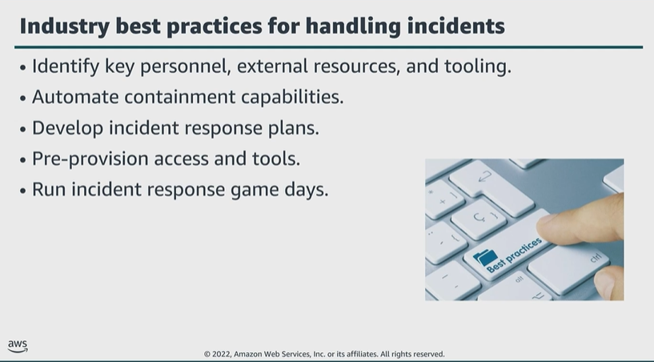

# Module 7: Best practices for handling an incident

Favorite: No
Archive: No
Notebook: AWS Cloud Security (../../AWS%20Cloud%20Security%2037a6c6880dca808794ffd649839ae789.md)
Edited: June 16, 2026 2:49 PM
Created: June 16, 2026 2:40 PM

## Industry best practices for handling incidents

- Maintain a contact list of personnel within your organization who you would need to involve when responding to and recovering from an incident.
- Engage with external partners if necessary to help you respond to and recover from an incident.
- Research, and test tools that would help your organization respond to and recover from an incident.
- Automating containment of an incident can reduce response times and organizational impact.
- Preparation is critical to minimize disruption from an incident.
- Create easy-to-follow runbooks that details the steps to respond to and recover from an incident.
- Ensure that your escalation and communication plans include personnel in your organization and external parties that you must notify at each stage during an incident.
- Have a process to identify and document the root cause of an event so that you can develop mitigation strategies to limit or prevent recurrence. And develop procedures for prompt and effective responses.
- As part of planning, ensure that security personnel have the right tools pre-deployed into AWS. Also, ensure that security personnel have the corrected access pre-provisioned into AWS so that they can appropriately respond to an incident.
- Rehearse incident response and recovery frequently. Run simulated incident response events or game days that involve key staff and management for different threats.
  - Use lessons learned from game days as part of a feedback loop to improve processes.

