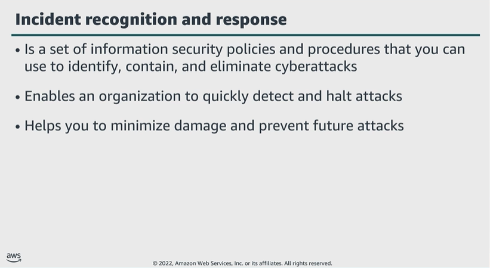

# Module 7: Identifying an incident

Favorite: No
Archive: No
Notebook: AWS Cloud Security (../../AWS%20Cloud%20Security%2037a6c6880dca808794ffd649839ae789.md)
Edited: June 16, 2026 12:52 PM
Created: June 16, 2026 12:35 PM

## Incident recognition and response

- Incident response is a set of information security policies and procedures you can use to identify, contain, and eliminate cyberattacks.
- The goal of incident response is to enable an organization to quickly find and stop attacks, helping to minimize damage and prevent future attacks of the same type.

## Recognizing incidents

**Not all events are incidents in need of immediate remedy.**

- Example of normal events:
  - Someone is logging in from a remote location. In this scenario, an employee might be travelling or using an approved VPN.
  - A failing hard drive that is still fully operational. If the drive is still operational, the enterprise can timely schedule a cycling of the drives without panicking and hot swapping when it’s too late.
  - An employee trying to access resources they shouldn’t access. This might not constitute a breach, if the access was denied, it’s still a behavioral insight that you should monitor.

## Phase 1: Discovery and recognition

- Once an incident is identified through user reports, solution analyses, or manual identification, the incident is logged, and an investigation and categorization can begin.
- During this phase, a notification is received. Notifications are set up by the user and initiated by specified alerts to send an email, SMS text, or push notification through a mobile app.
- Incident escalation is what happens when an employee can’t resolve an incident themselves, and needs to hand off the task to a more experienced or specialized employee.
- Investigation and diagnosis include conducting an incident investigation to gather answers and develop strategies to resolve any threats.

## Phase 2: Resolution and recovery

- When an enterprise has identified the failure of a component, a reduction in quality of service, or an exploit in need of remedy, they move into resolution and recovery phase of incident response.
- Forensic isolation is when you isolate the incident and deep dive to discover the issue. Forensics often require capturing the disk image or as-is configuration of an OS.
- The problem might be a bug in the code base. If so, you need to reproduce the error. Without being able to reproduce the error that the customer experienced, you won’t be able to fix it.
- Staging a fix; which is when you reproduce the issue, apply a fix, and test.
- Deploy the fix; pushing any new infrastructure as code, or any new application code to production.
- Incident closure; resolving the incident.

## Key takeaways: Identifying an incident

- Incident response is a set of information security policies and procedures that you can use to identify, contain, and eliminate cyberattacks.
- Not all events are incidents in need of immediate remedy.
- The first phase of an incident is the discovery and recognition phase.
- The second phase of an incident is the resolution and recovery phase.
