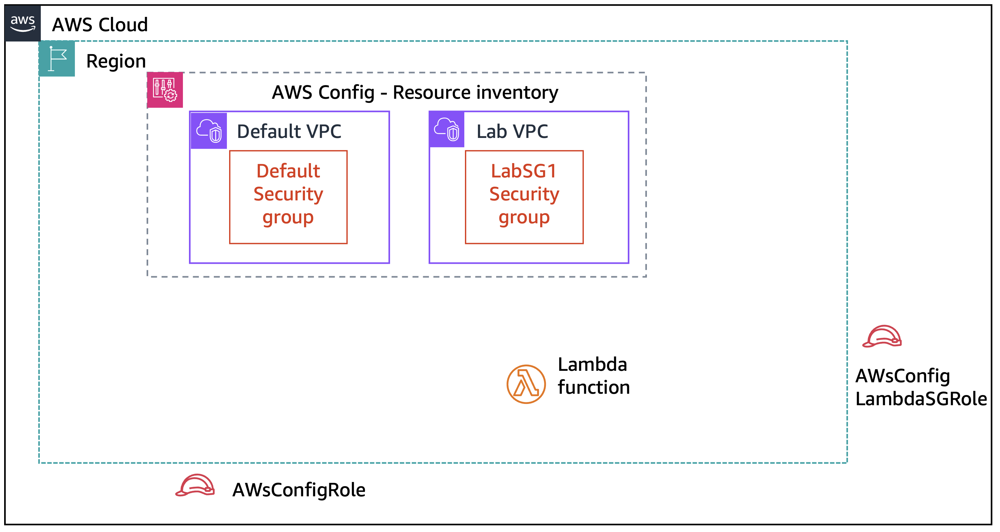

# Module 7: Lab 7.1 - Remediating an Incident by Using AWS Config and Lambda

Favorite: No
Archive: No
Notebook: AWS Cloud Security (../../AWS%20Cloud%20Security%2037a6c6880dca808794ffd649839ae789.md)
Edited: June 16, 2026 4:05 PM
Created: June 16, 2026 2:51 PM

# **Lab 7.1: Remediating an Incident by Using AWS Config and Lambda**

## **Lab overview and objectives**

In this lab, you will learn how to use the AWS Config service to monitor changes to specific resources in your AWS account. You will discover how to use the service to identify changes that could be a security concern, such as a user modifying an Amazon Elastic Compute Cloud (Amazon EC2) security group. Furthermore, you will then gain practical experience by integrating AWS Config with AWS Lambda to automatically remediate specific security incidents of concern.

After completing this lab, you should be able to do the following:

- Explain how to use AWS Identity and Access Management (IAM) roles to grant AWS services access to other AWS services.
- Enable AWS Config to monitor resources in an AWS account.
- Create and enable a custom AWS Config rule that uses a pre-created Lambda function.
- Test the behavior of an AWS Config rule to ensure it's working as intended.
- Analyze Amazon CloudWatch logs to audit when AWS Config rules are invoked.

## **Duration**

This lab will require approximately **75 minutes** to complete.

## **AWS service restrictions**

In this lab environment, access to AWS services and service actions might be restricted to the ones that are needed to complete the lab instructions. You might encounter errors if you attempt to access other services or perform actions beyond the ones that are described in this lab.

## **Scenario**

During this lab, your responsibility is to monitor Amazon EC2 security group settings in an AWS account. You will define which inbound ports should and shouldn't be open in a security group. Your will configure a solution to automatically remediate an incident where someone modifies a security group's inbound rules and they no longer conform with the desired configuration.

When you start the lab, your AWS account will contain two IAM roles and a Lambda function. It will also contain a default VPC with a default security group in it and a custom VPC named _Lab VPC_, which has a security group named _LabSG1_ in it.

The following diagram shows the architecture that was created for you in AWS at the _beginning_ of the lab.



During the lab, you will configure the AWS Config service to create an inventory of specific resources in one Region of your AWS account. You will then create an AWS Config rule.

By the _end_ of this lab, you will have created the architecture shown in the following diagram.


After you build the solution, a security incident will be remediated through the steps described in the following table.

| **Step** | **Explanation**                                                                                                             |
| -------- | --------------------------------------------------------------------------------------------------------------------------- |
| 1        | The AWS Config rule will monitor for any changes to security groups that are tracked in the AWS Config resources inventory. |
| 2        | When the rule notices that changes were made to a security group, the rule will invoke the Lambda function.                 |
| 3        | The function will remediate the situation by updating the desired inbound rule configuration for the security group.        |

## **Accessing the AWS Management Console**

1. At the top of these instructions, choose **Start Lab**.
   - The lab session starts.
   - A timer displays at the top of the page and shows the time remaining in the session.
     **Tip:** To refresh the session length at any time, choose **Start Lab** again before the timer reaches 0:00.
   - Before you continue, wait until the circle icon to the right of the AWS link in the upper-left corner turns green. When the lab environment is ready, the AWS Details panel will also display.
2. To connect to the AWS Management Console, choose the **AWS** link in the upper-left corner, above the terminal window.
   - A new browser tab opens and connects you to the console.
     **Tip:** If a new browser tab does not open, a banner or icon is usually at the top of your browser with the message that your browser is preventing the site from opening pop-up windows. Choose the banner or icon, and then choose **Allow pop-ups**.

## **Task 1: Examining and updating IAM roles**

In this task, you will analyze two IAM roles that were pre-provisioned for you in the lab environment. You will also update the permissions of one of the roles. AWS Config and Lambda will use these roles later in the lab.

1. In the IAM console, observe the permissions granted to the _AwsConfigLambdaSGRole_ role.
   - In the search box to the right of **Services**, search for and choose **IAM**.
   - In the navigation pane, choose **Roles**.
   - Choose the **AwsConfigLambdaSGRole** link.
   - On the **Permissions** tab, expand **awsconfig_lambda_ec2_sg_role_policy**.
     The following IAM policy document displays. The policy is formatted in JavaScript Object Notation (JSON).
     ```json
     {
       "Version": "2012-10-17",
       "Statement": [
         {
           "Action": [
             "logs:CreateLogGroup",
             "logs:CreateLogStream",
             "logs:PutLogEvents"
           ],
           "Resource": "arn:aws:logs:*:*:*",
           "Effect": "Allow"
         },
         {
           "Action": [
             "config:PutEvaluations",
             "ec2:DescribeSecurityGroups",
             "ec2:AuthorizeSecurityGroupIngress",
             "ec2:RevokeSecurityGroupIngress"
           ],
           "Resource": "*",
           "Effect": "Allow"
         }
       ]
     }
     ```
     **Analysis:** This is a custom role that was created for you. Later in this lab, you will attach this role to a Lambda function that you will create. This role defines the permissions that the Lambda function will have when it runs. The policy will allow the Lambda function to add or remove inbound rules on Amazon EC2 security groups. The policy will also allow the Lambda function to create and write events to CloudWatch logs.
     A second custom IAM role was also created for you in the account. You will look at that role and modify it in the next set of steps.
2. Update the permissions that are granted to the **AwsConfigRole** IAM role.
   - In the navigation pane, choose **Roles**.
   - Choose the **AwsConfigRole** link.
   - On the **Permissions** tab, expand the **S3Access** policy, which is already attached to this role.
     Currently, this role grants permissions to get the bucket access control lists (ACLs) of Amazon Simple Storage Service (Amazon S3) buckets and upload objects to an S3 bucket if certain conditions are met. These permissions will allow AWS Config to write CloudWatch log files to Amazon S3.
   - Near the top of the tab, choose **Add permissions** > **Attach policies**.
   - To search for policies related to AWS Config, in the **Search** box, search for `Config` and press Enter.
   - Select the **AWS_ConfigRole** policy.
   - Choose **Add permissions**, which is located in the lower-right corner.
   - Optionally, expand **AWS_ConfigRole** to observe the policy details.
     The policy grants read-level access (mostly Get, List, and Describe actions) to many AWS services.
     **Analysis:** You will grant AWS Config the ability to use this role when you configure AWS Config in the next task. The role defines the permissions that AWS Config will have when monitoring one of the Regions in the AWS account.

In this task, you analyzed the permissions that are granted to an IAM role that a Lambda function will use later in the lab. You also updated and analyzed the permissions granted to an IAM role that AWS Config will use in the next task.

## **Task 2: Setting up AWS Config to monitor resources**

In this task, you will configure AWS Config to monitor specific resources in a Region in the AWS account.

1. Set up AWS Config.
   - In the search box to the right of **Services**, search for and choose **Config**.
   - Choose **Get started**, and configure the following settings:
     - Under **Recording strategy**. Choose **Specific resource types**.
     - **Resource type:** Choose **AWS EC2 SecurityGroup**. For **Frequency** choose **Continuous**.
     - **IAM role for AWS Config** Choose **Choose a role from your account**.
     - **Existing roles:** Choose **AwsConfigRole**.
       **Note:** Recall that AwsConfigRole was the second role that you analyzed in the previous task.
     - In the **Delivery channel** section, notice that AWS Config will store findings in an S3 bucket by default. Keep the default settings, and choose **Next**.
     - On the **AWS Managed Rules** page, choose **Next** at the bottom of the page.
     - Review the AWS Config setup details, and then choose **Confirm**.
       A banner appears briefly, and then the AWS Config Dashboard displays.
2. To observe the resource inventory that AWS Config created, in the navigation pane, choose **Resources**.

   The **Resource Inventory** page displays and lists the Amazon EC2 resources in your account.

   **Note:** If the resources list displays a message saying that your resources are being discovered, wait a few minutes. It might take a few minutes for AWS Config to identify all of your resources.

   **Analysis:** Recall that you configured AWS Config to inventory _EC2 Security Group_ type resources. The Amazon EC2 security groups that were pre-provisioned in the Region where you set up AWS Config are included in the inventory. However, notice that many other resource types also appear in the inventory. AWS Config tracks resources related to the resources that you are primarily interested in, because related resources can affect the behavior of the primary resources. The lab environment that you are working in includes many of these related resources (such as internet gateways and network ACLs).

In this task, you set up the AWS Config service in one Region in the AWS account to monitor specific resources of interest. You then observed how AWS Config created an inventory of resources.

## **Task 3: Modifying a security group that AWS Config monitors**

In this task, you will configure new inbound rule settings in one of the security groups that is listed in the AWS Config resource inventory. The purpose is to effectively emulate a security incident. Some of the inbound rule settings that you will define during this task won't match the desired settings, which you will define in a later task.

1. Locate the security group in the _Lab VPC_.
   - In the search box to the right of **Services**, search for and choose **VPC**.
   - In the navigation pane, choose the **Filter by VPC** box, and choose **Lab VPC**.
   - In the navigation pane, choose **Security groups**.
     At least two security groups are defined in this VPC.
   - Select the **LabSG1** security group.
2. Add inbound rules to the security group to allow HTTP, HTTPS, SMTPS, and IMAPS network traffic.
   - Choose the **Inbound rules** tab, and then choose **Edit inbound rules**.
     Notice that one inbound rule for HTTP connections is already defined.
   - For the existing rule, change **Source** to **Anywhere-IPv4**.
   - Choose **Add rule** and configure the following:
     - **Type:** Choose **HTTPS**.
     - **Source:** Choose **Anywhere-IPv4**.
   - Choose **Add rule** again and configure the following:
     - **Type:** Choose **SMTPS**.
     - **Source:** Choose **Anywhere-IPv4**.
   - Choose **Add rule** again and configure the following:
     - **Type:** Choose **IMAPS**.
     - **Source:** Choose **Anywhere-IPv4**.
   - Choose **Save rules**.
     The inbound rules should now look like the rules in the following screenshot (although your security group rule IDs are different).
     

In this task, you located a security group in the _Lab VPC_ and defined three new inbound rules in the security group. Later in this lab, you will observe these modifications are identified as a security incident and remediated.

## **Task 4: Creating an AWS Config rule that calls a Lambda function**

In this task you configure an AWS Config rule to invoke a pre-created Lambda function. The rule and the function will work together to ensure that monitored Amazon EC2 security groups have only the desired inbound rules.

1. Go to the **i AWS Details** section and copy the value for _LambdaFunctionARN_ to your clipboard.

   Note: You will use the ARN in the next set of steps.

2. Create a new AWS Config rule that will invoke the Lambda function whenever monitored Amazon EC2 security groups are modified.
   - Navigate to the AWS Config console.
   - In the navigation pane, choose **Rules**.
     Currently, AWS Config doesn't have any rules defined.
   - Choose **Add rule**.
   - For **Select rule type**, choose **Create custom Lambda rule**.
   - Choose **Next**.
   - On the **Configure rule** page, configure the following:
     - **AWS Lambda function ARN:** Paste in the Lambda function ARN that you copied.
     - **Name:** Enter `EC2SecurityGroup`
     - **Description:** Enter `Restrict inbound ports to HTTP and HTTPS`
     - **Trigger type:** Select **When configuration changes**.
     - **Scope of changes:** Choose **Resources**.
     - **Resource type:** Choose **AWS EC2 SecurityGroup**.
       _AWS EC2 SecurityGroup_ appears in the resources area.
     - In the **Parameters** section, add a parameter with the following settings:
       - **Key:** `debug`
       - **Value:** `true`
       **Note:** Any parameters that you define here will be passed by this AWS Config rule to the EC2SecurityGroup Lambda function.
   - Choose **Next**, and then choose **Save**.
3. Observe the AWS Config _EC2SecurityGroup_ rule details.
   - Choose the **EC2SecurityGroup** link.
   - In the **Resources in scope** section, choose the **Noncompliant** dropdown menu, and choose **All**.
     In the **Rule details** section, notice the **Last successful evaluation** field. Initially, this field displays _Not available_; however, after a few minutes, a timestamp will display.
     **Note:** The initial evaluation might take a few minutes to complete. This same evaluation will also occur when any security group that is within scope is modified in the future.
     Notice the Amazon EC2 security group resources that are listed as in scope.
     While the initial evaluation occurs, the **Compliance** value will be _No results available_. After several minutes, the value for each security group resource changes to _Compliant_. Wait until you see that it is compliant.
     Notice that the **Annotation** column displays _Permissions were modified_.

In this task, you configured an AWS Config rule to invoke the pre-created lambda function. The rule and the function will work together to monitor and remediate any undesired updates to inbound rules for monitored Amazon EC2 security groups.

## **Task 5: Revisiting the security group configuration**

Now that the initial AWS Config compliance evaluation has occurred, you will reexamine the _LabSG1_ security group. You will observe whether the security incident changes (the modifications that you made to the inbound rules) were noticed and then remediated.

1. Analyze the inbound rules defined on the _LabSG1_ security group.
   - Navigate to the VPC console.
   - In the navigation pane, choose the **Filter by VPC** box, and choose **Lab VPC**.
   - In the navigation pane, choose **Security groups**.
   - Select the **LabSG1** security group.
     On the **Inbound rules** tab, notice that only HTTP and HTTPS traffic is permitted.
     The inbound rules should now look like the rules in the following screenshot (although your security group rule IDs are different).
     
     **Analysis:** Recall that you defined inbound rules for SMTPS and IMAPS, as well as HTTP and HTTPS, on this security group. However, the rules for SMTPS and IMAPS no longer exist. Also, recall that you set the IP version for all rules to only IPv4, but now the HTTP and HTTPS rules are defined for IPv4 and IPv6.
     In summary, you modified the inbound rules in this security group to look like the ones in the following screenshot. However, they have been significantly modified to look like the previous screenshot.
     
2. Analyze the Lambda function code.
   - Navigate to the Lambda console.
   - In the navigation pane, choose **Functions**.
   - Choose the **awsconfig_lambda_security_group** function link.
   - In the **Code source** section, open the **awsconfig_lambda_security_group.py** file that you imported.
     Observe the following details:
     - On line 2, the function imports boto3, which is the AWS SDK for Python.
     - On line 9, **REQUIRED_PERMISSIONS** are defined. This array includes the desired ingress (inbound) IP permissions for Amazon EC2 security group resources that are in scope of the AWS Config rule that you defined.
     - The required permissions are defined in the format that the **describe_security_groups()** API call requires. This call is invoked on line 117.
       For more information about this API call, see the [AWS SDK for Python documentation](https://boto3.amazonaws.com/v1/documentation/api/latest/reference/services/ec2.html#EC2.Client.describe_security_group_rules).
     - On line 129, the function checks whether the **debug** parameter is included in the AWS Config rule. Recall that this was a parameter you configured when you defined the AWS Config rule in task 4. If debug is set to true then the Lambda function code will print additional debugging information when it runs. You can see examples of this throughout the Lambda code.

In this task, you observed the logic for the Lambda function to detect and remove the additional permissions for SMTPS (TCP port 465) and IMAPS (TCP port 993) in the security group.

**Analysis:** The security incident (when you modified the inbound rules) occurred _before_ you created the AWS Config rule and Lambda function to remediate such incidents. During initial rule validation, AWS Config detected the security incident.

If you were to modify the security group again, an AWS Config compliance evaluation would be initiated. The evaluation would invoke the Lambda function, and your changes would be reverted so that the inbound rules again match the desired settings. The default security groups are being similarly monitored and would have their settings remediated if changed.

## **Task 6: Using CloudWatch logs for verification**

In this task, you will analyze CloudWatch logs and filter the log entries to find evidence of the remediation.

1. Locate the logs that show evidence of the changes that the AWS Config rule and its associated Lambda function made to the security group.
   - In the search box to the right of **Services**, search for and choose **CloudWatch**.
   - In the navigation pane, expand **Logs** and then choose **Log groups**.
   - Choose the **awsconfig_lambda_security_group** log group link.
     One or more log stream entries are visible in the log streams list.
   - Choose **Search all**.
   - In the **Filter events** search field, enter `revoking for` and then press Enter.
   - Expand each log event and review the contents.
     Each event provides details about the action that the Lambda function took. In one of the events, you should find details showing that the inbound rules that you manually added for SMTPS (TCP port 465) and IMAPS (TCP port 993) were removed.
     The other filtered events logged the changes to the other two security groups that exist in your account. These security groups are also in the resources inventory that your AWS Config rule is monitoring.

In this task, you observed evidence in the CloudWatch logs that AWS Config invoked the Lambda function to automatically revoke the modifications that were made to the security group.

## **Submitting your work**

1. To record your progress, choose **Submit** at the top of these instructions.
2. When prompted, choose **Yes**.

   After a couple of minutes, the grades panel appears and shows you how many points you earned for each task. If the results don't display after a couple of minutes, choose **Grades** at the top of these instructions.

   **Tip:** You can submit your work multiple times. After you change your work, choose **Submit** again. Your last submission is recorded for this lab.

3. To find detailed feedback about your work, choose **Submission Report**.

## **Lab complete**

Congratulations! You have completed the lab.

1. At the top of this page, choose **End Lab**, and then choose **Yes** to confirm that you want to end the lab.

A message panel indicates that the lab is terminating.

1. To close the panel, choose **Close** in the upper-right corner.
