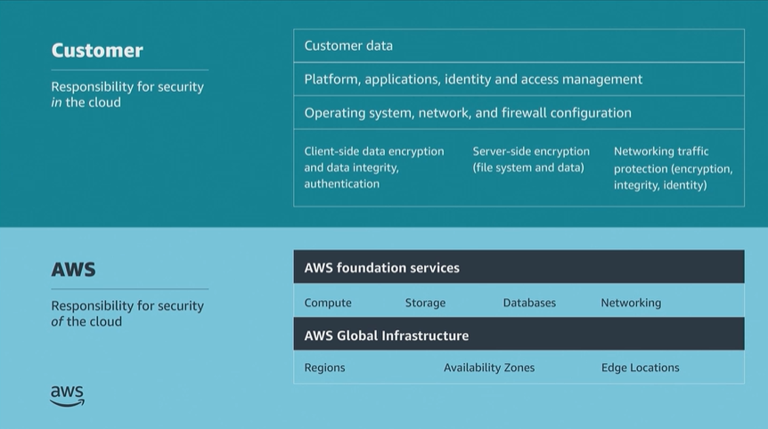

# Module 7: Responding to and Managing an Incident

Favorite: No
Archive: No
Notebook: AWS Cloud Security (../../AWS%20Cloud%20Security%2037a6c6880dca808794ffd649839ae789.md)
Edited: June 16, 2026 12:34 PM
Created: June 16, 2026 12:30 PM

## Bank business scenario

- After discussing various services that can be used to address threats, the Bank has told the developer that they are on board.
- The developer has the Bank’s full support, and support of the board, to begin preparing for migration to the AWS Cloud.
- The developer knows that securing resources in the Cloud is a job that is never fully complete.
- Because of the migration, the Bank’s incident response plan needs to be reviewed and updated.
- The plan needs to include the new tools and methods that their security administrators will use.

## Shared responsibility model

